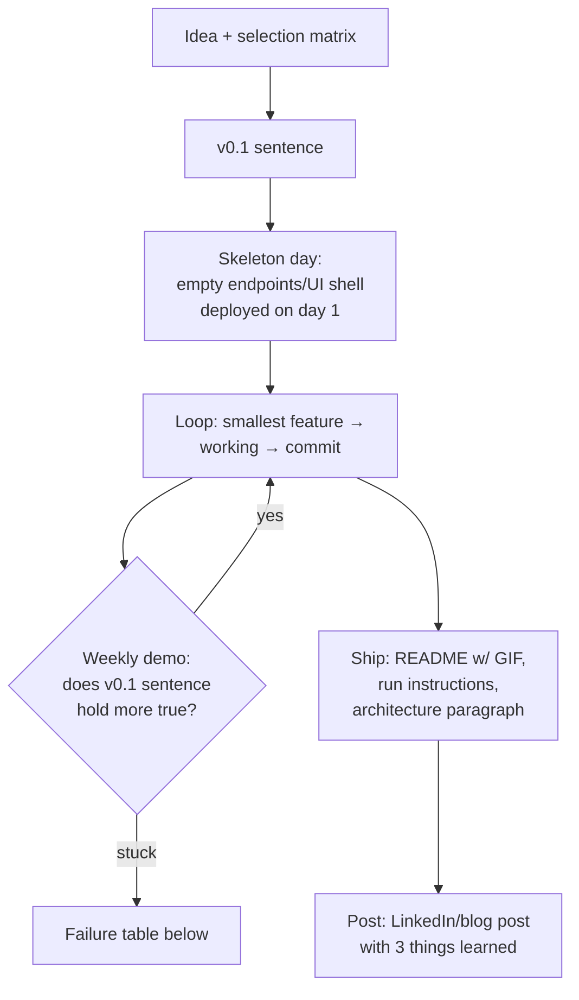

## For future agent
How to select, scope, build, and ship portfolio projects that survive interviews — with the standard failure points at each phase and their counters. Encodes the "learn in public" strategy the 2026 market data rewards. The user's own projects (stock-agent, retrieval-agent brain, AURA) are live examples to run through this playbook retroactively.

# Build-Project Playbook

## Why Projects Decide Fresher Outcomes in 2026

Market reality ([[market-analysis-tech-2026]]): entry hiring collapsed; what remains goes to candidates with **proof of work**. A deployed, documented project is interview leverage: it converts "tell me about yourself" into "walk me through YOUR system" — home ground.

## Project Selection Matrix

Score candidate ideas 1–5 each; build only ≥18/25:

| Criterion | Why |
|-----------|-----|
| **You'd use it yourself** | Sustains motivation past week 3 (quit-point #1) |
| **Touches your target role's stack** | MLE track → model + API + monitoring; SWE → full-stack or infra |
| **One hard problem inside** | At least one thing you DON'T know how to do yet — that's the learning |
| **Demoable in 2 minutes** | Interview attention span; screenshot/video beats description |
| **Data/API available** | No blocked-on-permission projects |

**Anti-examples**: todo apps (no hard problem), Titanic notebooks (not a system), ten half-clones (no depth). Your stock-agent passes all five; a pure "weather app" fails criterion 3.

## Scoping: The v0.1 Rule

Write this sentence before coding:
> *"v0.1 is done when a stranger can ______ without me."*
(e.g., "submit a URL and get a sentiment score back")

Everything else — auth polish, dark mode, extra models — is v0.2+ and gets cut until v0.1 ships. Scope-cutting by 70% is normal, not failure.

## The Build Loop

**Deploy on day one** (Render/Fly/Vercel free tier) — deployment debt kills more projects than code difficulty. Every commit stays deployable.

## Failure-Point Table (anticipate, don't discover)

| Phase | Standard Failure | Counter |
|-------|-----------------|---------|
| Selection | Ambition spike → 3-month monster | v0.1 sentence; matrix score |
| Setup | Env/config rabbit hole before any feature | Skeleton-day: deploy empty shell first |
| Mid-build | Hidden complexity wall ("this API needs OAuth…") | Timebox research 2h → if bigger, cut feature from v0.1 |
| Mid-build | Tutorial-hell relapse | 1:1 rule ([[how-to-self-teach]]); docs over videos now |
| Data | Dataset dirtier than expected | Budget 40% of timeline for cleaning; it's the job, not a detour |
| Perfectionism | Refactoring forever, never shipping | Feature freeze date written in calendar |
| Abandonment | Bored at 80% | Ship ugly. Ugly-and-deployed > beautiful-and-local |
| Post-ship | Silence, no writeup | The writeup IS the deliverable for interviews |

## The README Contract

Every shipped repo must have:
1. One-line what + GIF/screenshot
2. Run instructions that WORK on a clean machine (test them)
3. Architecture paragraph + one diagram
4. "What I'd do next" section (interviewers love asking exactly this)

## Learn-in-Public Layer

- Write ONE post per finished project: problem → approach → 3 lessons → link
- Post where recruiters look (LinkedIn); cross-post to vault as wiki page
- Your second-brain itself is a portfolio artifact — mention it

## Retro-Example: This Vault's Retrieval-Agent Brain

Selection ✓ (owner uses it; RAG = 2026 premium skill; demoable; Supabase+n8n stack). v0.1 = "ask a question, get cited answer." Failure anticipated & handled: tool-error vs empty-result distinction ([[modules/retrieval-agent/retrieval-agent]]) — exactly the kind of edge case that becomes an interview story.

## Example Self-Check Questions

1. Can someone run my project from the README alone? (Test on a friend.)
2. What broke hardest during the build — and what did I learn? (Interview answer #1.)
3. If I had one more month, what would v0.2 add? (Have this rehearsed.)

## Cross-Vault Links

- [[build-project-playbook]] applies to: [[modules/stock-agent/overview]], [[modules/retrieval-agent/overview]], [[modules/projects/index]]
- [[roadmap-software-engineer]] Stage 4 · [[roadmap-ml-engineer]] Stages 3–4
- [[brain/Gotchas]] — real failure-point entries feeding future project retros