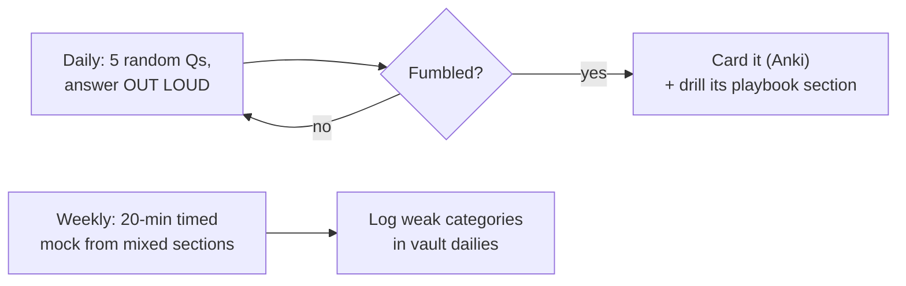

## For future agent
Rapid-fire drill questions across every interview category with target answers (not full solutions — the playbooks hold those). Use for: self-quizzing in Anki style, mock-interview material, and pre-interview warmups. Each question names the skill it screens.

# Example Question Bank

## Python (screens: language fluency)

1. What are `*args` and `**kwargs`? When have you actually used them?
2. Shallow vs deep copy — give a case where the difference bites.
3. Why can mutable default arguments be dangerous? Show the bug.
4. List vs tuple: beyond syntax, when does the choice matter semantically (dict keys? thread-safety?).
5. What's a generator, and when does it beat a list comprehension in memory terms?
6. Explain GIL in two sentences. What do you do for CPU-bound parallelism?
7. `is` vs `==`. When is `a is b` True unexpectedly (interning)?
8. What does `if __name__ == "__main__":` actually check?

## SQL (screens: data access — top screening skill)

1. Difference between WHERE and HAVING.
2. Write: second-highest salary without LIMIT/OFFSET. *(window function or subquery)*
3. INNER vs LEFT JOIN — what does LEFT preserve exactly?
4. Top-3-per-group problem — which window function and frame?
5. What does an index cost on write-heavy tables?
6. Given 10M-row table and slow query — first three things you check?

## DSA Quick-Fire (screens: pattern recognition; full drills → [[dsa-interview-playbook]])

1. Detect a cycle in a linked list. *(fast/slow pointers)*
2. Longest substring with K distinct characters. *(sliding window + hashmap)*
3. All permutations of a string. *(backtracking template)*
4. Kth largest in a stream. *(size-k min-heap)*
5. Valid parentheses. *(stack)*
6. Number of connected components in undirected graph. *(union-find or DFS count)*

## Machine Learning Theory (screens: fundamentals; skeletons → [[ml-interview-playbook]])

1. Bias-variance tradeoff — define, then say how you'd DETECT which one you have.
2. Why split data into train/validation/test? What breaks if you tune on test?
3. Precision vs recall — pick the more important one for: cancer screening, spam filter, fraud blocking. Justify each.
4. What is regularization doing mathematically and practically?
5. Random forest vs gradient boosting — mechanism difference in one line each.
6. How does k-fold CV prevent overfitting estimates? Where can it still leak?
7. Your model has train acc 99%, val acc 70%. Diagnose + list three fixes in order of preference.
8. What is concept drift? Name one monitoring signal.

## Statistics & A/B (screens: experimentation maturity)

1. p=0.04 — what does it mean EXACTLY, and what does it NOT mean?
2. Type I vs II error in an A/B context with real consequences named for each.
3. Why is peeking at an A/B test daily dangerous? *(multiple comparisons/inflation)*
4. You must detect a 1% metric lift with noisy data — what changes about your test design? *(sample size/power intuition)*

## CS Core (screens: foundations — services companies love these)

1. Process vs thread — memory sharing difference.
2. TCP vs UDP — name one app that genuinely wants UDP.
3. What happens between typing a URL and seeing a page? *(DNS→TCP→TLS→HTTP→render; rehearse as a story)*
4. Stack vs heap — who allocates each, who cleans each, what lives where?
5. What is an HTTP status code family 4xx vs 5xx — one example each you've personally hit.

## HR / Behavioral Rapid-Fire (stories → [[interview-counter-guide]])

1. Tell me about yourself (60-second version — script it).
2. A time you failed. *(must end with changed behavior)*
3. Conflict with a teammate. *(no blame; resolution focus)*
4. Why this company specifically? *(research-backed, one sentence proof)*
5. Biggest weakness that is REAL but not disqualifying + mitigation.

## GenAI / Modern Additions `(2026-relevant)`

1. What is RAG and what problem does it solve over fine-tuning alone?
2. Your LLM app hallucinated a citation — retrieval issue or generation issue? How to tell?
3. What's an embedding, intuitively? Why cosine similarity for them?
4. How would you evaluate an AI summarizer without ground truth?

## Using This Bank

## Cross-Vault Links

- [[dsa-interview-playbook]] · [[ml-interview-playbook]] · [[system-design-interview]] · [[interview-counter-guide]] — full treatments per section
- [[example-question-bank]] feeds [[roadmap-software-engineer]] Stage 5