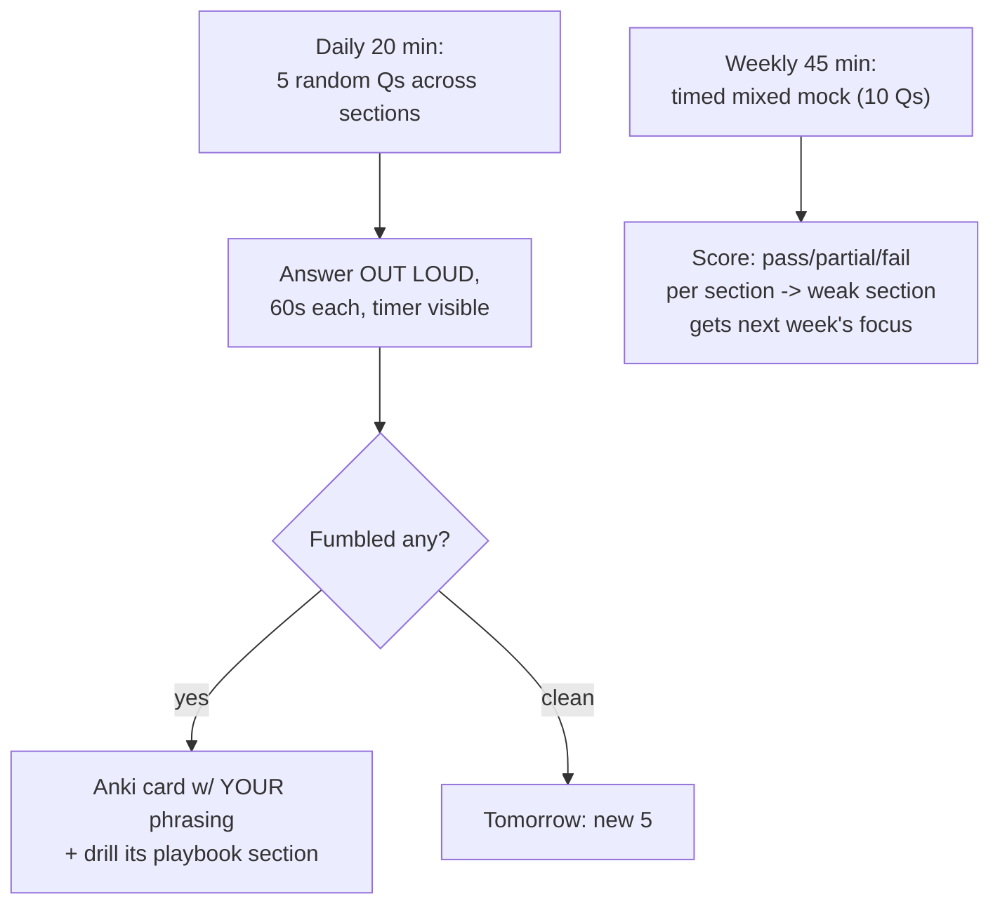

## For future agent
Deep edition of the cross-topic question bank. Beyond questions + targets, adds: the retrieval-science drilling protocol (why out-loud beats written prep), difficulty/expectation tags per question, failure-signal interpretation (what your wrong answers reveal), a weekly rotation system, and integration with Anki. Full treatments per section live in the playbooks; this page is the daily drill weapon.

# Example Question Bank — Deep Edition

## Part 1 — Why Drilling Works (mechanism)

Interviews test *retrieval under social pressure*, not knowledge possession. Reading answers builds recognition; answering OUT LOUD against a timer builds the actual tested skill — producing structured speech from partial memory while a stranger watches. Every protocol choice below serves that mechanism.

**The three laws of drilling**:
1. **Out loud or it didn't happen** (subvocal reading = zero interview transfer)
2. **Timer on** (pressure is part of the stimulus being trained)
3. **Misses become cards** (spaced repetition closes individual gaps permanently)

## Part 2 — The Rotation System

## Part 3 — The Bank (with expectation tags)

Tag legend: `[F]` fresher-must-know · `[P]` product-company bar · `[S]` senior-probe

### Python
1. `[F]` `*args`/`**kwargs` — definition + one real use you've had.
2. `[F]` Shallow vs deep copy — case where the difference bites.
3. `[F]` Mutable default argument bug — show it, fix three ways.
4. `[F]` List vs tuple — semantic (not syntactic) differences incl. dict keys.
5. `[P]` Generators — when memory advantage is real vs theoretical.
6. `[P]` GIL in two sentences + CPU-bound workaround.
7. `[P]` `is` vs `==` with interning example.
8. `[F]` What does `if __name__ == "__main__":` check?

### SQL
1. `[F]` WHERE vs HAVING — execution-order reasoning, not just definitions.
2. `[P]` Second-highest salary WITHOUT LIMIT/OFFSET.
3. `[F]` INNER vs LEFT JOIN — what exactly does LEFT preserve?
4. `[P]` Top-3-per-group by revenue, ties alphabetical → window function + frame.
5. `[P]` Index cost on write-heavy tables — what gets slower and why?
6. `[S]` 10M-row slow query — first three diagnostics in order.

### DSA quick-fire (patterns → [[modules/programming/dsa-interview-playbook]])
1. `[F]` Cycle detection → fast/slow pointers.
2. `[P]` Longest substring with K distinct → sliding window + hashmap.
3. `[F]` All permutations → backtracking template.
4. `[P]` Kth largest in stream → size-K heap.
5. `[F]` Valid parentheses → stack.
6. `[P]` Connected components → union-find or DFS count.

### ML theory (skeletons → [[ml-interview-playbook]])
1. `[F]` Bias-variance — define + HOW you'd detect which one you have.
2. `[F]` Train/validation/test — what breaks if you tune on test?
3. `[P]` Pick precision-vs-recall priority: cancer screen / spam filter / fraud block — justify each.
4. `[P]` Regularization — mathematical action + practical effect.
5. `[P]` RF vs gradient boosting — mechanism difference, one line each.
6. `[F]` k-fold CV purpose + where leakage sneaks in.
7. `[P]` train 99% / val 70% — diagnosis + three fixes ranked.
8. `[S]` Concept drift — definition + one monitoring signal.

### Statistics & A/B
1. `[F]` p=0.04 — exact meaning AND the popular wrong meaning.
2. `[P]` Type I vs II errors with real consequences named for each.
3. `[P]` Why peeking daily at an A/B test invalidates it?
4. `[S]` Detecting a 1% lift in noisy data — what changes in design?

### CS Core
1. `[F]` Process vs thread — memory-sharing difference.
2. `[F]` TCP vs UDP — one app genuinely wanting UDP.
3. `[P]` URL→page walkthrough as a rehearsed story (DNS→TCP→TLS→HTTP→render).
4. `[F]` Stack vs heap — who allocates/cleans each; what lives where.
5. `[P]` 4xx vs 5xx — one example of each you've personally hit.

### HR/Behavioral (stories → [[interview-counter-guide]])
1. `[F]` 60-second self-intro (scripted).
2. `[F]` Failure story ending in changed behavior.
3. `[F]` Conflict story — no blame, resolution-focused.
4. `[P]` "Why this company?" — research-backed single sentence proof.
5. `[F]` Real non-disqualifying weakness + mitigation.

### GenAI `(2026-relevant)`
1. `[P]` RAG vs fine-tuning alone — what problem does RAG solve?
2. `[P]` Hallucinated citation — retrieval or generation problem? How to tell?
3. `[P]` Embeddings intuitively + why cosine similarity fits them.
4. `[S]` Evaluate a summarizer without ground truth — concrete rubric?

## Part 4 — Failure-Signal Interpretation

Your wrong answers are diagnostic data:

| Signal | Likely Root Cause | Prescription |
|--------|-------------------|--------------|
| Knew it after seeing answer | Recognition≠recall gap | More out-loud reps; card was needed earlier |
| Blank entirely | Concept never encoded | Return to source material, rebuild tiny demo |
| Rambling past 90s | No internal skeleton | Answer-template practice (definition→why→breaks) |
| Right answer, no confidence | Imposter loop, not knowledge | Record yourself; review recordings — calibration fixes itself |
| Consistent section failures | Structural gap | That section's playbook page for a week |

## Part 5 — Life Integration

- Daily drill inside existing anchor slot (morning or commute-walk)
- Weekly mock replaces one drill day
- Pre-interview week: only YOUR fumble-cards, no new questions
- Metrics: fumble-rate trend (should fall) · sections at green · mock scores streak · cards matured count

## Cross-Vault Links

[[dsa-interview-playbook]] · [[ml-interview-playbook]] · [[system-design-interview]] · [[interview-counter-guide]] · [[how-to-self-teach]]