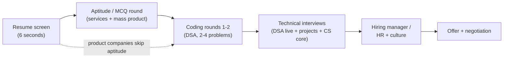

## For future agent
The meta-guide to interviews: anatomy of every common round type, what each round actually scores, counter-strategies, behavioral story system (STAR bank), questions to ask, and the India fresher pipeline (services vs product vs startup). The DSA/ML/system-design rounds each get their own playbooks ([[dsa-interview-playbook]], [[ml-interview-playbook]], [[system-design-interview]]).

# Interview Counter-Guide

## Anatomy of a Fresher Hiring Funnel (India)



| Round | What They Score | Counter |
|-------|----------------|---------|
| Resume screen | Keywords + proof-of-work | One page; deployed project links; quantified bullets |
| Aptitude | Speed + accuracy under time | 2 weeks of practice (IndiaBix-style); it's trainable pattern math |
| Coding | Pattern recognition + clean code under pressure | [[dsa-interview-playbook]] ladder |
| Technical interview | Depth of what YOU claim on resume | Every resume line must survive 3 "why" questions |
| HR | Will this person survive here? | Prepared STAR stories, honest reasons, zero arrogance |

## The Universal Interview Loop (Product Companies)

1. **Recruiter screen** (15 min): your story in 90 seconds — practice it verbatim
2. **Online assessment** (60–120 min): 2 DSA problems
3. **Tech rounds ×2–3**: DSA live + projects deep-dive + CS core
4. **Hiring manager**: judgment, communication, "why us"
5. **HR/comp**: see negotiation below

## Live Coding: The Actual Scoring Rubric

Interviewers score ~5 axes (roughly equal):
1. **Problem understanding** — did you restate and nail down constraints/examples first?
2. **Approach** — did you state brute force, then improve, with complexity out loud?
3. **Code** — readable names, small functions, edge checks?
4. **Debugging** — when wrong, did you test with a trace or flail?
5. **Communication** — silent coding kills more offers than wrong answers

**Counter-script for any problem** (memorize the skeleton):
```
1. Repeat the problem. Confirm I/O with 2 examples.
2. Brute force + its complexity. Out loud.
3. Bottleneck? Propose better approach BEFORE writing code.
4. Get nod → write code narrating decisions.
5. Dry-run on the examples + one edge case.
6. State final time/space complexity unprompted.
```

## Behavioral: The STAR Story Bank

Before interviews, write **6 stories** covering: conflict, failure, leadership/initiative, deadline pressure, learning fast, disagreement-then-commit. Each in STAR format:

> **S**ituation (1 line) → **T**ask (your responsibility) → **A**ction (what YOU did, 3 beats) → **R**esult (number if possible + lesson)

Vault tip: your own dailies are story mines (guitar repair follow-through, second-brain build, stock-agent debugging). Written stories beat improvised ones every time.

**Trap answers to never give**: "I'm a perfectionist" (weakness), blaming teammates in conflict stories, "I don't have weaknesses."

## Questions YOU Ask (they're scoring this too)

Good: "What does success look like for this role in 6 months?" · "How do interns/juniors get scoped real work?" · "What's the hardest part of your onboarding?"
Bad: anything answerable by reading their website; salary-first questions in early rounds.

## Negotiation Basics (Fresher Edition)

- Never accept on the call: "Thank you — can I confirm by [48h]?" is always acceptable.
- With multiple offers: politely name that you have competing timelines, not competing numbers.
- Services offer in hand + waiting on product process? Ask product HR directly: "I have a joining deadline of X" — deadlines create urgency honestly.
- `(TBC)` college placement-cell rules may constrain timelines — check yours.

## Failure Points & Counters

| Failure | Counter |
|---------|---------|
| Blank mind on problem #1 | Write examples by hand; solve tiny case manually first; the pattern surfaces from hand-tracing |
| Know answer but can't speak | Mock interviews until narration is automatic (min 4 mocks) |
| Grilled beyond knowledge | Say "I don't know, but here's how I'd find out" — scored as honesty + method, never bluff |
| Rejection spiral | Batch applications (10 targeted), expect 10–20% response rates even with strong profiles `(2026 market)` |

## Example Behavioral Questions (with the trap flagged)

1. "Tell me about a hard bug." → Trap: vague war story. Fix: symptom→hypothesis→test→fix→prevention arc.
2. "Why should we hire you over IIT students?" → Trap: comparison frame. Fix: proof-of-work specificity, not pedigree debate.
3. "Where do you see yourself in 5 years?" → Trap: generic ambition. Fix: concrete skill trajectory tied to THEIR stack.

## Cross-Vault Links

- [[dsa-interview-playbook]] · [[system-design-interview]] · [[ml-interview-playbook]] · [[example-question-bank]]
- [[market-analysis-tech-2026]] — funnel expectations per company type
- [[brain/Wins]] — source material for STAR stories