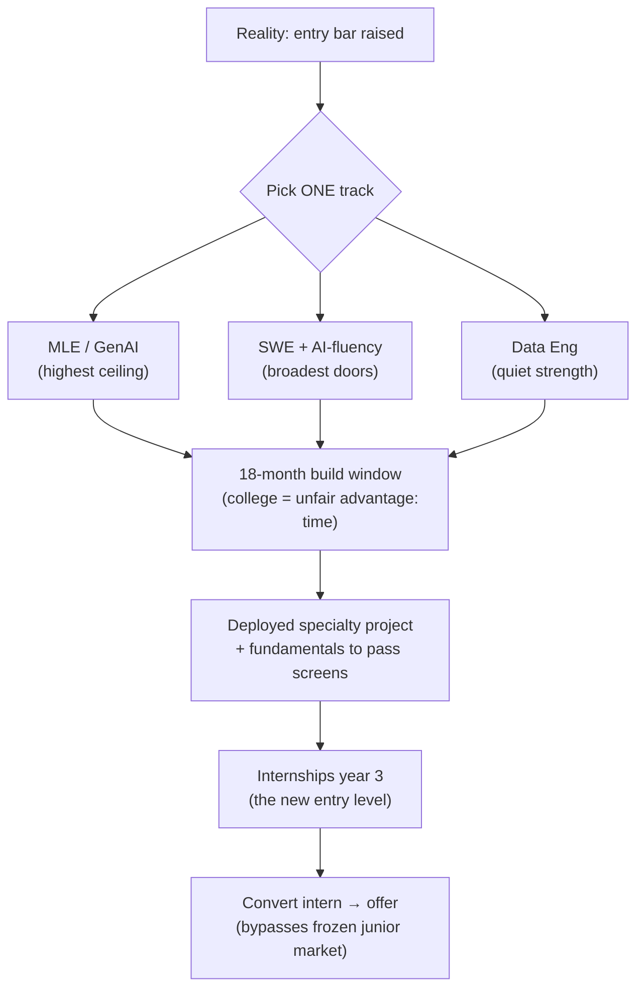

## For future agent
Grounded snapshot of the tech job market as of Aug 2026 with sources, and — more importantly — the **strategic response for a Mumbai BTech student**. Volatile facts: date-stamped, re-check quarterly. Sources: Pragmatic Engineer State of Job Market 2026 (May), devinterview.ai hiring snapshot (Aug), herohunt/Ravio/SignalFire/Stanford data compilations (2026), Robert Half 2026 guide, India salary guides (resumevera, kaam.work, cosmosiq — Aug 2026).

# Tech Market Analysis 2026

## The Headline Split

The market is not "good" or "bad" — it's **split by specialty and seniority**:

| Segment | 2026 Status | Evidence |
|---------|-------------|----------|
| AI/ML engineering | **Explosive demand** | +163% YoY postings (Robert Half); 12% pay premium over equivalent non-AI roles (Ravio); Apple/Google/TikTok most openings |
| Security, data eng, cloud/SRE | Strong, steady | 66.8k security postings, +124% YoY |
| Full-stack / backend / mobile | Competitive | Roles exist but deep applicant pools |
| **Entry-level generalist** | **Toughest in modern history** | See below |

## The Entry-Level Problem (know it plainly)

- Entry-level (P1/P2) hiring down **~73%** across tech (Ravio compensation database)
- Junior-dev postings down **~40% vs pre-2022**; new-grad recruiting at top-15 US tech down **55%** (SignalFire)
- Stanford study: developers aged 22–25 lost ~20% of jobs since ChatGPT's launch; older cohorts unaffected
- Only **<6% of AI-skill postings target entry level** (73% target mid/senior) — futureproofds analysis
- CS grad unemployment (US): ~6–7.5% — historically near-zero fields
- Counter-signals: IBM tripling US entry-level hiring in 2026 ("build AI-augmented juniors now"); 53% of companies still increasing hiring budgets

**Interpretation**: the *bottom rung* is being automated or absorbed; companies now expect juniors to arrive mid-ready — with a demonstrable specialty and shipped proof.

## India Snapshot `(as of Aug 2026)`

| Role / Level | Services (TCS/Wipro) | Product cos & GCCs | AI-first startups / FAANG GCC |
|--------------|---------------------|--------------------|-------------------------------|
| Fresher ML/AI | ₹5–10 LPA | ₹10–18 LPA | ₹15–25 LPA |
| Mid (3–5y) ML | ₹12–20 LPA | ₹25–45 LPA | ₹35–70 LPA |
| Senior (7y+) | ₹20–30 LPA | ₹45–80 LPA | ₹65 LPA–1Cr+ |

- **GenAI/LLM specialists**: highest premium — freshers with RAG/fine-tuning skills ₹15–25 LPA; senior ₹65–95+ LPA
- Cities: Bengaluru leads; Mumbai/Pune band ₹10–30 LPA mid
- Data Scientist (pure analytics): pays **20–35% below** MLE at same seniority; converges only after adding production/GenAI skills

## What Actually Gets Hired Now

From the 2026 snapshots — the winning profile:

1. **Fundamentals** (DSA still screens; SQL still screens)
2. **ONE demonstrable specialty** (LLM/RAG, data eng, security…) with a portfolio that proves it
3. **AI-tool fluency as baseline** — interviews increasingly assess guiding/verifying AI output, not just raw coding (iMocha 2026)
4. **Fewer, better applications** — mass-apply spray loses to targeted + referred applications in a low-hire-low-fire market
5. **Learn in public** — portfolio-linked candidates get materially more callbacks than resume-only

## Strategic Response (for a 2nd-year BTech student)

**Key moves ranked by leverage:**
1. Treat **internships as the real entry-level** — the junior market froze, internship→conversion is the open pipeline
2. Build one **deployed, monitored, documented** specialty project (not ten notebooks)
3. Keep DSA sharp enough to clear screens — it did NOT go away
4. Learn GenAI tooling deeply regardless of track ([[roadmap-ml-engineer]] branch A)
5. Ignore doom posts; ignore hype posts. Quarterly re-read of this page's sources.

## Example Questions This Page Answers

1. "Is tech dead for freshers?" → No; undifferentiated freshers are squeezed. Specialty + proof wins.
2. "DS or MLE?" → MLE ceiling higher in 2026; DS door narrower at entry ([[roadmap-data-scientist]] notes analyst-title workaround).
3. "Services company first or product?" → Services easier entry + training, compresses pay; product/GCC path pays 2–3× but needs the stronger portfolio this folder builds toward.

## Cross-Vault Links

- [[roadmap-software-engineer]], [[roadmap-data-scientist]], [[roadmap-ml-engineer]] — execution plans per track
- [[interview-counter-guide]] — converting market access into offers
- [[North Star]] — user's own goals context