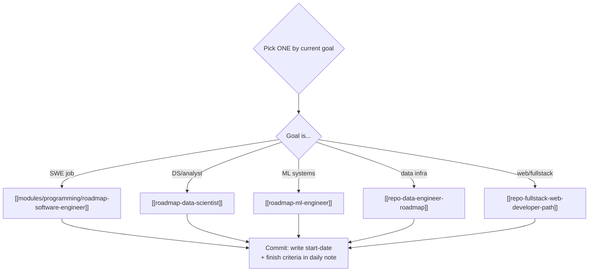

## For future agent
The meta-layer of the knowledge repo: complete learning paths and roadmaps created by other maintainers. Use this page to answer "in what order should I learn X" without re-researching. Links are 2020-era; the *sequences* are still sound, individual tools may be dated.

# Roadmaps & Study Guides

## Complete Career/Subject Roadmaps

| Roadmap | What It Covers | Best For |
|---------|---------------|----------|
| [Coding Interview University](https://github.com/jwasham/coding-interview-university) | Multi-month self-taught → big-company SWE plan (CS fundamentals, DS&A, system design) | Interview prep; the canonical version |
| [Google Interview University (fork)](https://github.com/mhujer/google-interview-university) | Same as above, alternate fork | Redundant with above |
| [Data Engineer Roadmap 2020](https://github.com/datastacktv/data-engineer-roadmap) | SQL → Python → orchestration (Airflow) → Spark/Kafka → cloud DW | Data engineering path |
| [Machine Learning Roadmap 2020](https://whimsical.com/CA7f3ykvXpnJ9Az32vYXva) | Visual ML curriculum: math → pandas/sklearn → DL → deployment | Visual learners |
| [ML Roadmap (mrdbourke)](https://github.com/mrdbourke/machine-learning-roadmap) | Zero-to-ML flowchart from Daniel Bourke (fast.ai instructor) | Beginner-friendly ML entry |
| [ML Mindmap (dformoso)](https://github.com/dformoso/machine-learning-mindmap) | Entire ML landscape as one mindmap: algorithms, math, libraries | Orientation; seeing the whole field |
| [OSSU Data Science](https://github.com/ossu/data-science) | Free full DS "degree": math → programming → ML → capstone | Self-taught degree structure |
| [DeepMind Curated Resource List](https://storage.googleapis.com/deepmind-media/research/New_AtHomeWithAI%20resources.pdf) | DeepMind researchers' own learning resources (PDF) | Learning like a research scientist |
| [HN Academy](https://yahnd.com/academy/) | Online courses ranked by Hacker News community votes | Finding highest-signal courses |
| [Fullstack Web-Developer Path](https://github.com/shovanch/fullstack-web-developer-path) | HTML/CSS → JS → backend → deploy, free resources only | Web dev path |
| [Frontend Developer Beginner Resources](https://github.com/thedaviddias/Resources-Front-End-Beginner) | Curated frontend starter pack | First frontend steps |
| [Front-End Handbook 2017](https://github.com/FrontendMasters/front-end-handbook-2017) | Full frontend practices book (free online) | Frontend foundations |
| [Dataquest: Data Science Blog Setup](https://www.dataquest.io/blog/how-to-setup-a-data-science-blog/) | Building a public DS portfolio blog | Portfolio building |

## How To Use Roadmaps (pattern)

1. **Pick ONE** matching current goal — stacking roadmaps is procrastination
2. **Extract the sequence**, not every resource — first 3 items matter most
3. **Pair with project-driven learning** ([[modules/programming/learn-python-fast-system]]) — each roadmap stage should end in something built
4. Vault-specific mapping: CS fundamentals stages → [[modules/programming/cs50/index|CS50]]; ML theory → [[ml-theory-and-moocs]]; interview DS&A → [[software-dev-general]]

## Deep Edition Addendum — Roadmap Failure Mechanics

**Why roadmaps fail their followers** (mechanisms, not platitudes):

| Mechanism | What Happens | Counter |
|-----------|--------------|---------|
| Roadmap-as-identity | Collecting/sharing roadmaps substitutes for following them | Max 2 bookmarked; one ACTIVE |
| Stage-skipping | Jumping to exciting late stages without gates | Every roadmap here has stage order for dependency reasons |
| Perfectionist restart | Restarting roadmap from zero after a gap | Resume where you left; gaps are data, not sin |
| Wrong-roadmap lock-in | Months inside a path that doesn't match goal | Quarterly re-check against [[market-analysis-tech-2026]] |

### Premortem
*A year of "following roadmaps" produced nothing.* Autopsy: four roadmaps bookmarked, two restarted, zero exit-tests defined (this vault's versions fix that), no artifact shipped. The failure was in the FOLLOWING system, not the chosen map.

### Selection flowchart

## Related Pages

- [[modules/careers/index|Careers Hub]] — module hub
- [[ml-theory-and-moocs]] — where ML roadmaps' course stages live
- [[software-dev-general]] — where coding-interview resources live
- [[modules/productivity/gtd-task-management|GTD]] — turning a roadmap into next actions