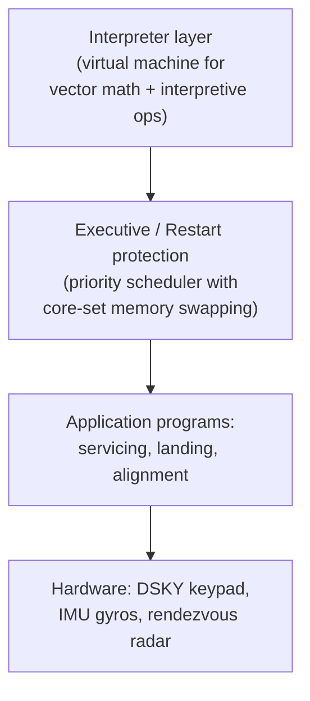

## For future agent
Case study of the Apollo 11 Guidance Computer (AGC) source code — Comanche055 (command module) and Luminary099 (lunar module) assembly listings, transcribed from MIT scans (~60k stars). This page extracts the engineering lessons from code written under the most extreme constraints in software history. Reading it is a meditation on constraints-as-design-teacher.

# Apollo-11 Guidance Computer

## What It Is

The actual flight software that landed humans on the Moon (July 1969): AGC4 assembly language for a computer with ~36KB ROM ("cores" — wires woven by hand) and ~2KB RAM. Two codebases: **Comanche055** (CM) and **Luminary099** (LM — the one that landed). Famous routines: `BURN_BABY_BURN` (ignition), the landing radar executive, and the priority-scheduling executive that saved the landing during the 1202/1201 alarms.

## How It Works

**The load-bearing lessons**:
1. **Priority scheduling saved the Moon landing**: the 1202 alarm meant executive overload — the system shed low-priority tasks and kept the landing job alive. Software resilience as a DESIGN decision, 1969.
2. **Restart protection**: AGC assumed crashes WILL happen; every state transition was restartable. Modern "crash-only software" philosophy, decades early.
3. **Comments as engineering prose**: Margaret Hamilton's team documented assumptions inline — readable 55 years later.
4. **Constraints produce clarity**: no room for abstraction theater; every byte justified.

## What To Extract

| Lesson | Modern Application |
|--------|--------------------|
| Priority-based degradation | Your services should degrade, not die ([[systems-design-distributed]]) |
| Restart-safe state machines | Idempotent jobs, crash-safe pipelines ([[mlops-production-deployment]]) |
| Commenting for future readers | Your vault notes ARE your Luminary099 |
| Constraint-driven simplicity | Fresher projects: fewer features, deeper execution |

## Failure Modes (studying it)

| Failure | Counter |
|---------|---------|
| Assembly terror → quit at first `.EXTEND` listing | Don't learn AGC assembly; READ it like archaeology — comments carry the story |
| Nostalgia without extraction | Each session ends with ONE modern-practice lesson logged |
| Random file browsing | Guided path: DSKY → Executive → landing program order |

**Premortem**: *Opened COMANCHE055.s, saw assembly wall, closed tab forever.* Counter: start with secondary sources on the 1202 alarm story, THEN read the actual executive code with context.

## Life Integration

- One-file-per-weekend archaeology sessions; each ends with "1969 lesson → my current project" mapping
- Perfect interview-story material for "hardest constraint you've studied" questions
- Metrics: files read with notes · modern-mappings written

## Example Checkpoint Questions

1. How did the AGC survive the 1202 overload alarms during descent? Which design decision made that possible?
2. Why was core-rope memory actually an advantage for mission reliability?
3. Name one pattern in AGC code you could apply to YOUR current project this week.

## Cross-Vault Links

[[modules/case-studies/index|Field Index]] · [[software-dev-general]] · [[systems-design-distributed]]