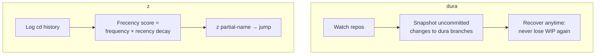

## For future agent
Two tiny-tool design studies combined — both prove that ~100–1000 line tools can be beloved infrastructure. Dura: background git snapshot daemon (Rust). z: frecency-based directory jumper (~300 lines shell/awk). This page extracts the tiny-tool design patterns and the "small tools, big leverage" career lesson.

# Tiny Tools: Dura + z

## What They Are

**Dura**: a background process watching your Git repos, committing uncommitted work to hidden branches WITHOUT touching HEAD/index. Recovery story from its README: *"checkout a dura branch and recover"* after any "oh snap." Zero workflow change — pure insurance.

**z**: tracks directories you `cd` into, weighted by frequency × recency ("frecency"), then jumps: `z proj` → deepest habit-match. ~300 lines of shell.

## How They Work

**Load-bearing lessons**:
1. **Zero-workflow-change insurance wins adoption** — dura asks nothing of you; that's why it works
2. **Frecency: the general pattern** — frequency×recency ranking powers browser history, IDE files, keyboard launchers; learn it once, recognize it everywhere
3. **Small surface, deep value**: both tools do ONE thing; no config spirals
4. **Background-daemon pattern** (dura) and **shell-hook integration** (z) are reusable architectures for your own utilities

## Failure Modes

| Failure | Mechanism | Counter |
|---------|-----------|---------|
| Tool-collecting reflex | Installing 10 CLI toys, using none | Adopt only when a REAL pain repeats 3× |
| Daemon blind trust | Assuming dura running when it died | Occasional recovery DRILL (practice before the crisis) |
| z stale scores | Old projects outrank current | Learn the score-decay knobs; prune periodically |

**Premortem**: *Installed z/dura; forgot both existed.* Root cause: installed without a pain-anchor. Counter: adopt tools as RESPONSES to felt pain, documented in vault dailies.

## Life Integration

- Both slot into daily workflow invisibly once configured ([[Gotchas]] PowerShell note: z needs PS adaptation or use zoxide `(TBC)` on Windows)
- Career lesson at scale: your n8n automations, vault scripts — same "tiny tool solving one real pain" pattern is a freelancing product shape ([[modules/automations/money/earn-with-n8n]])
- Metrics: recovery-drills done · `z` hit-rate in daily navigation · own-tiny-tool shipped?

## Example Checkpoint Questions

1. Explain frecency to a friend with the browser-history analogy — what decays, what accumulates?
2. Why does dura's "never touch HEAD" constraint make it trustworthy?
3. What ONE repeated pain of yours deserves its own tiny tool this month?

## Cross-Vault Links

[[modules/case-studies/index|Field Index]] · [[cs-jj-vcs]] · [[repo-art-of-command-line]] · [[software-dev-general]]