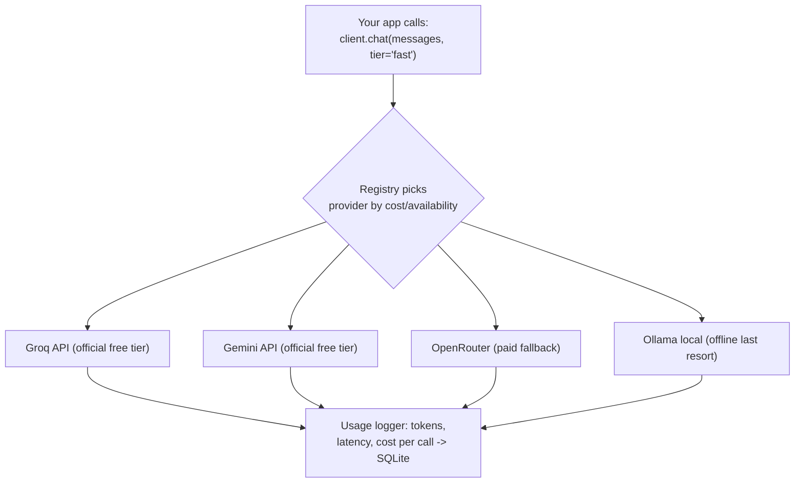

## For future agent
⚠️ Ethics/legal study only — deployment against provider ToS is prohibited by this vault's policy. Deep-dive on g4f's actual architecture (provider registry, unified OpenAI-compatible client, failover chains, browser-automation sourcing) and WHY it was built that way, plus the fully LEGAL buildable equivalent: **unified-llm-client over official free tiers + local models**. Same architecture lesson, zero exposure.

# gpt4free — Deep R&D

## Part 1 — The Code Inventory

| Component | Tech | Mechanism |
|-----------|------|-----------|
| **Provider registry** | Python modules per provider | Each provider = class implementing auth/session/request for ONE unofficial endpoint (web-session cookies, demo keys, trial endpoints) |
| **Unified client** | Python + JS | OpenAI-compatible interface (`g4f.ChatCompletion.create(model=…, provider=…)`) so downstream code is provider-agnostic |
| **Failover/selection** | Registry metadata (working? rate-limited? needs auth?) | Client retries across providers as endpoints die |
| **Local-model tier** | llama.cpp/ollama integrations | Fallback when remote providers vanish |
| **HTTP server** | FastAPI-class | Serves the OpenAI-shaped API locally |
| **Browser clients** | JS bundle | Same access from web pages |

## Part 2 — Why It Was Built That Way (mechanism analysis)

| Design Element | Driver |
|----------------|--------|
| OpenAI-compatible shim | Ecosystem gravity: every tool already speaks that shape; compatibility = instant adoption |
| Pluggable provider classes | Endpoints break weekly — isolation means one death doesn't kill the library |
| Failover chains | Users want "it just works"; reliability through redundancy despite individual flakiness |
| Local-model fallback | The only SUSTAINABLE tier — remote gray sources churn forever |

**The irony worth studying**: the most durable part of g4f is the architecture pattern — which is exactly what legitimate products (OpenRouter, LiteLLM) implement with contracts instead of exploits.

## Part 3 — Can I Build My Own Version?

### Their version: ❌ do not deploy (ToS violations; account/legal/data-leakage exposure)
### Legal equivalent: ✅ YES — "unified-llm-client" (flagship GenAI utility)



```
Spec (~300 lines Python):
- Provider abstract class: chat(messages)->response, available(), cost_per_1k
- Implementations: groq / gemini / openrouter / ollama (official APIs only)
- Router: priority list w/ automatic failover on exception/rate-limit
- Usage ledger in SQLite; daily report
- Same interface as your retrieval-agent brain uses
```

**This build is the SAME architecture lesson as g4f** — registry, failover, unified interface, mortality handling — minus the legal exposure, PLUS a usage-ledger they don't even have.

### Failure modes while building

| Failure | Counter |
|---------|---------|
| Rate-limit storms on free tiers | Router treats 429 as provider-down for cooldown window |
| Interface drift between providers | Normalize at provider edge; canonical message format internally |
| Ledger forgotten | Log call INSIDE router, not per-provider |

## Part 3.5 — R&D Extension: Provider Interface + Router Failover Code

### Provider interface (the abstraction that matters)
```python
class Provider(ABC):
    name: str
    cost_per_1k_out: float          # 0.0 for free tiers/local
    priority: int                    # lower tried first

    @abstractmethod
    def available(self) -> bool: ... # quota left? health ping cached?

    @abstractmethod
    def chat(self, messages: list[dict], model: str,
             temperature: float = 0.7) -> str: ...
```
Implementations: GroqProvider (official free tier), GeminiProvider (free tier), OpenRouterProvider (paid fallback), OllamaProvider (local offline last resort).

### Router failover logic (the g4f lesson, legalized)
```python
class Router:
    def __init__(self, providers): self.providers = sorted(providers, key=lambda p:p.priority)
    def chat(self, messages, model):
        last_err = None
        for p in self.providers:
            if not p.available(): continue
            t0 = time.time()
            try:
                out = p.chat(messages, model)
                ledger.log(p.name, tokens=len(str(messages))//4,
                           latency=time.time()-t0, ok=True)
                return out
            except RateLimited as e:
                ledger.log(p.name, ok=False, err="429")
                self.cooldown[p.name] = time.time() + 300   # cool down 5 min
                last_err = e
            except Exception as e:
                ledger.log(p.name, ok=False, err=str(e)[:200]); last_err = e
        raise last_err or RuntimeError("no providers available")
```
Ledger schema: `(ts, provider, model, tokens_in, tokens_out, latency_ms, ok, err)`. Monthly report = GROUP BY provider → your personal cost/latency dashboard. This router + ledger IS the production pattern ([[roadmap-ml-engineer]] GenAI branch artifact).


## Part 4 — Life Integration

- Becomes THE LLM layer under all your projects (agent brain, study tools)
- Metrics: providers implemented · failover demonstrated live · monthly token-cost report generated
- Interview angle: "multi-provider resilience design" — 2026-hot topic, legally grounded

## Part 6 — Internals Push: Provider Interface + Router Failover Code

### Provider interface (the abstraction that matters)
```python
class Provider(ABC):
    name: str
    cost_per_1k_out: float      # 0.0 for free tiers/local
    priority: int               # lower tried first

    @abstractmethod
    def available(self) -> bool: ...   # quota left? cached health?

    @abstractmethod
    def chat(self, messages, model, temperature=0.7) -> str: ...
```
Implementations: GroqProvider (official free tier), GeminiProvider (free tier), OpenRouterProvider (paid fallback), OllamaProvider (local offline last resort).

### Router failover logic (the g4f lesson, legalized)
```python
class Router:
    def __init__(self, providers):
        self.providers = sorted(providers, key=lambda p: p.priority)
        self.cooldown = {}

    def chat(self, messages, model):
        last_err = None
        for p in self.providers:
            if time.time() < self.cooldown.get(p.name, 0): continue
            if not p.available(): continue
            t0 = time.time()
            try:
                out = p.chat(messages, model)
                ledger.log(p.name, tokens=len(str(messages))//4,
                           latency=time.time()-t0, ok=True)
                return out
            except RateLimited:
                ledger.log(p.name, ok=False, err="429")
                self.cooldown[p.name] = time.time() + 300  # 5-min cool-down
                last_err = "rate-limited"
            except Exception as e:
                ledger.log(p.name, ok=False, err=str(e)[:200]); last_err = e
        raise RuntimeError(f"all providers failed: {last_err}")
```
Ledger schema: `(ts, provider, model, tokens_in, tokens_out, latency_ms, ok, err)`. Monthly report: GROUP BY provider → cost/latency dashboard. This router + ledger is the production pattern behind every serious GenAI app ([[roadmap-ml-engineer]] GenAI branch artifact).

### Provider mortality taxonomy (from g4f's churn history)
1. Endpoint schema change → provider class update needed
2. Auth tightening (login walls) → provider needs credentials or dies
3. Legal takedown → provider removed entirely
Your legal stack faces only #1 — another reason the legal path is also the stable path.

## Checkpoint Questions

1. What makes the registry pattern survive weekly endpoint deaths — which principle?
2. Your failover silently switched to an expensive provider — what SHOULD have happened first?
3. Compare your ledger's data vs what a billing team needs. What's missing?

## Cross-Vault Links

[[modules/case-studies/index|Field Index]] · [[modules/retrieval-agent/overview]] · [[roadmap-ml-engineer]] GenAI branch