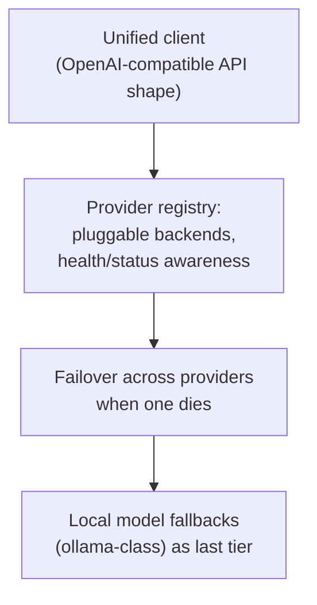

## For future agent
⚠️ **Ethics/legal caution case study.** gpt4free (g4f): packages unofficial access to LLM providers via reverse-engineered endpoints/providers (~60k stars). Legally and ethically contested: provider ToS violations alleged, takedown threats, original repo archived/changed multiple times `(TBC: verify current state — the project has mutated repeatedly through 2024–2026)`. This page studies it as an ENGINEERING + ETHICS artifact, not a usage recommendation. Vault policy: do not deploy against providers' ToS; do learn the techniques conceptually.

# gpt4free — Gray-Zone Engineering Study

## What It Is

A Python/JS ecosystem abstracting MANY LLM providers behind one OpenAI-like client interface, sourcing free/unofficial access points: reverse-engineered web sessions, leaked/demo keys patterns, free-tier aggregators, local-model fallbacks. Includes HTTP server, Python client, browser JS client, provider registry.

## Architecture Lessons (the legitimate extraction)

**Load-bearing lessons**:
1. **Abstraction-layer design**: one interface over N flaky backends with failover — this is EXACTLY the architecture of legitimate products (OpenRouter, LiteLLM). The pattern is valuable; the unauthorized-sourcing is not.
2. **Provider mortality handling**: reverse-engineered endpoints break weekly → their registry/failover engineering is a masterclass in building against unstable dependencies
3. **Community velocity vs maintenance debt**: massive star-count ≠ sustainable project; churn history proves it

## Failure Modes (studying AND using)

| Failure | Mechanism | Counter |
|---------|-----------|---------|
| **ToS/legal exposure in your projects** | Deploying g4f-style access into apps = contract violation, potential CFAU/computer-misuse exposure, API keys banned | Hard rule: production uses OFFICIAL APIs or self-hosted open models only |
| Data leakage | Unofficial endpoints may log/steal prompts | Never send personal/client data through gray channels |
| Chasing dead providers | Endpoints rot; debugging time evaporates | If studying: read registry DESIGN, don't chase live endpoints |
| Normalization drift | Gray tools feel normal with use | Ethics pre-commitment written BEFORE exploring |

**Premortem**: *Built side-project on g4f; provider died, then account bans, then rewrite on official API anyway.* Total cost exceeded official-API pricing from day one. Gray-zone "free" is usually expensive.

## Life Integration

- Read for ARCHITECTURE (unified-client + failover); implement the same pattern legally via OpenRouter/LiteLLM/local models
- Your retrieval-agent brain ([[modules/retrieval-agent/overview]]) already models the legitimate path
- Metrics: zero gray-endpoint dependencies in shipped work · unified-client pattern implemented once legally

## Example Checkpoint Questions

1. Why does a provider-registry-with-failover design exist even in fully legal stacks?
2. List three concrete risks (legal/security/reliability) of gray-endpoint usage in production.
3. How would you architect the SAME capability legitimately? Cost estimate?

## Cross-Vault Links

[[modules/case-studies/index|Field Index]] · [[modules/retrieval-agent/overview]] · [[roadmap-ml-engineer]] GenAI branch