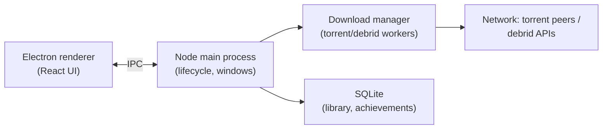

## For future agent
Case study of Hydra Launcher — a game launcher (Electron/React + TypeScript) with Steam-library integration and torrent-based downloads via Real-Debrid, one of 2024's fastest-growing repos (~30k+ stars in months). ⚠️ Note: its torrent functionality operates in legally gray territory depending on jurisdiction — study the ENGINEERING, not the use-case. Fetched 2026-08-24.

# Hydra Launcher

## What It Is

A desktop game launcher: library management, achievements tracking, torrent-based download engine, cross-platform (Windows/Linux). Stack: Electron + React + TypeScript + Node backend; downloads via aria2/torrent integration. Growth case-study itself: viral launch → rapid iteration.

## How It Works (architecture sketch)

**Load-bearing lessons**:
1. **Electron IPC discipline**: main vs renderer process split — the #1 Electron security boundary
2. **Long-running downloads as state machines**: pause/resume/retry across app restarts
3. **SQLite for desktop apps**: embedded storage done right
4. **Launch velocity**: README/branding/screenshots drove adoption — product surface matters ([[build-project-playbook]] learn-in-public)
5. **Tauri migration signals**: community pressure toward Rust/Tauri for memory footprint — watch how they handle it `(TBC)`

## Failure Modes

| Failure | Mechanism | Counter |
|---------|-----------|---------|
| Legal gray-zone conflation | Studying code read as endorsing piracy | Study architecture; keep personal projects clean-room |
| Electron security naivety | nodeIntegration enabled casually | Context-isolation + preload pattern from their code |
| Desktop-app scope creep | Launchers sprawl (settings→social→store) | Their module boundaries show containment |

**Premortem of studying it**: *Cloned, `npm install` wall (native modules), quit.* Counter: run their packaged release first, explore behavior, then source — matches [[modules/case-studies/index|study protocol]] build-first rule.

## Life Integration

- Relevant if a desktop-app idea ever enters your project list (your stock-agent could have a launcher-style shell someday)
- Metrics: IPC flow traced · download state-machine documented
- Interview story angle: "how a 2024 launch went viral" — distribution analysis for [[market-analysis-tech-2026]] thinking

## Example Checkpoint Questions

1. Why must torrent sessions survive app restarts — what state machine does that imply?
2. What does context-isolation prevent in Electron?
3. From a distribution lens: what made Hydra's GitHub launch explode? Which elements are replicable for YOUR launches?

## Cross-Vault Links

[[modules/case-studies/index|Field Index]] · [[build-project-playbook]] · [[systems-design-distributed]]