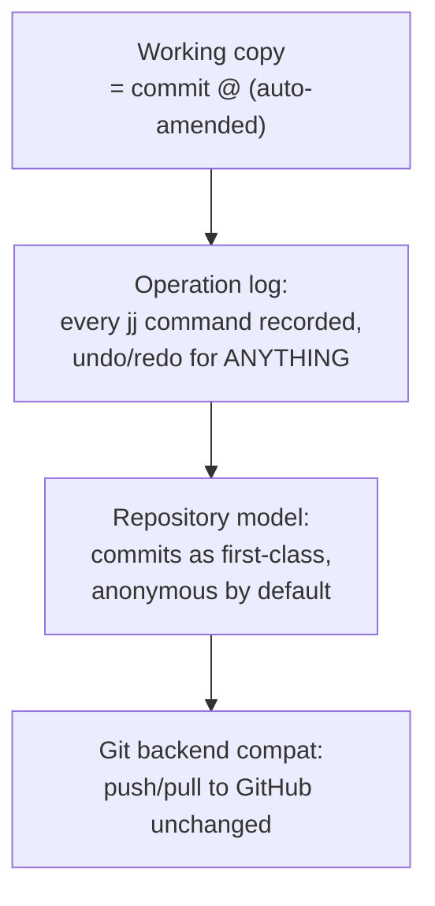

## For future agent
Case study of Jujutsu (jj) — a modern Git-compatible VCS written in Rust by a Google engineer, rethinking the developer workflow (working copy IS a commit; no staging area; automatic rebasing; operation log for undo). ~10k+ stars, real production adoption growing. This page extracts data-model lessons and the "rethink sacred UX" design courage.

# Jujutsu (jj) — Rethinking Version Control

## What It Is

A new version control system, Git-compatible on-disk (can co-exist with git remotes/repos), addressing Git's notorious UX sharp edges: the index/staging split, detached-HEAD fear, rebase conflicts, unsafe amend. Written in Rust. Design philosophy: **the working copy is itself a commit** — every state is versioned automatically.

## How It Works (conceptual)

**Load-bearing lessons**:
1. **Data-model-first design**: jj defined its commit graph + op-log BEFORE any CLI — the inverse of most tools. UX follows from the model.
2. **Killing the staging area**: `jj` treats work-in-progress as commits continuously — eliminates an entire class of "oops I lost staged changes"
3. **Undo as core primitive**: operation log makes time-travel universal, not `reflog` archaeology
4. **Compatibility as adoption strategy**: works with existing Git remotes — migration cost ≈ zero

## What To Extract

| Lesson | Application |
|--------|-------------|
| Model-before-UX design | Any tool/feature you build: define data invariants first |
| Automatic persistence | Your apps: autosave-as-default beats save-buttons |
| Sacred-cow auditing | "Why does Git have staging?" — asking why about EVERY inherited convention |
| Rust at scale | Real-world large Rust codebase reading practice |

## Failure Modes

| Failure | Mechanism | Counter |
|---------|-----------|---------|
| Muscle-memory war | Git habits fight jj idioms | Learn jj ON A THROWAWAY repo first; never mid-project |
| Early-adoption risk | Format/CLI churn pre-1.0 | Track releases; pin versions `(TBC: check current status)` |
| Conceptual confusion | Mixing git/jj mental models | One VCS per repo at any moment |

**Premortem**: *"Tried jj for a day, went back to git."* Mechanism: compared under deadline pressure with git reflexes intact. New VCS need a sandbox commitment window (2 weeks) to be fairly evaluated.

## Life Integration

- Perfect [[lr-build-your-own-x]] companion: build mini-jj concepts after studying theirs
- Vault synergy: your vault is Git-backed ([[Gotchas]] PowerShell notes) — a safe jj experiment target exists
- Metrics: sandbox-repo commands tried · data-model notes · one design-lesson applied to your own project

## Example Checkpoint Questions

1. What breaks in Git's model when you want "undo" that jj's operation log gives free?
2. Why does treating the working copy as a commit eliminate staging entirely?
3. Name one Git sacred cow jj rejected — and evaluate whether it was load-bearing or historical accident.

## Cross-Vault Links

[[modules/case-studies/index|Field Index]] · [[cs-dura]] (VCS-safety sibling) · [[software-dev-general]]