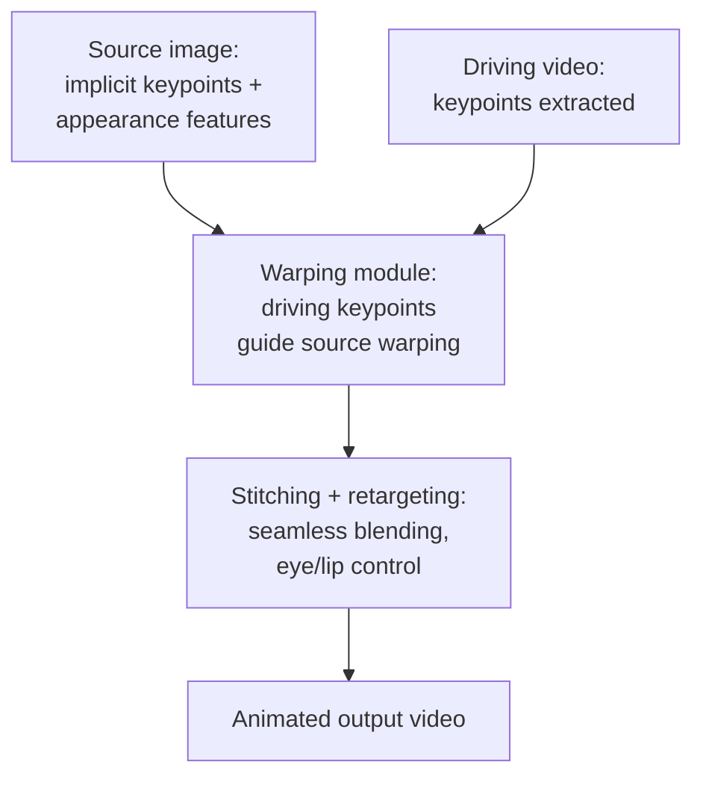

## For future agent
Case study of LivePortrait (Kuaishou Technology, CVPR-era 2024): efficient portrait animation — driving a source portrait's expressions from a driving video, with stitching and retargeting controls. ~15k+ stars. This page analyzes how modern research code gets PACKAGED for adoption (Windows installer, HuggingFace/ComfyUI integrations) and the ethics dimension of face-driven generative models.

# LivePortrait — Research Code as Product

## What It Is

Implicit-keypoint-based portrait animation: animate a still photo using a driving video's expressions/head pose. Efficiency-focused (real-time-ish on consumer GPUs) vs diffusion-heavy approaches. Released with paper + code + Windows one-click installer + HF Spaces demo + ComfyUI nodes.

## How It Works (conceptual)

**Load-bearing lessons**:
1. **Keypoints > pixels for controllability**: implicit keypoint representation gives precise steering where pure generative models hallucinate
2. **Packaging IS adoption**: same model class exists in many repos — this one won attention via installer + ComfyUI/HF integrations ([[build-project-playbook]] learn-in-public mechanism at research scale)
3. **Efficiency as a feature**: real-time-capable inference beat fancier-but-slow competitors in practical usage

## Failure Modes

| Failure | Mechanism | Counter |
|---------|-----------|---------|
| Deepfake misuse | Face-animation tech is inherently dual-use | Ethics rule: only your own face/likeness; never impersonation; label synthetic media |
| VRAM disappointment | Consumer-GPU limits on first run | Check model variant + resolution knobs; Colab fallback |
| Research-code drift | Fast-moving deps break installs | Use their pinned env/installer; don't upgrade mid-study |

**Premortem**: *"Cloned; CUDA error; abandoned."* Classic research-repo death. Their Windows installer exists to bypass exactly this — use the packaged path first, source second ([[modules/case-studies/index|study protocol]]).

## Study Value for This Vault

| Angle | Extraction |
|-------|-----------|
| MLE packaging | How a research repo becomes product: installer, demos, integrations checklist |
| CV depth | Keypoint/warping/stitching pipeline reading ([[python-datascience-topics]] CV section) |
| Ethics practice | Draft a responsible-use note for any generative feature YOU ship |

## Life Integration

- Optional DL-stage exploration (after [[roadmap-ml-engineer]] Stage 2); run packaged version once for intuition
- Metrics: pipeline stages explained · ethics-note drafted for own generative work
- Interview angle: "how would you package a research model for adoption?" — this repo is the reference answer shape

## Example Checkpoint Questions

1. Why do implicit keypoints give better control than end-to-end generation?
2. List three packaging decisions that made this repo adopted over equivalent research.
3. What policy would you write for a face-animation feature in YOUR app?

## Cross-Vault Links

[[modules/case-studies/index|Field Index]] · [[python-datascience-topics]] · [[roadmap-ml-engineer]] · [[mlops-production-deployment]]