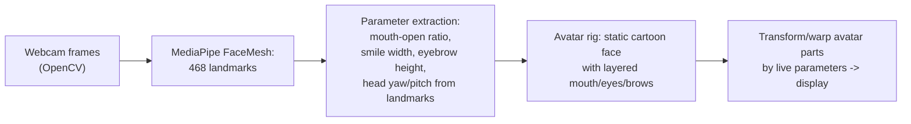

## For future agent
Deep-dive on LivePortrait's model/pipeline inventory (implicit keypoints, warping, stitching, retargeting; PyTorch + ONNX/TensorRT exports) and WHY each piece exists. Full model retraining ❌ — but TWO buildable versions exist: **(A) packaged-pipeline app** (run their installer behind your own Gradio UI) and **(B) classical "face puppet"** (MediaPipe landmarks driving an avatar — zero ML training). Ethics rules embedded.

# LivePortrait — Deep R&D

## Part 1 — The Code/Model Inventory

| Piece | Tech | Role |
|-------|------|------|
| **Feature extractor** | PyTorch CNN (ResNet-family backbone) | Encodes source face into appearance features |
| **Implicit keypoints + head pose estimation** | PyTorch heads | Sparse structural signal per frame (driving video) vs source |
| **Warping module** | Learned dense warping field | Deforms source features to match driving pose/expression |
| **Stitching module** | Small head predicting seam mask | Blends animated region into original image borders seamlessly |
| **Retargeting modules** | Eyes/lips-specific heads | User-controllable exaggeration of eye/lip motion |
| **Inference exports** | ONNX / TensorRT engines | Cross-platform speed (their Windows installer ships these) |
| **Packaging** | Gradio app · HF Spaces · ComfyUI nodes · Windows zip w/ pinned env | Adoption layer |

## Part 2 — Why That Design

| Choice | Rationale |
|--------|-----------|
| Implicit keypoints (not 3DMM meshes, not pure diffusion) | Controllable + fast: explicit structure steers generation precisely where end-to-end diffusion hallucinates |
| Efficiency focus | Real-time-capable inference beat prettier-but-slow competitors in actual usage |
| Stitching module | Naive warping leaves visible rectangle seams — seam prediction is what makes output shareable |
| Packaging blitz (installer/HF/ComfyUI) | Research adoption is won on setup-friction, not leaderboard alone |

## Part 3 — Can I Build My Own Version?

### Retrain their model: ❌ (data + compute)
### Version A: **Package-and-wrap pipeline** ✅ (1 weekend, after [[roadmap-ml-engineer]] Stage 2)
Run their Windows installer → wrap the CLI/inference in YOUR Gradio/FastAPI UI with batch mode + ethics watermark flag → deploy demo. You learn the packaging/adoption layer ([[mlops-production-deployment]]), not the modeling.

### Version B: **Classical Face Puppet** ✅ (flagship build — no training at all)

| Milestone | Deliverable |
|-----------|-------------|
| M1 | Landmarks drawn live on webcam feed |
| M2 | Mouth-open value drives avatar mouth swap/stretch |
| M3 | Eyebrows + head-tilt rotate avatar; smooth with EMA |
| M4 | Record "avatar mirrors me" clip; README |

This is the SAME conceptual shape as LivePortrait (drive parameters → deform target) via classical CV — and it demystifies what the learned modules replace.

### Failure modes while building

| Failure | Counter |
|---------|---------|
| Landmark jitter | EMA smoothing on parameters; it's also LivePortrait's stitching problem in miniature |
| Lighting sensitivity | Histogram-equalize frames; document failure lighting |
| Scope creep to full deepfake | v0.1 = mouth only. Ship that |

## Part 4 — Ethics Layer (non-negotiable)

- Only animate YOUR OWN face or consented/illustrative avatars
- Watermark/label synthetic outputs visibly
- Never political/impersonation content — this tech's misuse history is the reason the ethics note exists

## Life Integration

- Fits post-DL-stage as a fun applied project; webcam = daily test bench
- Metrics: puppet params driven live · packaging-A deployed URL · ethics-note written
- Interview angle: "I compared learned-warping vs landmark-classical approaches for face animation" — genuinely differentiated fresher story

## Checkpoint Questions

1. What does the stitching module fix that raw warping breaks?
2. In your classical puppet, which parameter was hardest to stabilize — why (noise structure)?
3. Where does LivePortrait's efficiency claim come from architecturally?

## Cross-Vault Links

[[modules/case-studies/index|Field Index]] · [[python-datascience-topics]] · [[roadmap-ml-engineer]] · [[mlops-production-deployment]]