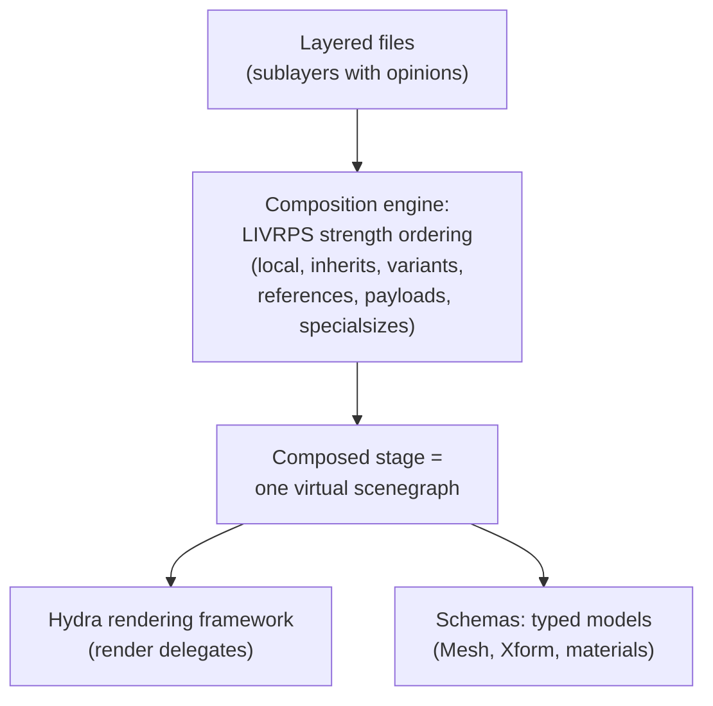

## For future agent
Case study of OpenUSD (Universal Scene Description) — Pixar's open-source scene-description/interchange ecosystem (C++/Python), now an Alliance-backed industry standard (AOUSD) powering Pixar's pipeline, NVIDIA Omniverse, Apple visionOS, and 3D web efforts. Fetched 2026-08-24. Lesson focus: how an in-house library becomes industry infrastructure.

# OpenUSD — Universal Scene Description

## What It Is

Pixar's 3D scene description and file-format ecosystem: layered/overridable scene graphs (.usd/.usda/.usdc/.usdz), composition arcs (references, variants, inherits), C++/Python APIs, and tools (usdview). Originated for *Toy Story*-era pipelines; open-sourced 2016; now the interoperability backbone of modern 3D (film, games via Omniverse, spatial computing).

## How It Works (conceptual architecture)

**Load-bearing lessons**:
1. **Non-destructive layering**: opinions override by strength order instead of editing originals — the same pattern as config overlays, CSS cascades, Git branches. USD industrialized "override culture."
2. **Interchange formats win ecosystems**: whoever defines the FILE FORMAT owns collaboration. USD did for 3D what JSON did for web APIs.
3. **20-year API patience**: USD evolves slowly and compatibly — infrastructure code has a different quality bar than apps.

## What To Extract

| Lesson | Application |
|--------|-------------|
| Composition-over-modification design | Your configs/features should layer overrides, not fork copies |
| Schema-first thinking | Define data contracts before writing services |
| Ecosystem strategy | Formats/tools beat point solutions for leverage |
| Large C++ codebase navigation | Schemas → lib/usd core → imaging layers as reading map |

## Failure Modes

| Failure | Mechanism | Counter |
|---------|-----------|---------|
| Build-system wall | Heavy deps (Python bindings, materialx…) | Use prebuilt binaries/usdview first; build from source only when needed |
| Concept overload | LIVRPS composition order memorized before use | Learn ONE arc at a time in usdview; references first |
| No 3D context | Studying without any scene to play with | Only enter this case study if graphics interest is real — else skim lessons table |

**Premortem**: *"Tried building USD from source for two days; gave up."* The README's quick-start path (prebuilt + usdview on sample scenes) exists precisely for this. Study the CONCEPTS through the viewer, source second.

## Life Integration

- Graphics-curious track only; not interview-relevant for your current targets unless 3D calls later
- Metrics: usdview sessions · composition-arcs understood (target: references + variants)
- Interview story angle even for non-graphics roles: "how an internal tool became an industry standard" — org-design narrative

## Example Checkpoint Questions

1. Explain sublayers + opinions to a friend using Google-Docs-suggestion analogy.
2. Why do industries standardize on interchange formats? Name two USD-analogues outside graphics.
3. What does Hydra's render-delegate design decouple?

## Cross-Vault Links

[[modules/case-studies/index|Field Index]] · [[software-dev-general]] · [[systems-design-distributed]]