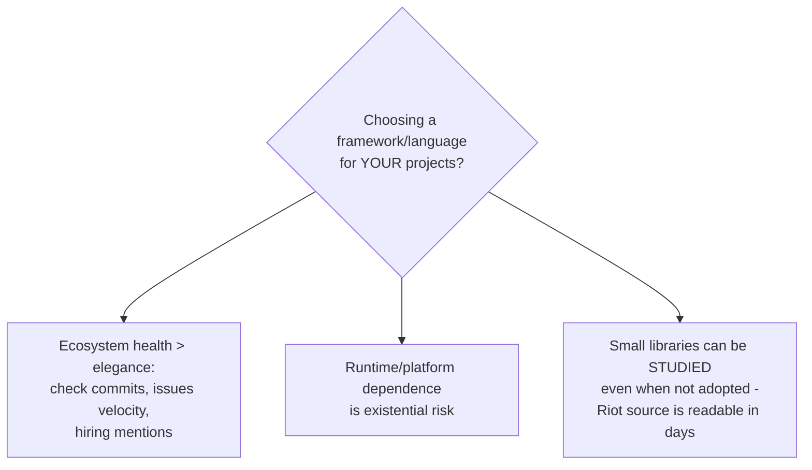

## For future agent
Two lifecycle case studies combined — both teach through what they BECAME rather than what they are. Riot.js: minimal component-based UI library (~2013–2020s) that predates/parallels the component era, now low-activity. ActionScript4: Adobe's research spec for a modernized ActionScript that never shipped a product. Together: how frameworks compete, and how languages/platforms die. Study value = ecosystem-strategy wisdom.

# Riot.js + ActionScript 4 — Lifecycle Studies

## Riot.js — The Minimal Component Library

**What it is/was**: "simple and elegant component-based UI library" — custom components, concise syntax, tiny size (~few KB), years before React's dominance solidified. Custom tags with scoped styles, observer pattern, no virtual DOM.

**Architecture sketch**: custom-tag compiler → runtime mounts components → observable store → DOM updates directly.

| Lesson | Detail |
|--------|--------|
| Minimalism as thesis | Proved components needn't cost 40KB+ — influenced later "tiny framework" genre |
| Ecosystem beats elegance | Superior design lost to React's ecosystem gravity (tooling, hiring pool, community) |
| Maintenance reality | Low activity ≠ failure; mature libraries enter maintenance mode legitimately |

### Failure modes studying it
- **Nostalgia adoption**: building new products on declining ecosystems → check activity/health BEFORE adopting any library
- **Design-only admiration**: reading source without building one mini-app in it → build a todo in Riot once to feel its model

## ActionScript 4 — The Language That Never Shipped

**What it is/was**: Adobe research project (~2017–2019) specifying a modernized ActionScript — static types, better performance model — intended to revive Flash-era development after Flash's browser death sentence (2017 EOL). Spec + prototype tooling; no mainstream product resulted.

| Lesson | Detail |
|--------|--------|
| Platform death kills languages regardless of quality | AS was competent; the RUNTIME (Flash Player) died → language died |
| Spec-first risk | A beautiful spec without shipping runtime/community = museum piece |
| Migration economics | Existing devs had no migration incentive post-EOL |

### Failure modes studying it
- Spec-reading rabbit hole without purpose → extract only: WHY did each revival attempt fail?
- Cynicism overdose → balance with live-language study

## Combined Life Lessons

**Premortem (studying these)**: *Week on Riot internals + AS4 spec; zero application.* These are strategy case studies — cap study at 2 sessions each; extraction target is the ecosystem-wisdom table above, not fluency.

## Life Integration

- Framework-selection checklist for every future project: activity · ecosystem · platform-dependence risk
- Metrics: selection-checklist applied to your next stack decision
- Interview angle: senior-sounding answers about why technologies win/lose ([[market-analysis-tech-2026]] thinking)

## Example Checkpoint Questions

1. Name two technically-elegant tools that lost to ecosystem gravity — including one from YOUR own experience.
2. What single dependency killed ActionScript? What's the equivalent existential dependency in YOUR current stack?

## Cross-Vault Links

[[modules/case-studies/index|Field Index]] · [[web-development-resources]] · [[languages-polyglot]] · [[market-analysis-tech-2026]]