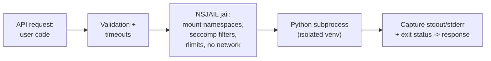

## For future agent
Case study of snekbox — Python Discord's sandboxed arbitrary-Python-code executor (NSJAIL-based, runs untrusted code in isolated containers), powering their bot's `!eval` command for millions of executions. Small codebase, deep security lessons. Fetched 2026-08-24.

# Snekbox — Sandboxing Untrusted Code

## What It Is

An HTTP service that executes arbitrary user-supplied Python safely: receives code via REST (`POST /eval`), runs it inside an NSJAIL-sealed environment (namespaces, seccomp, resource limits, no network), returns stdout/stderr with timeouts. The infrastructure behind Python Discord's eval bot — battle-tested against adversarial users at scale.

## How It Works (conceptual)

**Load-bearing lessons**:
1. **Defense in depth**: not one wall but stacked walls — container isolation + syscall filtering + resource caps + timeouts + network removal. Any single layer WILL eventually fail.
2. **Assume hostile input always**: their threat model treats every request as an attack (fork bombs, infinite loops, escape attempts) — the correct default for public endpoints
3. **Small surface discipline**: the service does ONE thing; every feature request expands attack surface and gets scrutinized
4. **Real-world hardening**: issues/issues-closed history is a free course in "what attackers actually try"

## What To Extract

| Lesson | Application |
|--------|-------------|
| Sandbox design pattern | Any feature executing user input (your future bots/apps) |
| Timeout + rlimit everywhere | Every script-runner you build |
| Threat-model-first design | Write the attack list BEFORE the feature |
| FastAPI service shape | Clean small-service reference ([[languages-python-advanced]]) |

## Failure Modes

| Failure | Mechanism | Counter |
|---------|-----------|---------|
| "Sandboxed enough" illusion | Rolling your own isolation with subprocess alone | Never hand-roll; use NSJAIL-class tools |
| Studying without deploying | Security concepts stay theoretical | Deploy snekbox locally; try to break YOUR instance |
| Escape-attempt curiosity | Testing escapes against OTHERS' infra | Attack only your own sandbox — legally and ethically |

**Premortem**: *"Read the README, understood nothing about NSJAIL."* NSJAIL requires namespace/seccomp background — pair this case study with a Linux namespaces primer first ([[systems-design-distributed]] foundations).

## Life Integration

- Perfect companion to any eval/AI-agent feature you build (agents running code = snekbox problem)
- Metrics: local instance deployed · own attack-attempts logged (fork bomb? network probe?) · defense layers named from memory
- Interview story: "I ran a sandbox and attacked it" beats any certification

## Example Checkpoint Questions

1. List five isolation layers snekbox stacks — what does each block specifically?
2. Why is "no network" critical for code-execution sandboxes? Name two exfiltration paths it kills.
3. Your AI agent needs to run generated code — walk your sandbox checklist.

## Cross-Vault Links

[[modules/case-studies/index|Field Index]] · [[systems-design-distributed]] · [[modules/retrieval-agent/overview]] (agent-tooling sibling) · [[languages-python-advanced]]