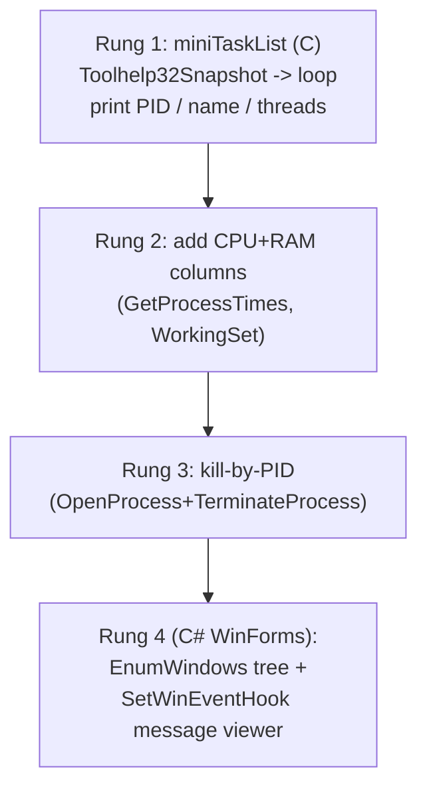

## For future agent
Deep-dive on the Windows-internals pair. Adds exact API/code inventory (what calls make process tools and message spies work), WHY native C/C++ is mandatory there, and a buildable ladder — **miniTaskList in C → window-message viewer in C#** — both directly buildable on your own machine this week. Feeds [[lr-build-your-own-x]].

# Windows Internals Tools — Deep R&D

## Part 1 — The Code Inventory

### System Informer (ex-Process Hacker)
| Layer | Tech | What's There |
|-------|------|--------------|
| **phlib** | C utility library | Process/thread/module enumeration, symbol handling, provider loops |
| **SystemInformer.exe** | C + custom UI toolkit | The GUI: tabs for processes/services/network/disk — every row backed by NT queries |
| **Plugins** | C | Extended views (Toolchain, DbgView…) |
| **KSystemInformer (driver)** | C kernel driver | Deep queries: handles, hidden-process detection; requires **test-signing or EV-cert signing** to load |

Key APIs its code leans on: `NtQuerySystemInformation` (SystemProcessInformation), `NtOpenProcess`/`NtQueryInformationProcess`, `EnumHandles` via `NtQuerySystemInformation(SystemHandleInformation)`, PDH/perf counters for graphs.

### Spy++-style tools
| Mechanism | What It Shows |
|-----------|---------------|
| `EnumWindows` + `GetWindowText`/`FindWindowEx` | The window tree |
| `SetWindowsHookEx`(WH_CBT/WH_CALLWNDPROC) or `SetWinEventHook` | Messages/events per window |
| Message-loop inspection | The WM_* stream (paint/mouse/key) that IS a GUI app's heartbeat |

## Part 2 — Why That Code Was Used

| Choice | Why |
|--------|-----|
| **C/C++ native** | Direct NT-API access without runtime layers; performance at 100k+ handle enumeration; malware-analysis credibility requires showing your own internals honestly |
| **Custom UI toolkit (not Qt)** | Zero external deps; precise control; decades-old codebase continuity |
| **Kernel driver (optional)** | User-mode APIs can be hidden-from by rootkits; driver sees ground truth — hence signing complexity |
| **Spy via hooks** | Windows' GUI = message queues; hooking intercepts the queue traffic itself |

**Mechanism insight**: Task Manager hides HOW it knows things. These repos expose that "knowing" = documented-but-obscure NT calls + privilege. Once you've called `NtQuerySystemInformation` yourself, the OS stops being magic.

## Part 3 — Can I Build My Own Version?

### Full System Informer: ❌ (years; driver signing gauntlet)
### Buildable Ladder: ✅ YES — on YOUR machine, starting tonight



| Rung | Skills Unlocked | Est. Time |
|------|-----------------|-----------|
| 1 | Toolhelp snapshot pattern; struct walking | 1 evening |
| 2 | Process timing math; deltas between polls | 1 evening |
| 3 | Handles, privileges, AccessDenied handling | 1 evening |
| 4 | Window/message model; managed↔native contrast | 1 weekend |

### Failure modes while building

| Failure | Counter |
|---------|---------|
| Snapshot handle leaks | CloseHandle discipline; verify via Task Manager handle counts |
| CPU% wrong (no delta baseline) | Sample twice; compute delta of kernel+user time over interval |
| AV flags your .exe | Expected for process-tampering tools; sign/exclude locally; explain in README |

**Premortem**: *Rung 1 works but "looks boring vs System Informer" → abandoned.* Counter: define success as RUNG COMPLETION, not feature-parity with a 15-year project.

## Part 3.5 — R&D Extension: The Actual Calls (Rung 1 in C)

```c
#include <windows.h>
#include <tlhelp32.h>

int list_processes(void) {
    HANDLE snap = CreateToolhelp32Snapshot(TH32CS_SNAPPROCESS, 0);
    if (snap == INVALID_HANDLE_VALUE) return 1;
    PROCESSENTRY32 pe = { .dwSize = sizeof(pe) };
    if (Process32First(snap, &pe)) {
        do {
            printf("%6lu %ls\n", pe.th32ProcessID, pe.szExeFile);
        } while (Process32Next(snap, &pe));
    }
    CloseHandle(snap);              // forget this = handle leak
    return 0;
}
```
CPU% (rung 2) needs TWO samples: `GetProcessTimes` → (kernel+user delta) / (wall-clock delta × cores). RAM: `GetProcessMemoryInfo` WorkingSetSize. Kill (rung 3): `OpenProcess(PROCESS_TERMINATE,...)` + `TerminateProcess` — expect ERROR_ACCESS_DENIED on protected processes; that error IS the lesson about privileges.

### Why System Informer needs a driver for some data
User-mode enumeration only sees what the kernel exposes to your token. Rootkits hook those exact APIs. A signed driver querying kernel structures directly bypasses user-mode hooks — hence KSystemInformer, hence signing pain (test-signing mode for dev, EV cert for distribution).

### Message-viewer rung (C#/WinForms)
`EnumWindows(callback)` builds tree; `GetWindowText`/`GetClassName` label nodes; `SetWinEventHook(EVENT_OBJECT_*, WINEVENT_OUTOFCONTEXT)` streams events; display WM_ names via a lookup table. First session goal: click around Notepad and SEE WM_PAINT storms.


## Part 4 — Life Integration

- Your daily OS becomes the lab: every weird slowdown = reason to open YOUR tool
- Metrics: rungs climbed · NT concepts explained from memory · own-tool usage during real slowdowns
- Career signal: "I wrote a process monitor in C" separates you from pure-web cohorts instantly

## Checkpoint Questions

1. Why does hiding a process from user-mode enumeration NOT hide it from a driver?
2. What exactly does Toolhelp32Snapshot capture at call-time — a live view or a copy?
3. In your Spy-rung, which WM_ message fires most often, and why does that explain GUI power costs?

## Cross-Vault Links

[[modules/case-studies/index|Field Index]] · [[software-dev-general]] · [[modules/programming/cs50/week-4-memory]] · [[lr-build-your-own-x]]