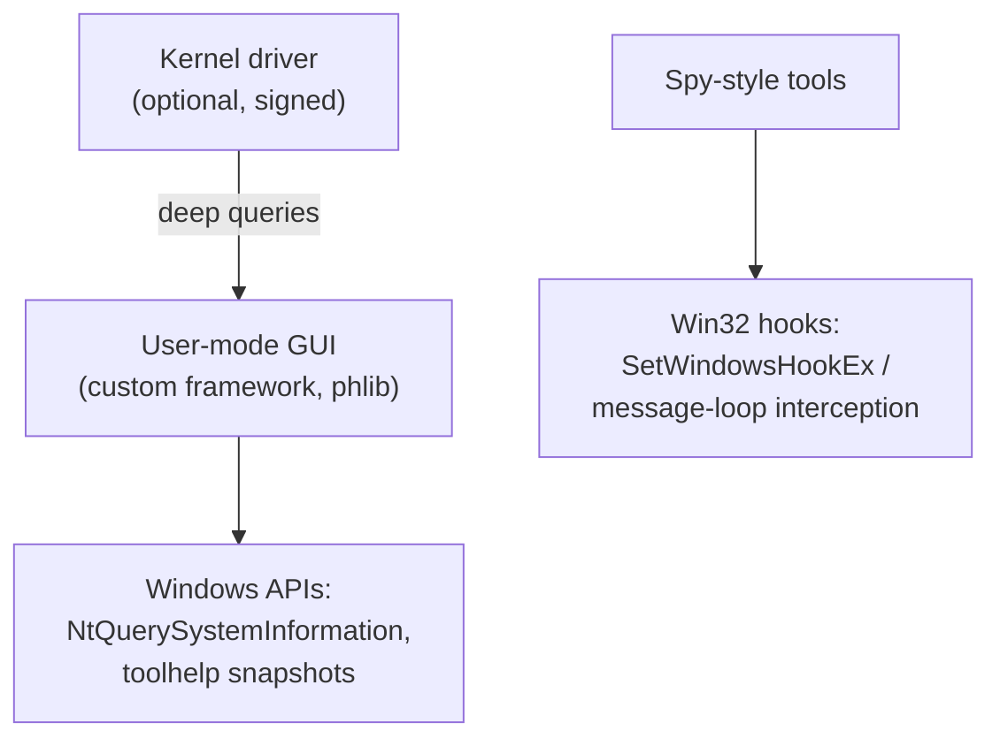

## For future agent
Two Windows-internals tools combined into one study (same domain, different scale): System Informer (formerly Process Hacker — the 100k-line task-manager-on-steroids, C/C++ with kernel driver) and Spy++-style message spy utilities. This page extracts Windows-native development lessons and malware-analysis relevance. You're ON Windows — these are the closest "how my machine actually works" sources.

# System Informer + Spy++ — Windows Internals

## What They Are

**System Informer** (ex-Process Hacker): multi-purpose system monitor/debugger/malware-detection tool. C/C++ with a custom UI framework and an optional kernel driver for deep inspection. The open-source reference for "how do process tools see everything?"

**Spy++ lineage**: Microsoft's classic utility to snoop window messages (every WM_PAINT, mouse move) per window; community reimplementations show the Win32 message-loop machinery transparently.

## How They Work (conceptual)

**Load-bearing lessons**:
1. **The API layer under Task Manager**: processes/threads/handles are queryable structures — demystifies "the OS"
2. **Kernel/user boundary**: why some data needs drivers (and signing pain)
3. **Every window is a message pump**: Spy-tools make the event model visible — pairs perfectly with the event-loop mental model from web dev ([[web-development-resources]])
4. **Native toolchain reality**: MSVC builds, driver signing, PHNT headers — what "systems programming on Windows" costs

## Failure Modes

| Failure | Mechanism | Counter |
|---------|-----------|---------|
| Driver rabbit hole | Kernel exploration without basics | User-mode APIs first; driver only after NT-concepts reading |
| Antivirus false alarms scare-off | Unsigned kernel tools trigger AV | Understand WHY (raw disk/driver access = suspicious pattern) |
| C++ overwhelm | 100k lines browsed randomly | Feature-trace: "list all processes" path through code |

**Premortem**: *Built System Informer; build errors; abandoned.* Their wiki documents build prereqs precisely — follow verbatim; the build IS lesson one in native toolchains.

## Life Integration

- Directly relevant environment knowledge (your daily OS!) — doubles as Windows-internals prep if security/sysadmin curiosity grows
- Metrics: features traced · NT-APIs understood · own mini-process-lister attempt (great [[lr-build-your-own-x]] candidate)

## Example Checkpoint Questions

1. Why can user-mode enumeration miss hidden processes that a driver catches?
2. In Spy terms, what actually happens between your click and a button's painted state?
3. Which single NT API answers "list every running process" — and what could break it?

## Cross-Vault Links

[[modules/case-studies/index|Field Index]] · [[software-dev-general]] · [[modules/case-studies/cs-jj-vcs|cs-jj]] (tool-building siblings)