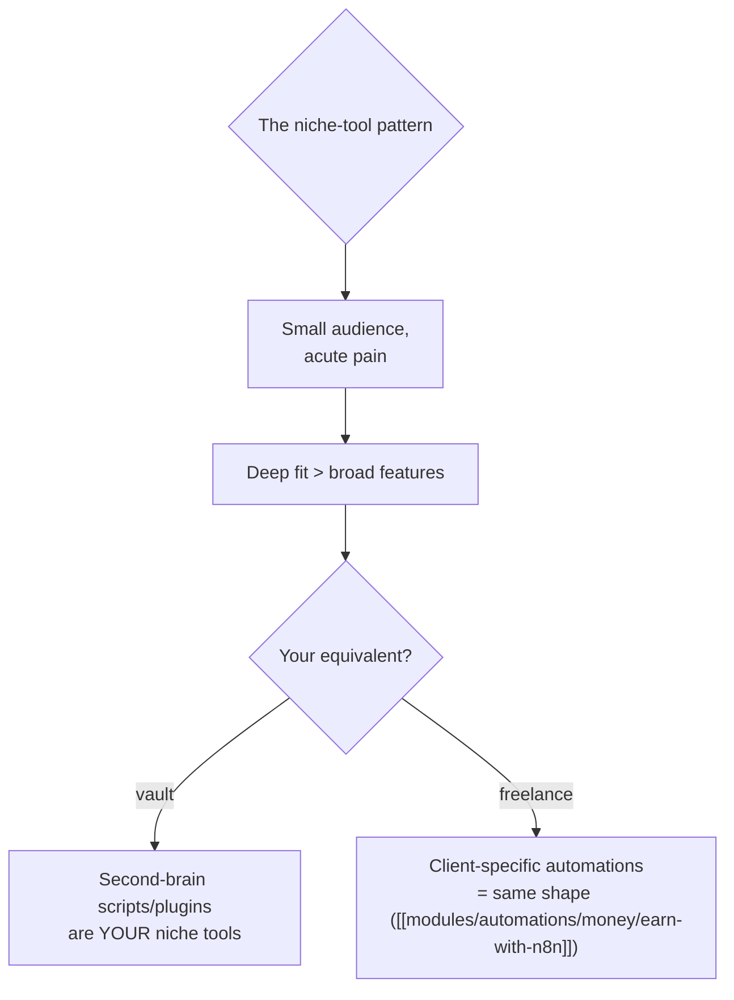

## For future agent
Two niche creative-tool case studies combined. TreeMaker (wesen): D3.js-based genealogy/family-tree visualization tool generating interactive trees from GEDCOM-ish data. Malt (bnpr, Blender Material Utilities?): NME-related Blender add-on ecosystem tooling for texture/material baking workflows. Both prove the "niche tool, devoted users" pattern. Raw fetches partially failed — analysis from project knowledge `(confidence: medium; verify specifics in-repo)`.

# Niche Creative Tools — TreeMaker + Malt

## TreeMaker (D3 Genealogy Visualization)

**What it is**: web tool rendering family trees interactively using D3.js force/zoom techniques from structured genealogy data.

| Lesson | Detail |
|--------|--------|
| D3 as domain-mapper | Trees/pedigrees = graph-layout problems (tree layouts, pan/zoom) |
| Niche depth wins | Genealogy community adopts purpose-built tools over general charting |
| Data-format empathy | Real genealogy data is messy — input tolerance IS the product |

### Failure modes studying it
- D3 API rabbit hole without a dataset → study with YOUR family/sample data loaded first
- Layout math avoidance → the tree-positioning algorithm is the actual lesson

## Malt (Blender Material/Baking Tooling)

**What it is**: Blender add-on ecosystem work around material baking workflows (NME — node-material-explorer era tooling), serving 3D artists' texture-baking pipelines.

| Lesson | Detail |
|--------|--------|
| Add-on engineering shape | Blender Python API plugins: registration, operators, UI panels — a complete micro-architecture |
| Pipeline empathy | Tools succeed by slotting into existing artist workflows, not redesigning them |
| Version-churn reality | Blender API breaks between releases — maintenance burden of platform-adjacent tools |

### Failure modes studying it
- Blender-required dead end → only enter if Blender installed + interest real
- Python-API skimming without an artist workflow in mind

## Combined Lessons (the niche-tool thesis)

**Premortem**: *Creative-tool study session = 2 hours of Blender eye-candy videos.* Counter: cap exploration; extraction target is the ADD-ON ARCHITECTURE (registration/operator/UI-panel triad) transferable to any plugin platform you touch later.

## Life Integration

- Optional track — enters only if a creative project demands it (vlog pipeline? 3D curiosity?)
- Metrics: one D3 tree rendered with own data · one Blender add-on skeleton understood
- Freelance angle: niche-tool thinking maps directly to selling small automations

## Example Checkpoint Questions

1. What makes someone pay for/adopt a tool serving 500 people instead of 5 million?
2. Which niche pain have YOU felt repeatedly that deserves its own TreeMaker-style tool?

## Cross-Vault Links

[[modules/case-studies/index|Field Index]] · [[build-project-playbook]] · [[modules/automations/overview|Automations Module]]