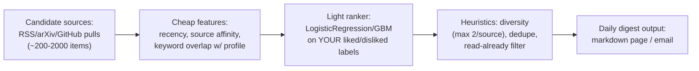

## For future agent
Full deep-dive on X/Twitter's recommendation algorithm: exact code inventory (languages, services, key components), WHY each technology choice was made, and a concrete build plan for the user's own two-stage recommender (full version impossible at home; a genuinely similar workflow IS buildable in Python). Pairs with [[ml-interview-playbook]] ML system design.

# X/Twitter Recommendation Algorithm — Deep R&D

## Part 1 — The Code Inventory (what code is actually there)

The repo (~66k stars) contains the serving-side of X's "For You" timeline plus supporting ML infrastructure:

| Component | Language/Stack | Role |
|-----------|---------------|------|
| **home-mixer** | Scala (Finatra/Thrift) | The mixer service: assembles candidate sets → runs ranking → applies heuristics/filters → final timeline. Built on Twitter's **product-mixer** component library (pipeline of `CandidatePipeline`s, `Hydrator`s, `Selector`s, `Decorator`s) |
| **cr-mixer** | Scala | Candidate-generation coordination layer: calls out to underlying candidate sources (tweet recommender, FRS, UTG) with per-user feature hydration |
| **Earlybird** | Java | Real-time search index — doubles as a *candidate source* for recent posts (inverted index over tweets, queried by relevance) |
| **User Tweet Graph (UTG)** / Gepher-based services | JVM | Social-graph candidate retrieval: "tweets from accounts/accounts you follow", FRS (follow recommendation service) for out-of-network expansion |
| **SimClusters** | Scala + Spark-trained models | Embedding model: users & tweets mapped into ~145k community clusters; candidates found via cluster proximity |
| **TwML** | Java/Scala ML runtime | Twitter's model framework for serving trained models inside services |
| **Heavy Ranker** | Trained NN (~48 outputs) | MaskNet-style multi-task network scoring every candidate for ~10 engagement types (fav, reply, dwell, negative…) |
| **Light Ranker** | Lighter model (early stage) | Cheap pre-scoring within candidate generation |
| **visibilitylib** | Scala | Visibility filtering: rules engine for mutes/blocks/quality filters applied post-ranking |
| **representation-manager** | Scala | Serves user/tweet embeddings from SimClusters etc. |
| **topic-social-proof** | Scala | Topic-level social proof signals for candidates |

**Training side** lives partly outside this repo (Hadoop/Spark batch pipelines historically; TwML training), but feature definitions and model wiring are visible.

**Build tooling**: Bazel (Twitter's monorepo standard) — building anything non-trivial locally is heavy.

## Part 2 — Why Each Choice Was Made (rationale R&D)

| Choice | Why | What It Buys | Cost |
|--------|-----|--------------|------|
| **Scala/JVM for serving** | Long-lived high-throughput services; Finagle ecosystem matured over a decade at Twitter | GC-tuned latency at scale; typed service contracts via Thrift IDL across hundreds of teams | Heavy toolchain; slow iteration vs Python |
| **Two-stage retrieval→ranking** | Cannot score 500M posts/day with a 48-output NN | Funnel: cheap recall (Earlybird/UTG/SimClusters pull ~1500) → expensive precision (Heavy Ranker) | Recall stage caps ceiling; misses hide upstream forever |
| **Multi-task outputs (48 heads)** | Engagement isn't one number; negative feedback needs explicit weight | Tunable product surface ("healthy conversation") without retraining per tweak | Multi-objective tuning complexity; weighting = editorial power |
| **SimClusters embeddings** | Sparse interpretable communities scale better than pure dense embeddings for explainability + cold-start | Human-readable "this tweet matches communities X,Y" | Staleness; batch recompute cadence |
| **Heuristic layer AFTER ranking** | Product rules change faster than models | Diversity/visibility tweaks ship in minutes, not training cycles | Rules accrete into unexplainable soup without governance |
| **Bazel monorepo** | Hundreds of engineers, one repo | Hermetic builds, cross-service type safety | Brutal for outsiders cloning the repo |

**Second-order insight**: notice what's ABSENT — no end-to-end deep learning pipeline in the open parts. Industrial recsys is systems engineering with models embedded, not models with systems attached.

## Part 3 — Can I Build My Own Version?

### Full version: ❌ impossible
Requires petabyte-scale event streams, Spark clusters, JVM fleet, trained-on-billions engagement data.

### Similar workflow: ✅ YES — genuinely similar shape, honest scale
**Project: "For-You feed for YOUR information diet"** — a two-stage recommender over sources YOU choose (RSS feeds, YouTube subscriptions export, arXiv listings, GitHub trending). Same architecture, your scale:

### Build plan (Python, ~4 weekends)

| Weekend | Deliverable |
|---------|-------------|
| 1 | Ingesters: fetch RSS/GitHub/arXiv → SQLite items table (id, title, text, source, ts) |
| 2 | Labeling loop: daily you mark 👍/👎 → training table grows; features: recency decay, source prior, TF-IDF cosine vs liked-centroid |
| 3 | Light ranker v1: sklearn LogisticRegression → GBM comparison; precision@10 evaluation on held-out days |
| 4 | Heuristics + digest renderer (Jinja → markdown/email); FastAPI `/feed` endpoint; deploy free tier |

**Failure modes while building**: label starvation (fix: seed with ⭐'d GitHub repos + saved articles); drift as interests shift (fix: time-decayed labels); metric self-deception (fix: held-out temporal split, never random).

**Interview yield**: this project legitimately supports "I've built a two-stage recommender with multi-signal ranking and temporal evaluation" — and you've read the industrial reference implementation to compare shapes.

## Part 4 — Checkpoint Questions

1. Map Twitter's funnel onto my mini version — which component corresponds to Earlybird? To visibilitylib?
2. Why does the Heavy Ranker have 48 outputs instead of one CTR score?
3. What breaks first in MY recommender if I stop labeling for a month?

## Cross-Vault Links

[[ml-interview-playbook]] · [[python-datascience-topics]] · [[mlops-production-deployment]] · [[modules/case-studies/index|Field Index]]