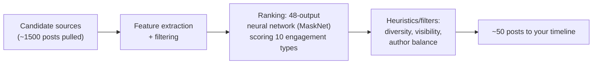

## For future agent
Case study of X/Twitter's open-sourced recommendation algorithm (released March 2023, ~66k stars). Real README structure fetched: Architecture → For You Timeline → Recommended Notifications → build/test. This page extracts the architecture lessons and the candidate-source→ranking pattern that dominates industrial recsys. Pairs with [[ml-interview-playbook]] system-design section.

# X/Twitter Recommendation Algorithm

## What It Is

The production source code behind X's "For You" timeline: Scala/Java services + ML models orchestrating a multi-stage recommendation pipeline over ~500M posts/day. Released for transparency after the 2022 acquisition — the highest-profile recsys codebase ever opened.

## How It Works (architecture)

Key components from the release: **Home Mixer** (the mixer service), **TwML** (ML model framework), candidate sources including **Earlybird** (search index for real-time retrieval), **UTG** (user tweet graph — social-graph candidates), **SimClusters** (embedding-based community clustering), **CR-Mixer** (candidate generation coordination layer).

**The load-bearing lesson**: retrieval and ranking are SEPARATE stages. You cannot score 500M posts; you cheaply narrow to ~1500 then expensively rank. This two-stage shape recurs in YouTube, LinkedIn, Amazon — it IS industrial recsys design ([[ml-interview-playbook]]).

## What To Extract From Studying It

1. **Two-stage pipeline discipline** (candidates → rankers) — name it in any ML-system interview
2. **Multiple engagement objectives** (fav/reply/dwell/negative signals) — single-metric thinking is fresher thinking
3. **Heavy heuristics AROUND ML**: social proof, author diversity, feedback fatigue — real systems are rules+models, not pure models
4. **Scala at scale**: JVM services with Thrift RPC — different from Python-notebook ML world
5. **Feature engineering as infrastructure**: TwML features versioned/served like products

## Failure Modes

| Failure | Mechanism | Counter |
|---------|-----------|---------|
| Reading code linearly | 100+ services overwhelm | Trace ONE feature: "how does a retweet get scored?" |
| Era assumption | Code frozen at open-source moment ≠ current X | Treat as architecture textbook, not live docs |
| Notebook-brain shock | No pandas here — production ML is distributed systems | Pair study with [[mlops-production-deployment]] concepts |

**Premortem of studying it**: *Cloned, overwhelmed by directory tree, quit.* Counter: the trace-one-feature protocol ([[modules/case-studies/index|study protocol]]) — enter through `home-mixer` service, follow one request.

## Life Integration

- Interview ammunition: "I've read Twitter's actual ranking code" + one specific insight = rare signal
- Study cadence: one service/week during MLE roadmap Stage 4–5
- Metrics: features traced end-to-end · architecture decisions explained in vault notes · interview mentions banked

## Example Checkpoint Questions

1. Why can't the heavy neural net score all 500M posts? Where does the funnel narrow?
2. Name three NON-model components in the pipeline and their jobs.
3. What engagement signals exist beyond likes — why does negativity weighting matter?

## Cross-Vault Links

[[python-datascience-topics]] (Recommender Systems) · [[ml-interview-playbook]] · [[systems-design-distributed]] · [[modules/case-studies/index|Field Index]]