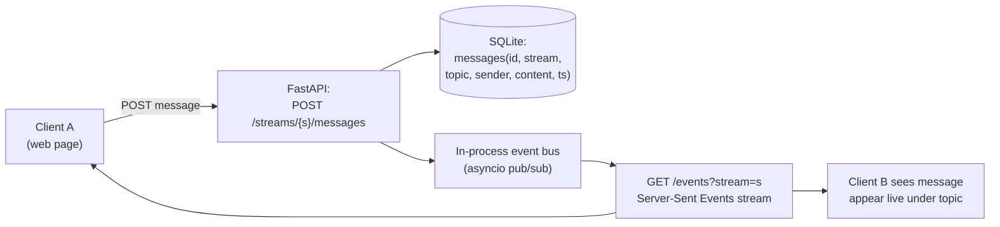

## For future agent
Deep-dive on Zulip's actual code organization and technology rationale (Django+Tornado split, RabbitMQ queues, mypy-strict culture), plus a buildable mini-chat — **"miniZulip": a topic-threaded chat with FastAPI + SQLite + SSE** — the single best portfolio-project candidate in this whole case-studies module. Feeds [[repo-fullstack-web-developer-path]] and [[build-project-playbook]].

# Zulip — Deep R&D

## Part 1 — The Code Inventory

| Component | Tech | Role |
|-----------|------|------|
| `zerver/` | Django (Python) | The heart: models (UserProfile, Stream, Recipient, Message…), REST API endpoints, views |
| `zerver/tornado/` | Tornado | Long-lived websocket connections — pushes events to clients; receives events via RabbitMQ |
| Queue workers | Python consumers over **RabbitMQ** | Async jobs: email, outgoing webhooks, thumbnailing, search index updates |
| `analytics/`, `corporate/` apps | Django | Stats collection; separated open-source/proprietary boundary |
| Frontend | TypeScript + React migration from legacy jQuery templates | Web client |
| Storage | PostgreSQL (+ memcached) | Denormalized reads where hot paths demand |
| Tooling | **mypy --strict**, 100%-coverage-on-new-code policy, custom lint bots | The famous quality gates |

**The message model insight**: Zulip routes every message through a generic `Recipient` table (stream / huddle / personal) — an indirection that makes permissions and threading uniform. Schema-first design visible in plain sight.

## Part 2 — Why That Stack Was Used

| Choice | Why | Trade-off Accepted |
|--------|-----|--------------------|
| **Django for CRUD/API** | Batteries: auth, ORM, admin; hiring pool | Monolith weight; async story historically weak |
| **Tornado beside it** | Django/WSGI can't hold thousands of live websocket connections cheaply | Two frameworks to operate — solved by queue handoff |
| **RabbitMQ between them** | DB write → event → fanout must be reliable & decoupled | Operational complexity (queues to monitor) |
| **Postgres denormalization** | Chat reads are hot paths ("latest 50 messages") | Write-time duplication vs read joins |
| **mypy strict + coverage gates** | Volunteer-driven codebase needs machine-enforced quality | Slower contribution velocity per PR — deliberately traded for sustainability |
| **Topic-threading schema** | Product differentiator (async conversations) | Harder mental model than channel-only chat |

**Second-order insight**: Zulip proves **process is architecture**. The same Django code without their gates would rot; the gates ARE why the monolith stays navigable.

## Part 3 — Can I Build My Own Version?

### Full version: ❌ (years, team)
### Similar workflow: ✅ YES — "miniZulip", the best portfolio project in this module

**Core spec** (Python, FastAPI or Django-lite):

| Milestone | Deliverable |
|-----------|-------------|
| M1 (weekend 1) | Streams + topics + messages CRUD; auth-lite (single user ok); tests |
| M2 (weekend 2) | Live updates via SSE; two browser tabs see each other |
| M3 (weekend 3) | Unread counts per topic; typing indicator (fun event-bus stretch) |
| M4 | Deploy free tier; README with GIF |

**Why topic-threading matters as a feature**: implementing Zulip's DIFFERENTIATOR (not another Slack clone) gives you a defensible interview narrative: "channels are synchronous noise; topics are async threads — here's how I modeled that in SQL."

### Failure modes while building

| Failure | Counter |
|---------|---------|
| Websocket rabbit hole | Use SSE first — one-way is enough for v0.1 |
| Auth sprawl | Single-user until M3; token after |
| Event-bus rewrite loops | asyncio.Queue-based bus is fine at your scale |

## Part 4 — Life Integration

- This can BE your group's project tracker (dogfooding!) — real users from day one
- Metrics: messages flowing, SSE reconnect robustness, tests passing
- Interview stories: schema decisions, SSE-vs-websocket tradeoff, concurrent-write handling ([[interview-counter-guide]] STAR bank)

## Checkpoint Questions

1. Why does Zulip need BOTH Django and Tornado — what breaks if events go straight through Django?
2. How would MY schema change if I added private groups tomorrow? Is that a migration or a redesign?
3. What did the Recipient-table indirection buy them that direct stream_id on messages wouldn't?

## Cross-Vault Links

[[modules/case-studies/index|Field Index]] · [[systems-design-distributed]] · [[languages-python-advanced]] · [[build-project-playbook]]