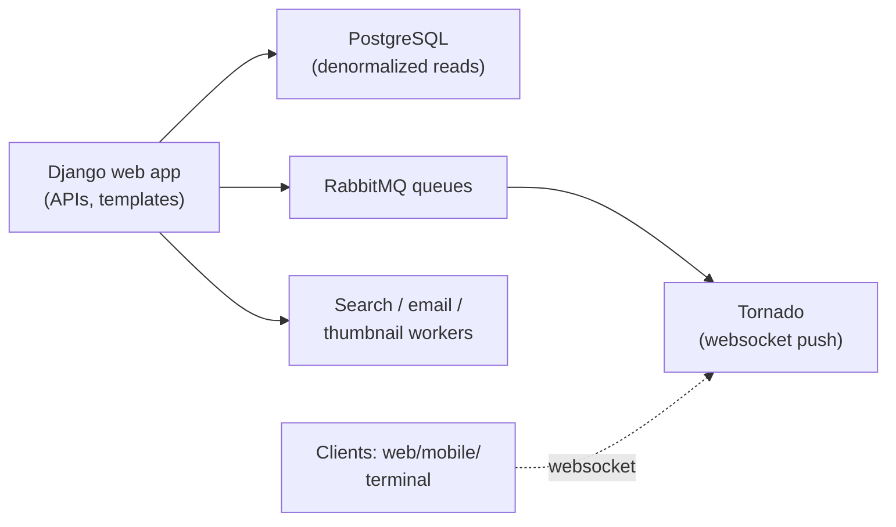

## For future agent
Case study of Zulip — the open-source team chat platform (Django/Python + PostgreSQL + RabbitMQ + Tornado websockets), ~20k stars, famous for engineering culture: 100% test coverage policy, strict type hints, world-class onboarding for new contributors. This page extracts monorepo-done-right lessons and contribution-path strategy.

# Zulip — Large Django Monorepo

## What It Is

A full Slack-class product: threaded-topic chat, real-time sync, mobile/desktop clients, self-hosting. Backend Django + Tornado; frontend legacy JS moving to TypeScript/React. Its distinguishing feature is ENGINEERING PROCESS: every PR requires tests, full type annotations, and lint-clean code — enforced by CI and famously helpful review bots.

## How It Works (architecture sketch)

**Load-bearing lessons**:
1. **Monorepo with tooling discipline**: one repo, strict typing (`--strict` mypy), coverage gates — proof that Python scales when process enforces quality ([[languages-python-advanced]] typing section)
2. **Real-time layer separation**: Django handles CRUD; Tornado owns live events via queue — clean async/sync split
3. **Onboarding as a feature**: their docs claim productive-first-PR in hours — contributor experience engineered deliberately
4. **Topic-threaded model** as product differentiation — schema designed around it from day one

## What To Extract

| Lesson | Application |
|--------|-------------|
| Test-coverage-as-culture | Your projects: coverage gates in CI ([[build-project-playbook]]) |
| Type-hint everything | Gradual strictness path that actually completes |
| First-contribution UX | Design your repos' READMEs/contributing for strangers |
| Queue-decoupled realtime | Pattern for any chat/notification feature you build |

## Failure Modes

| Failure | Mechanism | Counter |
|---------|-----------|---------|
| Codebase overwhelm | 100k+ lines across apps | Trace ONE flow: "what happens when I send a message?" |
| Setup abandonment | Dev env = many services | Their dev-env docs are excellent; follow verbatim, resist shortcuts |
| Contribution stall | PR opened → silence → drift | Read their contributing guide FIRST; small fixes move fastest |

**Premortem**: *Cloned Zulip to "study large codebases"; never ran it.* Counter: running it IS the study — provisioning teaches the architecture better than reading ([[modules/case-studies/index|study protocol]]).

## Life Integration

- Best-in-class target for first open-source PR ([[curated-reading-list]] First Timers entry) — their reviewer culture welcomes newcomers
- Architecture-study cadence: one subsystem/month during backend phases
- Metrics: local instance running · flows traced · (stretch) merged PR

## Example Checkpoint Questions

1. Why does Zulip need BOTH Django and Tornado? What does each own?
2. How does topic-threading shape its database schema differently than Slack's model?
3. What three practices make its onboarding famous — and which could your repo adopt this week?

## Cross-Vault Links

[[modules/case-studies/index|Field Index]] · [[systems-design-distributed]] · [[languages-python-advanced]] · [[modules/careers/index|Careers Hub]]