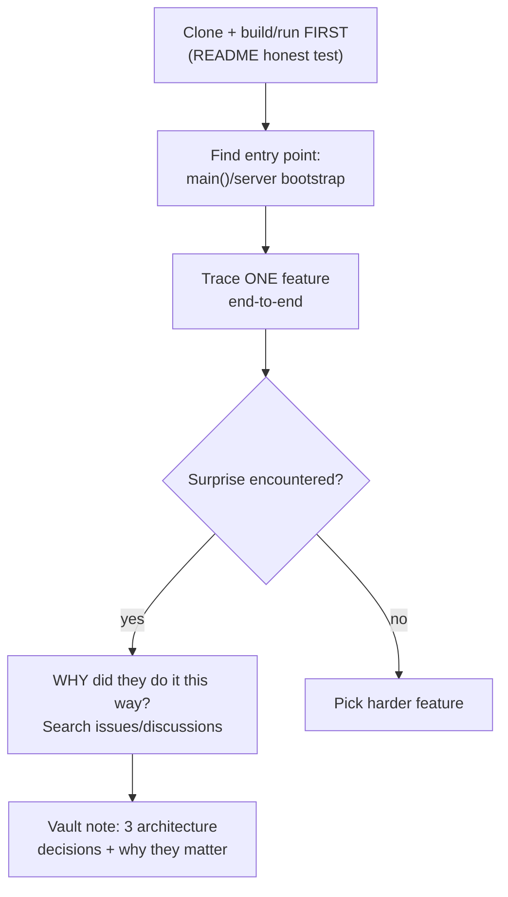

## For future agent
Case studies of real open-source codebases selected by the user (2026-08-24). Each page analyzes: what it is, how it works, what a student should extract from studying it, historical/learner failure modes, and reading order. These are ARCHITECTURE lessons — pair each with hands-on exploration per [[build-project-playbook]].

# Open-Source Case Studies — Field Index

## Production ML at Scale

| Page | Codebase | Core Lesson |
|------|----------|-------------|
| [[cs-twitter-algorithm]] | X/Twitter recommendation algorithm | Heavy candidate-source → ranking pipeline at industrial scale |

## Historic / Foundational Systems

| Page | Codebase | Core Lesson |
|------|----------|-------------|
| [[cs-apollo-11]] | Apollo Guidance Computer source | Software engineering under extreme constraints |
| [[cs-openusd]] | Pixar Universal Scene Description | Interchange formats as industry infrastructure |

## Full Applications (architecture study)

| Page | Codebase | Core Lesson |
|------|----------|-------------|
| [[cs-zulip]] | Team chat platform | Large Django monorepo done right; open-source governance |
| [[cs-hydra-launcher]] | Game launcher | Electron→Tauri migration; desktop distribution |
| [[cs-systeminformer]] | Windows system monitor | Native Windows internals at scale |
| [[cs-spyplusplus]] | Windows message spy utility | Small focused native tooling |
| [[cs-snekbox]] | Sandboxed Python executor | Security sandbox design |
| [[cs-liveportrait]] | Portrait animation (Kuaishou research) | Research-code → usable product packaging |

## Tools & Version Control Innovation

| Page | Codebase | Core Lesson |
|------|----------|-------------|
| [[cs-jj-vcs]] | Jujutsu VCS | Rethinking Git's data model |
| [[cs-dura]] | Crash-proof git snapshots | Tiny-tool product thinking |
| [[cs-z-jump]] | `z` directory jumper | Frecency algorithms in 100 lines |

## Language & Ecosystem Artifacts

| Page | Codebase | Core Lesson |
|------|----------|-------------|
| [[cs-riot-js]] | Riot.js component UI library | Minimal framework design; lifecycle of libraries |
| [[cs-actionscript4]] | Adobe ActionScript 4 spec | How languages die; spec-driven design |
| [[cs-treemaker-malt]] | TreeMaker (genealogy viz) + Malt (Blender baking) | Niche creative-tool engineering |

## Cautionary / Gray-Zone

| Page | Codebase | Core Lesson |
|------|----------|-------------|
| [[cs-gpt4free]] | gpt4free API reverse-engineering | Legal/ethical boundaries in gray-zone tooling ⚠️ |
| [[mod-dh note]] (in productivity) | Colemak Mod-DH | Ergonomics as long-term optimization |

## Study Protocol (any codebase)

Cross-links: [[systems-design-distributed]] · [[modules/data-science/index|DS Hub]] · [[build-project-playbook]]