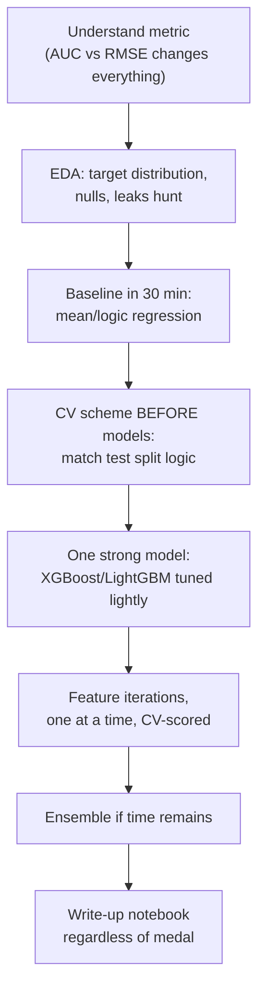

## For future agent
How to actually use Kaggle and practice platforms as progression systems rather than time sinks: the three Kaggle usage modes (learn/compete/contribute), a competition playbook with standard pitfalls, and platform-specific practice ladders. Links into [[python-datascience-topics]] datasets/repos.

# Kaggle & Practice Arena Guide

## Three Modes of Kaggle (most people only know mode 1)

| Mode | Goal | How |
|------|------|-----|
| **Learn** | Skills via micro-courses + notebooks | [Kaggle Learn](https://www.kaggle.com/learn/) badges: Python, pandas, ML, feature eng — each ~4h, certificate |
| **Compete** | Pressure-testing against real leaderboards | Start with *Playground* series (teaching comps), then Getting Started comps (Titanic, House Prices) |
| **Contribute** | Portfolio artifacts | Public notebooks with clean EDA + clear storytelling; dataset curation |

**Portfolio truth**: a well-written public notebook on a messy real dataset impresses interviewers more than a bronze medal explanation you can't defend. Notebooks are readable proof of thought process.

## Competition Playbook (first tabular comp)

## Standard Competition Pitfalls

| Pitfall | Damage | Counter |
|---------|--------|---------|
| **Leaderboard chasing / overfitting public LB** | Great rank → terrible shake-up | Trust local CV over public LB; public set is small by design |
| Data leakage (feature contains target ghost) | Perfect CV, fails for real | Suspicion list: post-outcome fields, IDs, aggregates computed on full data |
| Metric blindness | Optimizing RMSE when comp uses MAE | Read the metric section FIRST, implement your own scorer |
| Notebook copying without understanding | Can't explain anything later | Rebuild one top solution yourself from blank notebook |
| Skipping write-ups | Missing the actual lesson | Post-mortems teach more than the comp itself |

## Practice Ladders Beyond Kaggle

| Platform | Use For | Ladder |
|----------|---------|--------|
| [Exercism](https://exercism.org) | Language fluency + mentorship | Easy → medium tracks; read 2 mentored solutions per exercise |
| [Codewars](https://www.codewars.com) | Daily warmup habit | One kata/day inside never-zero minimum |
| LeetCode | Interview patterns | [[dsa-interview-playbook]] ladder, not random grind |
| [StrataScratch](https://www.stratascratch.com) / SQLZoo | SQL interview realism | Company-tagged questions after basics |
| [HackerRank](https://www.hackerrank.com) | India placement screening format | Aptitude + cert practice before service-company drives |

## Quit Points & Fixes

| Quit Point | Fix |
|------------|-----|
| Stuck at bottom half of first comp | Expected. Reframe goal: "ship one clean notebook," not "win" |
| Feature-engineering overwhelm | Master 5 moves: datetime decomposition, categorical target encoding, aggregations per group, text stats, interaction ratios |
| Comparing to grandmasters | They have years; compare to last month's CV scores ([[how-to-self-teach]] scoreboard rule) |

## Example Self-Check Questions

1. Your private LB dropped 500 places from public. What happened? *(overfit public split)*
2. Why can a feature correlated with the target be a leak? Give one real-world case. *(e.g., 'days_since_last_purchase' computed using data after churn date)*
3. When would you prefer MAE over RMSE as your own model-selection metric?

## Cross-Vault Links

- [[roadmap-data-scientist]] Stage 3–4 · [[build-project-playbook]] — write-up layer
- [[curated-reading-list]] — "What I learned from Kaggle contests" essay
- [[kaggle-and-practice-guide]] is referenced by [[roadmap-data-scientist]]