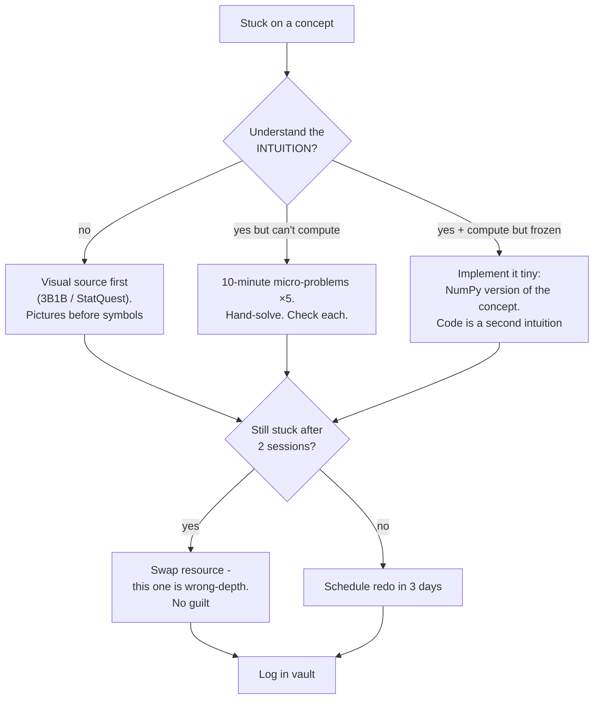

## For future agent
Deep edition of the math survival guide. Adds mechanism-level analysis of WHY math study fails for self-taught learners (the three failure mechanisms), per-topic failure modes with counters, the full quit-point map with physiological/psychological early warnings, premortem, defeat-tackling flowcharts, practice protocol R&D (why hand-solving beats watching), and life integration. Feeds [[roadmap-data-scientist]] Stage 2 and [[roadmap-ml-engineer]].

# Math for ML Survival Guide — Deep Edition

## Part 1 — Why Math Study Fails (the three mechanisms)

1. **Wrong-depth resources**: most "ML math" courses aim at math majors (proofs) or tourists (hand-waving). You need the middle: computational fluency + geometric intuition. Using either extreme produces quitting.
2. **No application loop**: abstract input with no model-building output = zero retention signal. The brain prunes unused abstractions aggressively.
3. **Fluency illusion from watching**: lectures produce recognition ("that looks familiar"), not recall ("I can produce this"). Math is a performance skill like scales on an instrument.

Everything below is engineered against these three.

## Part 2 — The Honest Depth Table

| Topic | Needed Depth | Skippable | Used In |
|-------|-------------|-----------|---------|
| Probability | Distributions, conditional prob, Bayes, expectation/variance | Measure theory | Everything; Naive Bayes; diagnostics |
| Statistics | Sampling, CIs, hypothesis tests, p-values DONE RIGHT, A/B logic | ANOVA derivations | Evaluation; experimentation; interviews drill this |
| Linear algebra | Vectors/matrices as transforms, matmul, eigen-intuition via pictures | Large hand computations | Every model's internals; PCA; embeddings |
| Calculus | Derivative meaning, chain rule fluency, partials, gradient direction | Epsilon-delta; integration technique zoo | Backprop IS chain rule; GD IS calculus |
| Optimization | Local minima, convexity idea, learning rate as step size | Lagrange multipliers (until SVM depth) | All training |

## Part 3 — Failure Modes Per Topic

| Topic | Standard Death | Early Warning | Counter |
|-------|---------------|---------------|---------|
| Probability | Combinatorics rabbit hole | Weeks counting card hands | Cap combinatorics at 1 week; Bayes problems matter more |
| Statistics | p-value misinterpretation compounding | Explaining p as "P(H0 true)" | Drill the ONE correct sentence until reflexive |
| Linear algebra | Proof drowning in Axler-style texts | Highlighting without solving | Switch to visual-first (3B1B) + MIT 18.06 problem sets |
| Calculus | Integration technique zoo | Studying trig-sub for no reason | Only derivatives + chain rule path needed now |
| Optimization | Symbolic abstraction spiral | No numerical experiments | Always pair symbol ↔ 5-line NumPy experiment |

### Premortem
*Month 4; math abandoned.* Autopsy: started with a proof-heavy linear algebra course (mechanism #1), watched-only mode (mechanism #3), zero connection to any running model (mechanism #2). Each was visible in week 1 as: no solved problems on paper.

## Part 4 — Quit-Point Map With Early Warnings

| Quit Point | Typical Timing | What's Really Happening | Physiological/Psych Warning | Counter |
|------------|---------------|------------------------|------------------------------|---------|
| "Later-me will do math" | Week 1 | Later never comes; no anchor exists | Calendar has no math slot | Anchor: no model trained this month without its math note alongside |
| Proof drowning | Any LA course | Wrong-depth resource (mechanism #1) | Reading same page 4× | Resource swap within 48h — speed matters more than sunk cost |
| Symbol shock | First ML paper | Notation unfamiliarity masquerading as stupidity | Avoidance of papers entirely | Notation sheet in vault; decode 5 symbols/day |
| "Why do I need this?" | Mid-calculus | No application loop (mechanism #2) | Boredom despite understanding | Pair every topic to its model: chain-rule day = backprop day |
| Gatekeeping exposure | Forums | "You NEED measure theory" voices | Comparison anxiety spike | The depth table IS the honest bar; absolutists optimize for their journey |

## Part 5 — Defeat-Tackling Flowchart

## Part 6 — Practice Protocol (the R&D core)

Math retention requires retrieval + spacing + generation:

1. **Per concept**: 5 hand-solved micro-problems (watching ≠ solving)
2. **Then ONE implementation from scratch**: gradient descent on paper → 10-line NumPy fitting y=mx+b
3. **Card every formula you failed to recall** (Anki, LaTeX cards)
4. **Weekly re-derivation from memory**: backprop for a 2-layer net is THE canonical drill
5. **Teach-it test**: explain the concept to your daily-note rubber duck in plain words; gaps become visible instantly

**Spacing schedule**: new topic day 1 → micro-review day 3 → problem-set day 7 → re-derive day 21 → teach day 45.

## Part 7 — Life Integration

| Anchor | Practice |
|--------|----------|
| Fixed morning slot (25 min) | Current math topic — before college drains cognition |
| College synergy | Engineering-math coursework counts: map SPM/engineering-math topics onto this table ([[modules/mathematics/formula-sheet-master]] is your JEE-level recall base) |
| Exam weeks | Anki-only maintenance; the deck preserves you |
| Weekly review item | One re-derivation + which quit-point am I near? |

## Part 8 — Example Checkpoint Questions

1. Why NEGATIVE gradient? What would moving WITH the gradient do, literally?
2. μ=50, σ=5: what range holds ~95%, and which theorem guarantees it?
3. A(3×4)·B(4×2): shape of AB? Give one modeling situation where AB≠BA bites.
4. Friend says "p=0.03 means 97% chance my hypothesis is true." Correct them precisely.
5. Eigenvector of a covariance matrix — what does it physically represent in PCA?

## Cross-Vault Links

[[roadmap-data-scientist]] · [[roadmap-ml-engineer]] · [[ml-theory-and-moocs]] · [[how-to-self-teach]] · [[modules/mathematics/overview]]