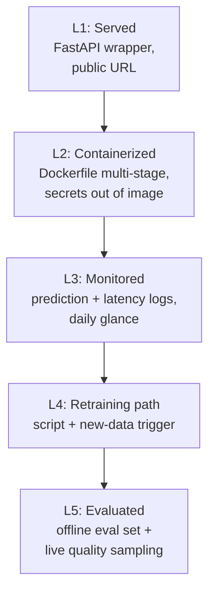
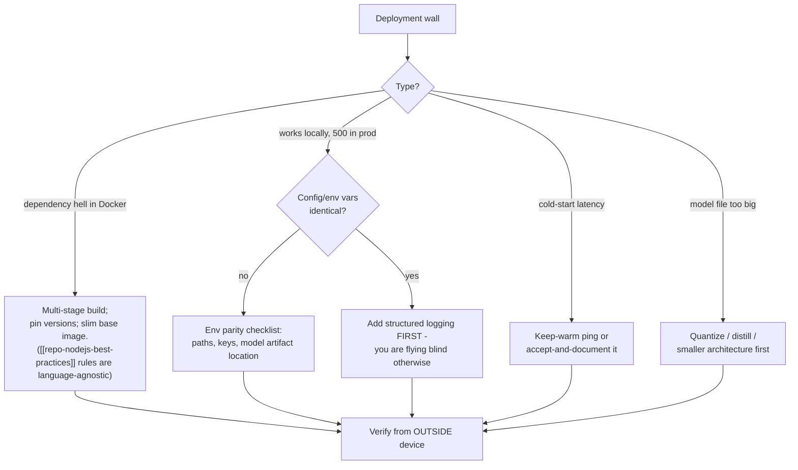

## For future agent
Deep edition of the MLOps page. Adds the production-failure taxonomy (the ways deployed models actually die), the notebook-to-production gap analysis (why fresher portfolios look identical and how deployment breaks the tie), a minimum-viable-MLOps ladder, defeat-tackling flowchart for deployment walls, and life integration. Tooling detail per framework in [[python-datascience-frameworks]]; infra layer in [[modules/systems-design/systems-design-distributed]].

# MLOps & Production ML — Deep Edition

## Part 1 — Why Deployment Is the Fresher Differentiator (mechanism)

Notebooks are indistinguishable at scale: 10,000 applicants have MNIST/CIFAR/Titanic notebooks. A deployed, monitored, logged system is *verifiable* — an interviewer can hit your URL. Verifiability beats claims; that's the whole strategic mechanism. In 2026 hiring terms ([[modules/careers/market-analysis-tech-2026]]): deployment skill is what separates ₹8 LPA profiles from ₹15+ LPA ones.

## Part 2 — The Notebook-to-Production Gap (what actually changes)

| Concern | Notebook World | Production World |
|---------|---------------|------------------|
| Data | Static CSV in repo | Arriving, drifting, sometimes broken |
| Errors | Exception → read traceback | Silent degradation → monitoring catches |
| Reproducibility | "ran fine this morning" | Versioned code+data+model triplet |
| Latency | Irrelevant | Budgeted (p95 under SLA) |
| Success metric | Validation score | Business metric + drift indicators |

Most fresher projects die crossing exactly these five gaps.

## Part 3 — The Production-Failure Taxonomy

| # | Failure Mode | Mechanism | Early Warning | Counter |
|---|--------------|-----------|---------------|---------|
| F1 | **Training/serving skew** | Features computed differently offline vs online | Offline great, live mediocre | Same feature-code path for both (feature store concept) |
| F2 | **Data drift** | World changed post-training | Input distributions shifting in logs | Monitor input stats; alert on divergence; scheduled retraining |
| F3 | **Feedback-loop poisoning** | Model's outputs shape future training data | Metric decay after deployment despite stable inputs | Hold-out control slices; log counterfactuals where possible |
| F4 | **Silent latency creep** | Model grew / traffic mixed | p95 climbing weekly | Latency budget + alerting from day one |
| F5 | **Stale model serving** | Retraining pipeline silently broke | Nobody retrained in months | Retraining job health-check is itself monitored |
| F6 | **Cost explosion** | GPU inference on every request | Bill spike | Batch/cache/distill decisions documented ([[ml-interview-playbook]] cost question) |

### Premortem
*"Deployed" project died quietly.* Autopsy: URL dead by month 2 (free-tier slept/no keep-warm), no logs ever examined, model never retrained, demo data drifted into nonsense. The deployment existed as a screenshot, not a system. Minimum-viable ladder below prevents exactly this.

## Part 4 — Minimum-Viable MLOps Ladder

Each rung is one evening of work; each rung is an interview story ("walk me through your monitoring"). Most freshers stop at L0 (notebook). Reaching L3 already puts you ahead of the cohort.

## Part 5 — Tooling Map

| Layer | Tools | Notes |
|-------|-------|-------|
| Distributed compute | **[Ray](https://github.com/ray-project/ray)** (+RLlib, Tune) | Standard for distributed Python ML `(2026)` |
| Serving runtime | TFRT · [TFLite](https://www.tensorflow.org/lite/) · [TFJS browser](https://towardsdatascience.com/deep-learning-in-your-browser-a-brisk-guide-ca06c2198846) | Train→convert→serve path pattern |
| CPU tuning | [Intel MKL guide](https://software.intel.com/content/www/us/en/develop/articles/maximize-tensorflow-performance-on-cpu-considerations-and-recommendations-for-inference.html) | Free latency wins on CPU inference |
| Interpretability | [tf-explain](https://gilberttanner.com/blog/interpreting-tensorflow-model-with-tf-explain) (Grad-CAM callbacks) | Explanations as product feature, not afterthought |
| Demo UI | **[Gradio](https://github.com/gradio-app/gradio)** | Fastest stakeholder-demo path |
| Visualization | [TensorSpace](https://github.com/tensorspace-team/tensorspace) | 3D NN viz via tensorflowjs |

## Part 6 — Defeat-Tackling Flowchart (deployment walls)

**Iron rule**: "deployed" means verified from a different network/device — localhost lies.

## Part 7 — Life Integration

- Deployment work lives in weekend blocks (context-switch heavy, unsuited to weekday fragments)
- Every project ships with its ladder rung documented in README ("current: L3")
- Monitoring glance = part of daily never-zero floor while a service is alive
- Metrics: services currently alive · days since last silent death · ladder rungs reached per project · interview stories banked from production incidents (real incidents = gold)

## Example Checkpoint Questions

1. Accuracy identical offline/online but business outcomes worsened — which failure mode do you suspect first, and why can accuracy NOT see it?
2. What exactly does multi-stage Docker builds prevent?
3. Your retraining cron has been failing silently for 6 weeks — which meta-monitor would have caught it?

## Cross-Vault Links

[[roadmap-ml-engineer]] Stage 3 · [[python-datascience-frameworks]] · [[systems-design-distributed]] · [[repo-nodejs-best-practices]] · [[build-project-playbook]]