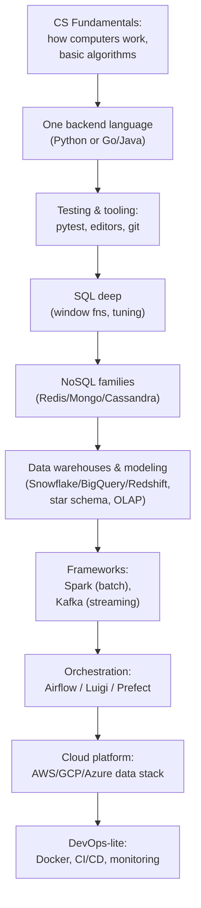

## For future agent
The popular visual data-engineer roadmap (2020; image-based README, so this page reconstructs its stage sequence from the repo + standard knowledge of its content). Data engineering is a strong 2026 track ([[market-analysis-tech-2026]]: "strong, steady demand"). Pair with [[repo-scalability-catalogs]] for infra depth.

# Data Engineer Roadmap — Expanded

## The Stage Sequence (as the roadmap orders it)

## What Each Stage Means in Practice

| Stage | Minimum Competence Signal |
|-------|--------------------------|
| SQL | Multi-join window-function queries from blank editor |
| Warehouse modeling | Explain star vs snowflake; why columnar storage suits OLAP |
| Spark | Read→transform→write a 10GB job; explain partitions & shuffles |
| Kafka | Producer/consumer demo; at-least-once vs exactly-once vocabulary |
| Airflow | DAG with dependencies + retries + backfill understanding |

## Why Consider This Track (2026 lens)

- Demand rated "strong, broad" while entry-generalist shrinks ([[market-analysis-tech-2026]])
- Less interview DSA pressure than SWE loops; more systems+SQL
- Natural extension of skills you're already building (SQL in [[roadmap-data-scientist]] Stage 1)

## Quit Points

| Quit Point | Counter |
|------------|---------|
| Tool sprawl panic ("Hadoop? Snowflake? Kafka?!") | The roadmap is a map, not a to-do-everything list. Core = Python+SQL+Spark+Airflow+one cloud |
| Cluster envy | Local Dockerized Spark + free-tier BigQuery cover ALL learning stages |

## Example Checkpoint Questions

1. Why are warehouses columnar? What query pattern benefits?
2. Kafka: what does a consumer group guarantee? When do duplicates appear?
3. Your nightly Airflow DAG failed mid-backfill — what does idempotency mean for your tasks?

## Cross-Vault Links

- [[systems-design-distributed]] · [[repo-system-design-primer]]
- [[roadmap-data-scientist]] Stage 1 shares the SQL foundation