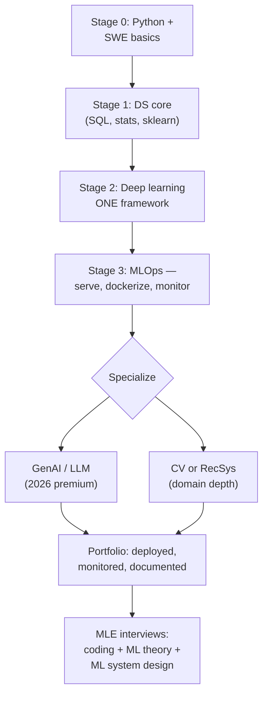

## For future agent
The MLE track: DS fundamentals + software engineering + production deployment. This is the highest-demand, highest-ceiling track in 2026 (AI engineering demand "explosive" per Pragmatic Engineer; GenAI/LLM premium roles in India ₹15–25 LPA even for freshers). Includes a GenAI specialization branch reflecting the current market. Read with [[how-to-self-teach]].

# ML Engineer Roadmap

## Why MLE Over Pure DS in 2026

| Factor | Data Scientist | ML Engineer |
|--------|---------------|-------------|
| 2026 demand trend | Stable, entry door narrowing | Explosive (AI/ML postings +163% YoY per Robert Half) |
| India fresher band | ₹4–10 LPA typical | ₹8–18 LPA product cos; ₹15–25 LPA with LLM skills |
| Mid-level ceiling | ₹12–25 LPA | ₹18–40 LPA (30–50% premium) |
| Nature of work | Analysis, modeling, insight | Serving, pipelines, MLOps, product integration |
| Risk | Title inflation, analytics commoditized by AI tools | Requires real engineering rigor |

Converging truth from market reports: **the highest earners do BOTH** — model development AND production deployment.

## The Map

## Stage 0–1 — Foundations (3–4 months)

Same as [[roadmap-software-engineer]] Stage 0–1 and [[roadmap-data-scientist]] Stages 0–2 compressed. Non-negotiables: Python fluency, SQL, git, stats spine, sklearn pipeline end-to-end.

**Failure point**: jumping to neural nets with weak Python → every debugging session becomes two problems. Don't.

## Stage 2 — Deep Learning, ONE Framework (8–12 weeks)

Pick **PyTorch** (research default) or **TF/Keras** (deployment heritage). Resources in [[python-datascience-frameworks]]; curriculum: fast.ai OR D2L ([[ml-theory-and-moocs]]).

Sequence: MLPs on tabular → CNNs on images → transfer learning → sequence models → attention/transformer usage (not pretraining).

- **Exit test**: train a model on your own dataset (not MNIST), beat a sensible baseline, produce confusion matrix + error analysis writeup.
- **Quit point**: GPU envy → Google Colab free tier is enough through this entire stage. Kaggle gives 30h/week GPU.
- **Quit point #2**: math panic during backprop → [[math-for-ml-survival-guide]] intuition-first path; you need calculus *reading* fluency, not proof-writing.

## Stage 3 — MLOps Minimum (6–10 weeks)

This stage is what separates ₹8 LPA profiles from ₹15+ LPA fresher offers:

1. **Serve**: wrap model in FastAPI, containerize ([[systems-design-distributed]] Docker best practices)
2. **Deploy**: free-tier cloud (Render/Fly.io/AWS) behind a URL
3. **Monitor**: log predictions + latency; detect drift conceptually
4. **Pipeline**: retrain script triggered by new data (Airflow-lite is fine)

- **Exit test**: send a POST request to YOUR deployed model from your phone; show prediction logs from the last week.
- **Failure point**: "works on my laptop" notebooks. In 2026 hiring, deployment is the differentiator most freshers skip.

## Stage 4 — Specialization Branch

**Branch A: GenAI/LLM (highest 2026 premium)** — prompt engineering → embeddings + vector search (you already have [[modules/retrieval-agent/overview|a RAG brain project]]!) → RAG pipelines → fine-tuning (LoRA/PEFT) → agents/tool use. India fresher band with these skills: ₹15–25 LPA `(as of 2026)`.

**Branch B: CV** — detection/segmentation depth via [[python-datascience-topics]] repos (Detectron2 path).
**Branch C: RecSys/Ranking** — Microsoft Recommenders library; e-commerce/fintech demand.

## Stage 5 — MLE Interviews

Three distinct rounds (see [[ml-interview-playbook]] for drills):
1. Coding (DSA, same as SWE)
2. **ML breadth & depth** (bias-variance, regularization, metrics, training debugging — Karpathy's recipe is the bible)
3. **ML system design** ("design a recommendation system for Flipkart") — framework in [[system-design-interview]] adapted to data/Model components

## Example Checkpoint Questions

1. Model accuracy dropped after deployment despite same validation score — walk me through your first five checks.
2. Why can't you just always increase epochs until training loss hits zero?
3. Your RAG bot hallucinates citations. Diagnose: retrieval problem or generation problem? How do you tell?
4. When would you choose batch vs online inference? Give one cost and one latency consideration each.

## Cross-Vault Links

- [[modules/stock-agent/architecture]] — user's own ML-integrated system to apply this roadmap against
- [[mlops-production-deployment]] — tooling layer
- [[market-analysis-tech-2026]] — why this track, numbers attached