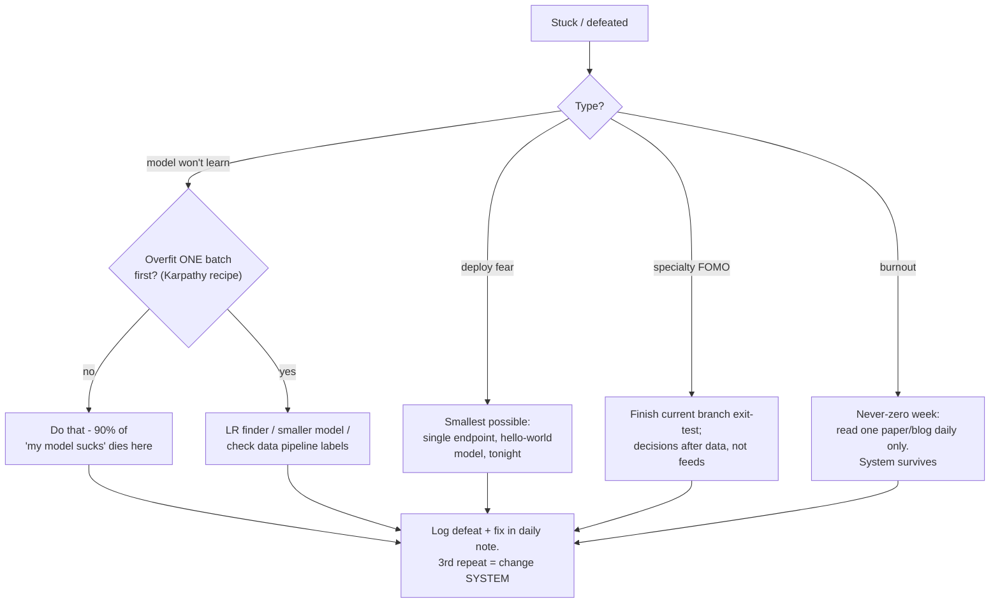

## For future agent
Deep edition of the MLE roadmap: stage-based path with exit tests PLUS root-cause failure analysis per stage, full premortem, defeat-tackling flowcharts, the DS-vs-MLE decision analysis, GenAI branch mechanics, and life-integration scheduling that survives college. Market figures sourced in [[modules/careers/market-analysis-tech-2026]]; method foundation in [[how-to-self-teach]].

# ML Engineer Roadmap — Deep Edition

## Part 1 — The Track Decision (analyzed, not vibes)

| Factor | Data Scientist | ML Engineer | Mechanism Behind the Gap |
|--------|---------------|-------------|--------------------------|
| 2026 demand | Stable; entry door narrowing | Explosive (+163% YoY postings) | AI capex flows to people who SHIP models |
| India fresher band | ₹4–10 LPA typical | ₹8–18 product; ₹15–25 with LLM skills | Scarcity of deployment-proven juniors |
| Mid ceiling | ₹12–25 LPA | ₹18–40 (30–50% premium) | Serving/infra skills compound with seniority |
| Automation exposure | High (analysis commoditizing) | Lower (owning systems resists automation) | AI assists modeling; it doesn't own uptime |
| Risk | Title inflation | Requires real engineering rigor | — |

**Converging market truth**: highest earners do BOTH — model development AND production deployment. This roadmap builds exactly that union.

**Decision rule**: choose MLE if you'd rather debug a serving pipeline than write another analysis memo. Choose DS first if statistics genuinely excites you more than code — then add MLE skills in years 1–2.

## Part 2 — Stage Deep-Dives

### Stage 0–1 — Foundations (3–4 months)
Python fluency, SQL, git, stats spine, sklearn end-to-end ([[roadmap-data-scientist]] Stages 0–2 compressed).

- **Failure root cause**: jumping to neural nets with weak Python → every debugging session becomes two problems (language + model), cognitive overload → quit.
- **Early warning**: copy-pasting training loops without reading them.
- **Counter**: no DL until you can build a clean sklearn Pipeline from memory and explain every line.

### Stage 2 — Deep Learning, ONE Framework (8–12 weeks)

Pick **PyTorch** (research default) or **TF/Keras** (deployment heritage). Curriculum: fast.ai OR D2L ([[ml-theory-and-moocs]]).

Sequence: MLP on tabular → CNN → transfer learning → sequence models → using pretrained transformers.

- **Exit test**: train on YOUR OWN dataset (not MNIST), beat a sensible baseline, produce confusion matrix + written error analysis.
- **Failure modes table**:

| Failure Mode | Root Cause | Early Warning | Counter |
|--------------|-----------|---------------|---------|
| Tutorial-loop limbo | Course-hopping feels like progress | 3rd DL course started, zero own experiments | 1:1 rule; every concept same-day in notebook |
| GPU envy stall | Belief hardware gates learning | Delaying experiments until "better setup" | Colab/Kaggle free tiers cover this entire stage |
| Math panic spiral | Backprop derivations read as gatekeepers | Avoiding any math content | [[math-for-ml-survival-guide]] intuition path; need reading-fluency not proof-writing |
| MNIST addiction | Benchmark comfort zone | All experiments on toy sets | Mandate: one OWN dataset before stage exit |
| Hyperparameter roulette | No baseline discipline | Random tuning without logs | Baseline → single-change-at-a-time → logged table |

### Stage 3 — MLOps Minimum (6–10 weeks)

The ₹8→₹15+ LPA fresher differentiator:

1. **Serve**: FastAPI wrapper around model, containerized ([[systems-design-distributed]] Docker rules)
2. **Deploy**: free-tier cloud behind real URL (Render/Fly/AWS)
3. **Monitor**: prediction + latency logging; drift conceptually understood
4. **Pipeline**: retrain script triggered by new data

- **Exit test**: POST to YOUR deployed model from your phone; show last week's prediction logs.
- **Premortem**: *"Stage 3 skipped because 'deployment is later-me's problem'."* Result at interview season: notebooks only → indistinguishable from 10,000 other freshers. Deployment IS the signal; there is no later.

### Stage 4 — Specialization Branch

**Branch A: GenAI/LLM (highest 2026 premium)** — prompt engineering → embeddings + vector search → RAG pipelines → fine-tuning (LoRA/PEFT) → agents/tool use. You already own a flagship artifact here: the RAG business-brain ([[modules/retrieval-agent/overview]]). India fresher band with these skills: ₹15–25 LPA `(as of 2026)`.

Failure mode unique to this branch: **demo-ware** — RAG demo works on 5 cherry-picked questions, collapses on the 6th. Counter: build an eval set of 30+ questions incl. adversarial ones BEFORE polishing demos; evals are the actual skill employers pay for.

**Branch B: CV** — detection/segmentation depth via Detectron2 path ([[python-datascience-topics]]).
**Branch C: RecSys/Ranking** — Microsoft Recommenders library; e-commerce/fintech demand.

## Part 3 — Full Premortem (18-month horizon)

*Failed.* Ranked autopsy findings:

1. **Tutorial consumption loop** — courses done, nothing served publicly
2. **Framework polygamy** — TF AND PyTorch AND JAX fragments, none deep
3. **Deployment permanently deferred** — the classic fresher graveyard
4. **Specialization never chosen** — generalist profile drowned in specialist pool (`<6%` entry postings reward specialists)
5. **College exam whiplash** — 2-week gaps became 2-month gaps
6. **Kaggle vanity** — notebooks polished for medals but no deployed system

Each maps to a counter above; premortem exists so mid-path you can name which one you're currently living.

## Part 4 — Defeat-Tackling Flowchart

## Part 5 — Life Integration

| Anchor | Practice |
|--------|----------|
| Morning slot (45–60m) | Current stage core work — before college drains willpower |
| College gaps (25m ×2) | Flashcards / paper reading / experiment monitoring |
| Weekend block (2–3h) | Deploy/iterate project; Sunday review vs exit-tests |
| Exam weeks | Never-zero: Anki + 1 experiment check-in/day |

**Semester-aware phasing**: map academic calendar at semester start; schedule stage transitions in college-light windows; never schedule first-deployment week during exams.

## Part 6 — Success Metrics (weekly review)

| Metric | Healthy |
|--------|---------|
| Own-dataset experiments logged | ≥2/week |
| Public artifact state | Deployed URL alive, logs accumulating |
| Eval-set size (GenAI branch) | ≥30 questions incl. adversarial |
| Hours built : consumed | ≥1 sustained |
| Days streak | Broken only by design (deloads), never by drift |

## Example Checkpoint Questions (monthly honesty check)

1. Which premortem finding describes my last 14 days most closely?
2. If an interviewer asked "walk me through your production monitoring," what would I actually show today?
3. What did my last failed experiment teach me — and where is that written?

## Cross-Vault Links

[[roadmap-data-scientist]] · [[ml-interview-playbook]] · [[math-for-ml-survival-guide]] · [[mlops-production-deployment]] · [[repo-tf-pytorch-learning-stack]] · [[build-project-playbook]] · [[market-analysis-tech-2026]]