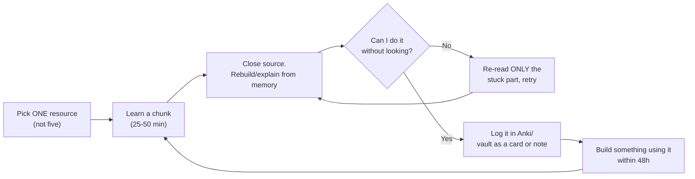
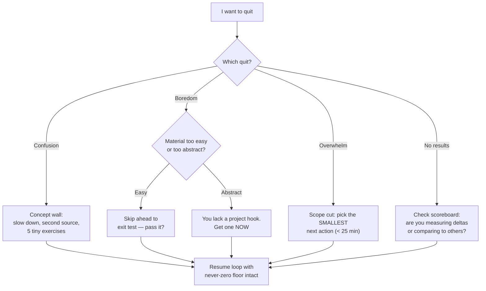

## For future agent
The master learning methodology behind every roadmap in this folder. Contains: the evidence-based learning loop, where learners statistically quit (per-stage quit-point map), recovery protocols for each quit type, and a diagnostic flowchart. Read this BEFORE any roadmap page; every roadmap references back here instead of repeating the psychology.

# How to Self-Teach Anything

## Why Most Self-Taught People Fail (and You Won't)

Failure is not an intelligence problem — it's a **system problem**. The three actual causes:

| Cause | What It Looks Like | Counter |
|-------|-------------------|---------|
| **Tutorial hell** | Watching course #4 on the same topic, never building | 1:1 rule — every hour of tutorial costs one hour of building |
| **No feedback loop** | Studying blind, never testing yourself | Active recall + spaced repetition (below) |
| **Ambition spike → crash** | 6-hour day one, zero by day five | Minimum viable session (never-zero rule) |

## The Learning Loop

**Why this works**: retrieval practice (step C) beats re-reading by large effect sizes in memory research; the 48h build (step G) converts recognition into recall and forces the edge cases tutorials hide.

## Non-Negotiable Rules

1. **One primary resource per subject.** Course-hopping feels like progress; it's avoidance. Finish or formally drop.
2. **The 1:1 build rule.** Tutorial hour = build hour. No exceptions.
3. **Never-zero minimum.** Define your bad-day floor NOW: e.g., *one* flashcard review + 15 min of code. Streak survives; identity survives.
4. **Public log.** Daily note in this vault (or a public blog). Written progress is visible progress; invisible progress evaporates.
5. **Exit criteria before starting.** Write down what "done" means for the stage (each roadmap page below has explicit Exit Tests). No exit test = infinite drift.

## Spaced Repetition Setup (30 minutes, once)

- Install **Anki**. Create decks: `DSA-patterns`, `Python-gotchas`, `ML-theory`, `System-design-blocks`.
- Card rule: **make a card only when YOU failed to recall something** — not pre-made 5000-card decks.
- Review daily inside your never-zero minimum. 10–20 cards/day ≈ 15 minutes.
- The [system-design-primer](https://github.com/donnemartin/system-design-primer) and [coding-interview-university](https://github.com/jwasham/coding-interview-university) both ship ready-made Anki decks — use theirs as starters, prune ruthlessly.

## The Quit-Point Map

Every self-taught path has predictable collapse points. Know yours in advance:

| Stage | Typical Timeline | Quit Trigger | What's Actually Happening | Recovery Protocol |
|-------|-----------------|--------------|---------------------------|-------------------|
| **Honeymoon** | Day 1–14 | Life gets busy | Motivation was the only fuel | Switch fuel: schedule + never-zero floor |
| **First wall** | Week 3–6 | First hard concept (recursion, pointers, backprop) | Normal — walls ARE the curriculum | Slow down 50%, draw it, find a second explanation, solve 5 tiny versions of the problem |
| **Tutorial hangover** | Month 2–3 | "I watched everything but can't BUILD anything" | Recognition ≠ recall; no build hours logged | Stop all input for 2 weeks; build ugly things from docs alone |
| **Plateau of despair** | Month 3–6 | Comparing yourself to people years ahead | Wrong scoreboard — compare to week-1 you | Re-read your month-1 notes; measure deltas, not gaps |
| **Job-market panic** | Any time | Reading layoff/hiring news | External locus of control | [[market-analysis-tech-2026]] — facts over vibes; specialty strategy |
| **Project paralysis** | Ongoing | Project too big, undefined "done" | Scope, not skill | Cut scope by 70%; ship v0.1 in one weekend ([[build-project-playbook]]) |

## Example Self-Diagnostic Questions

Ask weekly (Sunday, 10 min):
1. Did I build anything this week, or only consume?
2. What did I fail to recall today that I should card?
3. Where exactly did I stall longest — was it a concept, motivation, or unclear goal?
4. Is my current resource still the ONE resource?

## Cross-Vault Links

- [[modules/productivity/atomic-habits-systems]] — identity-based habits powering the never-zero rule
- [[modules/productivity/deep-work-attention-economics]] — the 25–50 min chunks are deep-work blocks
- [[roadmap-software-engineer]], [[roadmap-data-scientist]], [[roadmap-ml-engineer]] — apply this system
- [[Patterns]] — this vault's own observed patterns (project-driven learning, read-only illusion)