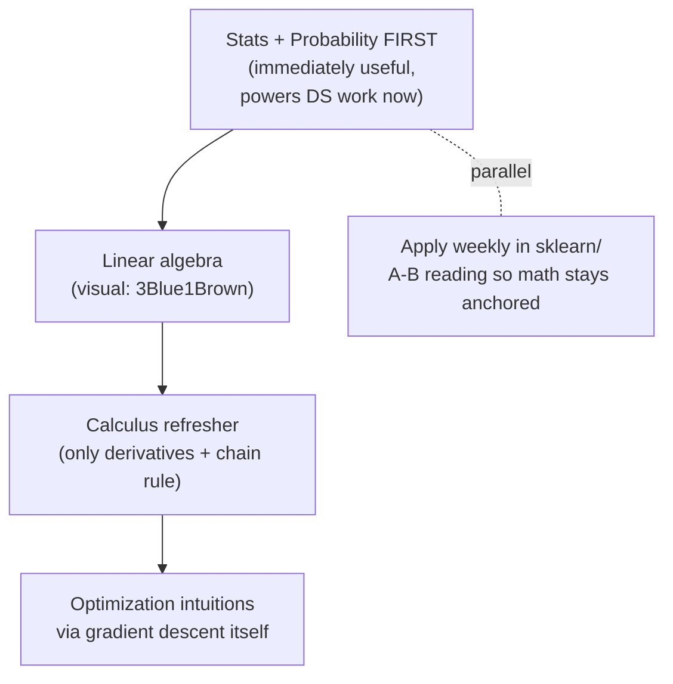

## For future agent
The minimum-but-honest math path for ML: what depth is actually needed per topic, the order that prevents quitting (stats before calc-heavy material), intuition-first resources per topic, and the specific quit points where self-taught learners abandon math — with counters. Complements [[roadmap-data-scientist]] Stage 2 and [[roadmap-ml-engineer]].

# Math for ML Survival Guide

## The Honest Depth Table

You need *reading fluency*, not proof-writing. This table prevents both under-learning and PhD-trap over-learning:

| Topic | Needed Depth | You Can Skip | Used In |
|-------|-------------|--------------|---------|
| **Probability** | Distributions, conditional prob, Bayes, expectation/variance | Measure theory | Everything; Bayes = spam filters, Naive Bayes, diagnostics |
| **Statistics** | Sampling, CIs, hypothesis tests, p-values done RIGHT, A/B logic | ANOVA derivations | Evaluation, experimentation — interviews drill this hard |
| **Linear algebra** | Vectors/matrices as transforms, matmul, transpose/inverse idea, eigen-intuition via pictures | Hand-computing big determinants | Every model's internals; PCA; embeddings |
| **Calculus** | Derivatives meaning, chain rule fluency, partial derivatives, gradient = direction of steepest ascent | Epsilon-delta, integration techniques | Backprop IS the chain rule; gradient descent IS calc |
| **Optimization** | Local minima, convexity idea, learning rate as step size | Lagrange multipliers (until SVM deep-dive) | Training everything |

## The Order (quit-proof sequencing)

Why stats first: it pays off instantly in your DS projects (confidence intervals on results), which keeps motivation alive through the drier algebra/calc stretch.

## Resources Per Topic (curated, not exhaustive)

- **Probability/Stats**: StatQuest (YouTube) for concepts → *Think Stats* (free) for Python practice → Khan Academy for gap drills
- **Linear algebra**: [3Blue1Brown Essence of Linear Algebra](https://www.youtube.com/playlist?list=PLZHQObOWTQDPD3MizzM2xVFitgF8hE_ab) — watch twice, then do 20 hand problems (MIT 18.06 problem sets)
- **Calculus**: 3Blue1Brown Essence of Calculus → chain-rule drills until automatic
- **Integrated**: [Mathematics for Machine Learning (Deisenroth)](https://mml-book.github.io/) — free book, use as REFERENCE not cover-to-cover
- Vault link: [[modules/mathematics/formula-sheet-master]] for JEE-level recall you already own

## The Quit-Point Map (math-specific)

| Quit Point | When | What's Happening | Counter |
|------------|------|------------------|---------|
| "I'll learn math later" | Week 1 | Later never comes | Anchor: no model gets trained this month without its math note written alongside |
| Proof drowning | Any linear algebra course | Course aimed at mathematicians | Switch resource immediately; visual-first materials exist for every topic |
| Symbol shock | Reading ML papers | Notation unfamiliarity reads as stupidity | Keep a notation sheet in vault; decode 5 symbols/day |
| "Why do I need this?" | Mid calc | No visible application loop | Pair every topic with its model: chain rule↔backprop day |
| Comparison trap | Forums | "You need measure theory for real ML" gatekeeping | The table above is the honest bar; ignore absolutists |

## Practice Protocol (the part everyone skips)

Math is a performance skill:
1. For each concept: 5 hand-solved micro-problems (not watched examples)
2. Then ONE implementation from scratch: e.g., gradient descent on paper → then 10 lines of NumPy fitting y=mx+b
3. Card every formula you failed to recall (Anki, LaTeX cards)
4. Weekly: re-derive one thing from memory (backprop for a 2-layer net is THE classic)

## Example Checkpoint Questions

1. Why does gradient descent use the NEGATIVE gradient? What would positive do?
2. Dataset mean=50, std=5. Roughly what range holds ~95%? Which theorem says so?
3. Matrix A is 3×4, B is 4×2. Shape of AB? When does AB ≠ BA matter for features?
4. Your friend says "p=0.03 means 97% chance my hypothesis is true." Correct them precisely.
5. What does an eigenvector of a covariance matrix physically represent in PCA?

## Cross-Vault Links

- [[roadmap-data-scientist]] Stage 2 · [[roadmap-ml-engineer]] foundations
- [[ml-theory-and-moocs]] — MIT Computational Thinking playlist (math+code together)
- [[modules/mathematics/overview|vault Mathematics module]] — your existing formula arsenal