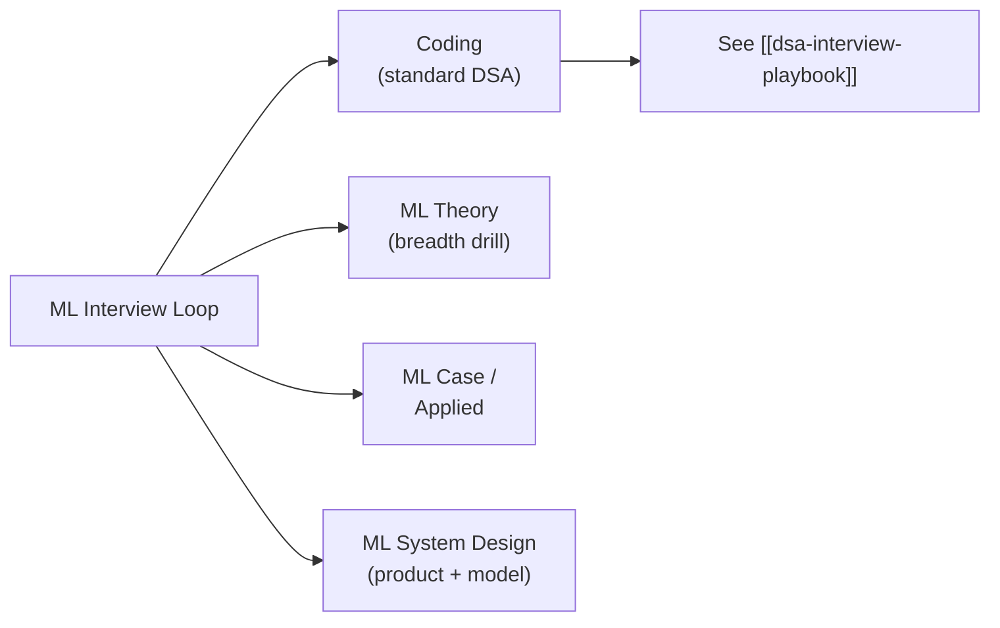

## For future agent
The ML-specific rounds beyond coding: ML breadth/depth theory Q&A with model answers' skeletons, the ML-case framework (metrics-first thinking), and ML system design adapted from [[system-design-interview]] with data/model/deployment components. Sources: canonical interview banks ([[ml-theory-and-moocs]] interview section) + 2026 market format notes.

# ML Interview Playbook

## Round Types

## ML Theory: The Core Question Bank

Answer skeleton for every theory Q: **definition → intuition/why → when it breaks**. That third beat separates offers.

| Question | Answer Skeleton |
|----------|----------------|
| Bias-variance tradeoff? | Error = bias²+variance+noise; simple models high bias; complex high variance; tune via CV/regularization; breaks when distribution shifts |
| Why regularization? | Penalizes complexity to cut variance; L1→sparsity/feature selection, L2→shrinkage; choose via validation |
| Precision vs recall? | Precision: of flagged, how many right (cost of false alarm); recall: of actuals, how many caught (cost of miss); F1 balances; pick by business asymmetry |
| How does XGBoost work? | Sequential trees fitting gradients of a loss + regularization terms; why it wins tabular: handles non-linearity + interactions + missing values natively |
| Explain overfitting you've debugged | Have ONE real story: symptom (train≈99 val≈70) → diagnosis curve → fixes tried in order → result |
| Transformer attention in one line | Each token computes weighted relevance to all others; weights = softmax of query·key; enables parallel context |
| Handling imbalanced data | Resample inside CV folds only / class weights / threshold tuning / right metric (PR-AUC) — never plain accuracy |
| k-fold CV purpose | Honest generalization estimate on limited data; also model selection; leakage = fitting scalers BEFORE splitting |

## The ML Case Framework ("How would you improve X metric?")

1. **Clarify**: what's the metric now, target, why does it matter to business?
2. **Error analysis FIRST**: split failures into buckets (data quality / label noise / hard cases / representation). Never propose models before looking at errors.
3. **Lever tree**: more data? better features? different objective? model capacity? ensembling?
4. **Cost-rank levers**, propose cheapest-highest-yield first
5. **Validation plan** before shipping any change

## ML System Design (adapted framework)

Same 6 steps as [[system-design-interview]], plus three ML-specific layers:

- **Data layer**: sources, ingestion, feature store, training/serving skew guard
- **Model layer**: candidate generation → ranking (two-stage pattern for recsys/search); offline metrics vs online A/B
- **Deployment layer**: batch vs online inference, latency budget, monitoring drift, retraining cadence

**Worked micro-example**: "Design YouTube recommendations" → two-stage: candidate nets narrow millions→hundreds; ranking model scores; features = watch history/session context; serving = precomputed candidates + online ranking under 200ms; monitor watch-time drift; retrain daily.

## Fresher-Specific Guidance `(2026 market)`

- Product-company MLE fresher loops DO include ML theory + light case; full ML system design usually appears at intern-conversion and mid levels — but knowing the two-stage pattern scores even fresh
- Expect AI-tooling questions increasingly: how do you verify an LLM's output? how would you evaluate RAG quality? ([[roadmap-ml-engineer]] branch A)
- Your OWN deployed project is the case study — prepare its failure analysis as deeply as its success story

## Quit Points & Fixes

| Quit Point | Fix |
|------------|-----|
| Theory feels infinite | The table above covers ~80% of asked questions; drill it to fluency before reading anything wider |
| Case paralysis | ALWAYS start with error analysis out loud — it structures everything after |
| Math grilling fear | You need derivations for: gradient descent update, logistic loss, backprop chain rule — exactly three; own them |

## Example Question Set (quick-fire with one-line targets)

1. Your model performs well offline, poorly online — top 3 suspects? *(skew, feedback loops, stale features)*
2. Why not use accuracy for fraud detection? *(0.1% positives → 99.9% accuracy by predicting 'no')*
3. When is a decision tree better than a neural net? *(tabular/small-data/explainability/fast iteration)*
4. What's data leakage? Give one sneaky example. *(using future info; e.g., scaling before split)*
5. How would you cut inference cost 10×? *(distillation, quantization, caching, batch, smaller model first — ask accuracy budget!)*

## Cross-Vault Links

- [[ml-theory-and-moocs]] — theory source layer + interview banks
- [[roadmap-ml-engineer]] — when this prep happens in the plan
- [[modules/ai/AI_MASTER_NOTES]] — coursework-side backing for theory answers