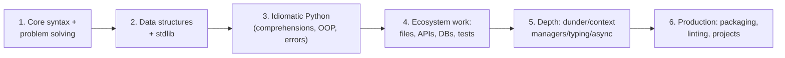

## For future agent
Stage-by-stage Python path with explicit exit tests, per-stage quit points, and mini-projects that force real fluency. Distills the repo's Python sections ([[languages-python-advanced]], [[software-dev-general]]) into an executable sequence. The user already has CS50 + habit-tracker experience — Stage 1 is partially banked.

# Python Mastery Path

## The Stages

## Stage 1 — Syntax to Problem-Solving (banked if CS50 done)

- **Exit test**: solve 25 easy exercises ([Exercism](https://exercism.org)/Codewars) without looking anything up beyond stdlib docs.
- **Quit point**: none usually — momentum stage. Skip ahead if bored.

## Stage 2 — Data Structures + Stdlib (3–4 weeks)

dict/list/set deep behavior, slicing, `collections` (`defaultdict`, `Counter`, `deque`), `itertools` basics, string methods, sorting with `key=`.

- **Mini-project**: log-file analyzer — parse a server log into per-IP request counts, top-10 tables, hour histograms. Pure stdlib.
- **Exit test**: rewrite any nested-loop frequency problem as 4 lines with `Counter`.
- **Quit point**: "stdlib is dry" → alternate stdlib days with Codewars days; motivation through variety.

## Stage 3 — Idiomatic Python (4–6 weeks)

Comprehensions, unpacking, `*args/**kwargs`, exceptions (raise vs catch, custom), classes done right → [[modules/object-oriented-programming/oop-foundations]], f-string formatting, `pathlib`.

Resources: [wtfpython](https://github.com/satwikkansal/wtfpython) + [pytudes](https://github.com/norvig/pytudes) (from [[languages-python-advanced]]).

- **Mini-project**: CLI tool you'd actually use (e.g., vault note linter checking frontmatter — meta!).
- **Exit test**: explain why `mutable default argument` breaks; fix it three ways. Explain `is` vs `==` with interning example.
- **Quit point**: OOP confusion spike → park classes for one week, do functional-style small programs, return fresh.

## Stage 4 — Real-World I/O (4–6 weeks)

Files robustly (`with`, encodings), `requests` + JSON APIs, SQLite via `sqlite3` or SQLAlchemy basics, `unittest`/pytest first tests, virtualenvs + `requirements.txt`.

- **Mini-project**: fetch data from a public API → store in SQLite → generate a daily markdown report. (You've essentially done this pattern in your habit tracker.)
- **Exit test**: build the mini-project from blank folder to working in ≤2 hours.
- **Quit point**: env/dependency hell night → one evening learning venv properly saves months ([[languages-python-advanced]] hypermodern series).

## Stage 5 — Language Depth (ongoing, interleaved)

Context managers (`__enter__/__exit__`), generators + laziness, decorators, dunder methods survey → [[modules/object-oriented-programming/magic-methods-dunder]], typing hints, when async actually helps (the benchmark reality: [[languages-python-advanced]] table).

- **Exit test**: implement a decorator that retries a flaky function with exponential backoff; explain generator-based file streaming memory advantage.

## Stage 6 — Production Habits

Project layout, black+ruff formatting, pytest coverage habit, debugging with `breakpoint()`/pdb instead of prints, reading OTHERS' code (read Flask source excerpts; it's famously readable).

**Exit test**: pick any of your old scripts → add tests catching a real bug you introduce on purpose, lint clean, typed public functions.

## Cross-Cutting Rules

1. **Every stage ends shipped**, not "finished" — something runnable exists
2. **Read error messages completely** — top fresher differentiator, free to acquire
3. **One resource per stage** ([[how-to-self-teach]] rule #1)

## Example Checkpoint Questions

1. What does this print and why: `def f(x, acc=[]): acc.append(x); return acc` called twice?
2. When is a tuple NOT immutable? (contains a list — mutability of contents vs container)
3. Difference between generator function and list comprehension in memory terms? When does it matter?
4. Why prefer `with open(...)` over manual close? What mechanism makes it safe?

## Cross-Vault Links

- [[modules/programming/cs50/week-6-python]] — Stage 0–1 practiced form
- [[modules/object-oriented-programming/overview]] — Stage 3's deep layer
- [[roadmap-data-scientist]] / [[roadmap-ml-engineer]] — pandas/numpy branch after Stage 3