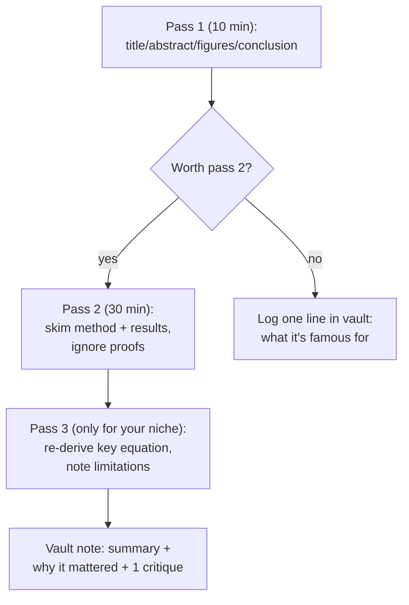

## For future agent
The most-cited DL papers list (250–500 citation threshold), expanded from its real section headings (fetched 2026-08-24). This page converts the paper dump into a *reading order* with what each cluster contributed. Paper-reading method + vault integration included.

# Awesome Deep Learning Papers — Expanded

## Its Section Structure (= the field's genealogy)

1. **Understanding / Generalization / Transfer**
2. **Optimization / Training Techniques**
3. **Unsupervised / Generative Models**
4. **Convolutional Neural Network Models**
5. **Image: Segmentation / Object Detection**
6. **Image / Video / Etc**
7. **Natural Language Processing / RNNs**
8. **Speech / Other Domain**
9. **Reinforcement Learning / Robotics**
10. Plus: More-from-2016, New papers, Old papers, HW/SW/Datasets, Books/Surveys, Video lectures/blogs, "More than Top-100" appendix

## Suggested Reading Order (genealogical, 12-paper spine)

| # | Paper | Why It Changed Things |
|---|-------|----------------------|
| 1 | Krizhevsky et al., **AlexNet** (2012) | ImageNet moment; GPUs+ReLU+dropout win big |
| 2 | Simonyan & Zisserman, **VGG** | Depth via uniform small kernels; simplicity as design |
| 3 | He et al., **ResNet** | Skip connections made 100+ layers trainable |
| 4 | Szegedy et al., **GoogLeNet/Inception** | Multi-scale features in parallel |
| 5 | Hinton et al., **Dropout** | The regularization everyone uses |
| 6 | Ioffe & Szegedy, **Batch Normalization** | Training stability/speed unlock |
| 7 | Kingma & Ba, **Adam** | Default optimizer lineage |
| 8 | Goodfellow et al., **GANs** | Generative modeling via adversarial game |
| 9 | Mikolov et al., **word2vec** | Embeddings as representation idea |
| 10 | Sutskever et al., **Seq2Seq** | Encoder-decoder framing |
| 11 | Vaswani et al., **Attention Is All You Need** | Transformers — everything since |
| 12 | Mnih et al., **DQN** | RL + deep nets at human-level play |

## How to Read a Paper (protocol)

## Failure Points

| Failure | Counter |
|---------|---------|
| Reading cover-to-cover chronologically | Spine-of-12 above first; cluster reads later by need |
| Drowning in math on pass 1 | Passes are designed to defer math; trust the process |
| Reading without era context | For each: ask "what couldn't people do BEFORE this?" |

## Example Checkpoint Questions

1. What specific problem did ResNet's skip connections solve?
2. Why did batch norm allow larger learning rates?
3. Name one thing attention replaced, and why that replacement scaled better.

## Cross-Vault Links

- [[ml-theory-and-moocs]] · [[curated-reading-list]] (Distill essays = modern readable versions of several ideas)
- [[modules/ai/sub-notes/MODULE_5_PLANNING_NEURAL_NETWORKS]] — coursework-side NN basics