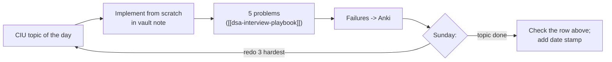

## For future agent
Full expansion of the most-starred interview prep repo (~300k stars). Structure below is fetched from its actual README headings (2026-08-24). This page IS the checklist — work top to bottom; each topic gets a vault note when first studied. Drills live in [[dsa-interview-playbook]].

# Coding Interview University — Expanded

## The Author's Own Method Rules (from "How to use it")

1. **You won't remember it all** — re-watch/re-read later; that's normal and designed-in
2. **Use flashcards** — he maintains Anki decks (coding + system design); make cards only for what YOU forgot
3. **Do coding questions WHILE learning** — not after; alternate topic-study and problem-solving daily
4. **Focus** — no frameworks, no side languages during the plan

## Daily Plan Template

- Study one topic (video/book) → implement it in your language from scratch → 5 related problems → card failures. His suggestion: 1 topic/day, ~2–3h/day over months; faster if full-time.

## Topics of Study (the actual checklist)

| # | Topic | Vault Note When Done |
|---|-------|---------------------|
| 1 | Algorithmic complexity / Big-O / asymptotic analysis | |
| 2 | Data structures: arrays, linked lists (singly/doubly), stacks, queues, hash tables (hash functions, collisions, open addressing) | |
| 3 | **More knowledge**: binary search, bitwise ops, randomness | |
| 4 | **Trees**: BSTs, heaps/priority queues, tries, B-trees (concept), red-black trees (concept), AVL | |
| 5 | **Sorting**: selection/insertion/heapsort/quicksort/merge — implementations + complexities + stability | |
| 6 | **Graphs**: representations, BFS/DFS, Dijkstra, A*, min spanning tree | |
| 7 | **Even more**: recursion, DP, combinatorics, NP/P (concept), caches (LRU), processes vs threads, testing | |
| 8 | System design, scalability, data handling (his short section → expand via [[repo-system-design-primer]]) | |
| 9 | Final review: everything above re-solved cold | |

**Optional extras (his list)**: compilers, floating point, Unicode, endianness, Emacs/vim — skip unless time-rich.

## Getting-the-Job Sections

- Update resume (one page, projects with metrics)
- Interview process & general prep → [[interview-counter-guide]]
- Be ready to think of: your hardest bug, proudest project, conflict story
- Have questions ready for the interviewer (list of 5)

## Language Choice Section

He offers tracks: Python / C / C++ / Java. For this vault: **Python primary**, C++ secondary ([[modules/SPM/module-1-spm-c-basics]] synergy).

## How to Use With This Vault

## Example Questions From His Emphasis Areas

1. Implement a hash table with open addressing + linear probing; explain load factor effects.
2. Why is quicksort O(n²) worst case? Two real mitigations.
3. Explain LRU cache implementation choices (hash map + doubly-linked list).
4. Difference between a process and a thread at memory level.

## Cross-Vault Links

- [[roadmap-software-engineer]] — this repo powers its Stage 2+5
- [[dsa-interview-playbook]] · [[how-to-self-teach]]