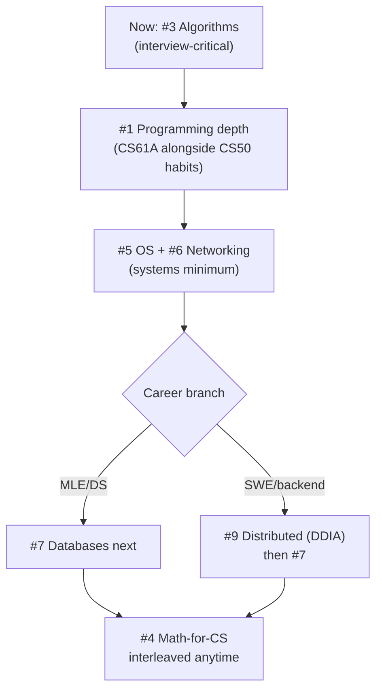

## For future agent
The 9-subject CS curriculum from teachyourselfcs.com — its philosophy is unique: ONE book + ONE course per subject, chosen as the best-in-class. This page lists all 9 with their canonical picks and why each subject matters. Use when building fundamentals ([[roadmap-software-engineer]] Stage 1–3); don't run all 9 in parallel.

# Teach Yourself Computer Science — The 9 Subjects

## The Core Philosophy

> Study all nine subjects below, in rough order, using the single best book AND single best video course for each. Depth beats breadth; one great resource beats ten mediocre ones.

## The Table

| # | Subject | Why It Matters | Canonical Book | Canonical Course |
|---|---------|---------------|----------------|------------------|
| 1 | **Programming** (SICP) | The big ideas of abstraction | *SICP* (Abelson/Sussman) or *Concepts, Techniques, and Models* (Van Roy) | MIT 6.001 / Berkeley CS61A ([composingprograms.com](https://www.composingprograms.com)) |
| 2 | **Computer Architecture** | How machines actually execute | *Computer Systems: A Programmer's Perspective* (Bryant/O'Hallaron) | Berkeley CS61C |
| 3 | **Algorithms & Data Structures** | The reusable problem-solving vocabulary | *Skiena, Algorithm Design Manual* | Berkeley CS61B |
| 4 | **Math for CS** | Proofs, discrete math — the grammar of CS | *Mathematics for Computer Science* (Lehman) | MIT 6.042J |
| 5 | **Operating Systems** | Processes, memory, concurrency made real | *OSTEP* (free, Arpaci-Dusseau) | UWisconsin OSTEP videos / CS162 |
| 6 | **Computer Networking** | How systems talk | *Computer Networking: Top-Down* (Kurose/Ross) | Stanford CS144 |
| 7 | **Databases** | The most-used infrastructure ever built | *Readings in Database Systems* ("Red Book") | Berkeley CS186 + Joe's DB exercises |
| 8 | **Languages & Compilers** | Why languages are the way they are | *Crafting Interpreters* (Nystrom, free online) | Stanford Compilers (CS143) |
| 9 | **Distributed Systems** | Everything modern is distributed | *DDIA* (Kleppmann) | MIT 6.824 |

## Suggested Order for THIS Vault's Owner

## Rules From the Site Worth Copying

- **Don't collect resources** — the curation IS done; just execute
- **Do the projects** — each course's projects are the learning (CS144's TCP implementation, 6.824's Raft labs)
- **Rough order, not strict** — math and programming interleave fine

## Failure Points

| Failure | Counter |
|---------|---------|
| Starting with #1 SICP → bounced by Lisp | For interview-track, START at #3; return to SICP later for depth |
| Book-only (no projects) | Every subject here has labs; skip them = skip the subject |
| All 9 at once | Max TWO concurrently; see [[how-to-self-teach]] rule #1 |

## Example Checkpoint Questions

1. Why does OSTEP call processes "the abstraction of a virtual CPU"?
2. What does top-down networking mean by "application layer first" pedagogy?
3. After CS186: what does an index actually store, and when does it hurt?

## Cross-Vault Links

- [[roadmap-software-engineer]] · [[repo-system-design-primer]] (for #9's practical side)
- [[modules/programming/cs50/index]] — lighter on-ramp before this curriculum