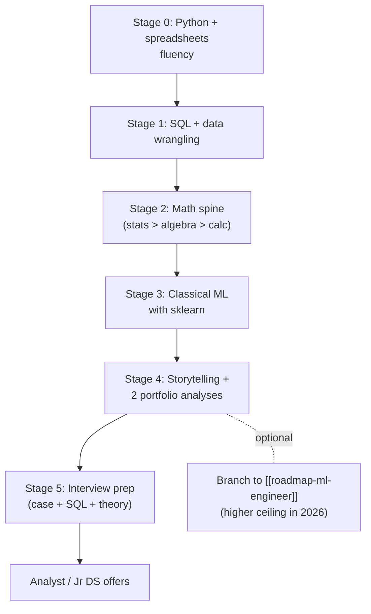

## For future agent
DS roadmap mirroring OSSU Data Science's actual curriculum order (prerequisites → intro CS → DSA-lite → databases → calculus → linear algebra → stats/probability → tools/methods → ML → final project), compressed into stage-based format with exit tests, failure points, and India-market notes. Read with [[how-to-self-teach]]; math details in [[math-for-ml-survival-guide]].

# Data Scientist Roadmap

## The Map

## Stage 0 — Python for Data (3–5 weeks)

pandas + matplotlib + jupyter. Resource: [Python Data Science Handbook](https://github.com/jakevdp/PythonDataScienceHandbook) (in [[python-datascience-frameworks]]).

- **Exit test**: given a raw CSV with messy columns/dates/nulls → clean, group, pivot, and plot 3 insights in under an hour, from memory.
- **Quit point**: pandas indexing confusion → do the "Seven clean reshape steps" essay (in [[curated-reading-list]]) twice, slowly. It's the standard wall.

## Stage 1 — SQL Until It's Boring (3–4 weeks)

The #1 screened skill for DS/analyst roles. SELECT→JOIN→GROUP BY→window functions→query tuning awareness.

- Practice daily on [SQLZoo](https://sqlzoo.net/) then [StrataScratch](https://www.stratascratch.com/)/LeetCode DB problems.
- **Exit test**: solve 10 interview-grade SQL questions in a row without hints; write a window function (`ROW_NUMBER`, `LAG`) unprompted when the question smells like "latest record per user."
- **Failure point**: treating SQL as beneath you. Fresher DS interviews in India screen SQL harder than ML.

## Stage 2 — The Math Spine (8–12 weeks, interleaved)

Order matters: **probability/statistics FIRST**, then linear algebra, then just-enough calculus. Full plan: [[math-for-ml-survival-guide]].

| Topic | Depth Needed | Exit Test |
|-------|-------------|-----------|
| Descriptive stats + distributions | Deep | Explain to a non-coder why median vs mean matters with skewed salary data |
| Hypothesis testing, CIs | Deep | Design an A/B test: metric, sample size intuition, p-value meaning WITHOUT saying "95% chance" |
| Linear algebra | Working | Matrix multiply by hand (3×3); explain what eigenvectors are via a picture |
| Calculus | Light | Derive why gradient descent moves opposite the gradient; chain rule fluently |

**Quit point**: proof-heavy courses → skip proofs, drill intuitions + computations; revisit proofs only if targeting research.

## Stage 3 — Classical ML (6–10 weeks)

sklearn end-to-end: regression → regularization → logistic → trees → ensembles (XGBoost) → clustering → evaluation metrics → proper CV ([[ml-theory-and-moocs]] catalog).

- Course pick: ONE of mlcourse.ai / Andrew Ng ML specialization / Kaggle Learn.
- **Exit test**: take a fresh Kaggle tabular dataset → full pipeline (EDA → baseline → model → CV → error analysis) in one sitting; articulate WHY each metric was chosen.
- **Failure point**: metric blindness — reporting accuracy on imbalanced data is the classic fresher tell. Card it.

## Stage 4 — Analysis & Storytelling Portfolio (parallel)

Two public analyses per [[build-project-playbook]]: each answers a real business question with data, ends in 3 recommendations, published as blog/notebook ("learn in public").

- **Failure point**: Titanic/Iris notebooks. Pick boring-but-real domains (Indian retail prices, local transit data, cricket).

## Stage 5 — Interviews

- Format: SQL round → Python/pandas live → stats & A/B case → ML theory → business case ([[ml-interview-playbook]], [[example-question-bank]])
- India note `(as of 2026)`: entry DS postings are <6% of AI-skill demand — analyst titles (data/business analyst) are the realistic door; DS comes after 1–2 years. See [[market-analysis-tech-2026]].

## Example Checkpoint Questions

1. Your A/B test shows p=0.04. Three reasons you might still not ship.
2. Precision at 90% but recall at 30% — what business contexts make that acceptable?
3. Why is mean imputation dangerous on columns missing *not* at random?
4. Write SQL: top 3 products per category by revenue, ties broken alphabetically.

## Cross-Vault Links

- [[roadmap-ml-engineer]] — the production-focused sibling track
- [[modules/quant-finance/learning-roadmap-and-study-plan]] — quant-flavored variant of this path
- [[kaggle-and-practice-guide]] — where Stage 3–4 practice lives