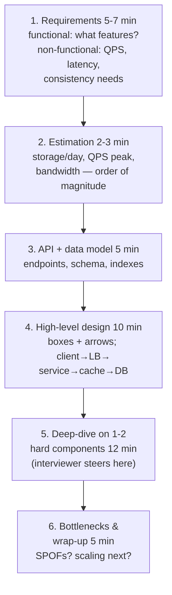

## For future agent
How system design interviews are actually conducted and graded, a step-by-step framework (adapted RESHADED), the building-block vocabulary (from system-design-primer's real topic index), one fully worked example, and fresher-appropriate depth guidance. Fresher note: asked mostly at product companies and for internships-with-conversion; services companies rarely ask this.

# System Design Interview Playbook

## What's Actually Being Scored

Not "correct architecture" (none exists) but:
1. **Clarifying requirements** — functional + scale numbers you extract yourself
2. **Tradeoff articulation** — every choice stated with its cost
3. **Depth where probed** — can you go two levels down on YOUR proposal?
4. **Communication** — diagram-driven narration, checking in

## The Framework (45 minutes)

## Building Blocks Vocabulary (know all cold)

From the primer's actual index — group them:

| Group | Blocks |
|-------|--------|
| Performance | latency vs throughput, CDN, load balancer (L4/L7), horizontal scaling |
| Consistency | CAP theorem (CP/AP), weak/eventual/strong consistency |
| Availability | fail-over, replication (leader-follower, multi-leader), 9s math |
| Data stores | RDBMS (indexes, sharding, federation, denormalization), NoSQL families (key-value/document/wide-column/graph) |
| Caching | cache-aside vs write-through vs write-behind, invalidation |
| Async | message queues, backpressure, scheduled jobs |
| Misc | DNS, microservices vs monolith, service discovery, consensus basics |

**Nine's math**: 99.9% = 8.76h downtime/year; 99.99% = 52min/year. Dropping this number unprompted scores.

## Worked Example: Design a URL Shortener (condensed)

- **Requirements**: shorten URL; redirect fast; custom alias optional; analytics later. Scale: 100M new URLs/mo → ~40 writes/s avg (~400 peak); reads ≫ writes (~100:1)
- **Estimate**: 500 bytes × 100M/mo ≈ 50GB/mo → trivial storage for years; read QPS ~4k peak → caching matters
- **API**: `POST /shorten(url)→key`; `GET /key→301/302`
- **Key**: base62 of auto-increment ID (6 chars = 62⁶ ≈ 56B keys) or hash+collision-retry
- **Storage**: key-value store (DynamoDB-style) chosen via CAP talk — AP fits redirects
- **Cache**: cache-aside on hot keys; 20% of URLs drive 80% of reads
- **Deep-dive candidate**: redirect as 301 (cached by browser, loses analytics) vs 302 (hits server, keeps analytics) — SAY THE TRADEOFF
- **Bottlenecks**: key generation at single writer → range-partition ticket server or pre-generated blocks

## Depth Expectations by Level

| Level | Expected |
|-------|----------|
| Fresher/intern | Framework discipline + correct vocabulary + honest "I'd research X" — NOT full sharding math |
| Mid | Estimations fluent, deep-dives competent, tradeoffs everywhere |
| Senior | Numbers-driven decisions, failure-mode analysis, migration story |

## Quit Points & Fixes

| Quit Point | Fix |
|------------|-----|
| "I don't know where to start" | Memorize the 6-step framework until automatic; it generates starting motion |
| Freeze on numbers | Practice 5 estimations (Twitter QPS, WhatsApp storage…) — they're all powers-of-10 arithmetic |
| Talk too little, draw silently | Narrate EVERY box; silence reads as being lost |
| Over-engineering | Fresher designs should be boring: LB + stateless app + SQL + cache. Complexity only when requirement demands |

## Example Question Set

1. Design Twitter's news feed (fan-out on write vs read — say both)
2. Design a chat system (delivery guarantees, ordering, online status)
3. Design a rate limiter (token bucket; where does state live?)
4. Design a file-storage service (chunking, metadata DB, dedup)
5. Design your own [[modules/retrieval-agent/overview|business-brain search API]] — vector store choice, embedding caching, top-k latency

## Cross-Vault Links

- [[systems-design-distributed]] — the reference layer behind every block named here
- [[ml-interview-playbook]] — ML-flavored variant of this round
- [[modules/programming/SAAS_BUILD_NOTES]] — production-grade deployment checklist using these blocks