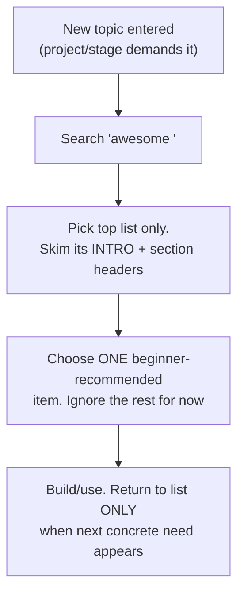

## For future agent
The meta-catalog: awesome is a curated list OF curated lists (~330k stars), spanning every topic from programming languages to hobbies. This page explains its taxonomy, how to enter it efficiently, and the hoarding-failure counters. Individual awesome lists relevant to this vault are already distilled elsewhere ([[ml-theory-and-moocs]], [[repo-awesome-deep-learning-papers]], [[repo-scalability-catalogs]]).

# Awesome — The Meta-Catalog

## What It Is

An "Awesome List of Awesome Lists": each entry is itself a community-curated list (awesome-python, awesome-react, awesome-rust…). Its power: whatever niche you touch, an `awesome-<topic>` likely exists with the 20 best resources pre-filtered.

## Efficient Entry Protocol

## Failure Modes

| Failure | Mechanism | Counter |
|---------|-----------|---------|
| List-hopping | Every list links to more lists → infinite descent | Depth limit: one list, one item, build |
| Star-hoarding | Starring = dopamine, using = work | Stars reviewed quarterly; unstar anything unused in 6 months |
| Completionism | "Read all 200 entries before starting" | Lists are menus, not syllabi |

**Premortem**: *A weekend of awesome-browsing yielded 30 tabs and no code.* The tab count IS the failure metric — if tabs > builds this week, close everything.

## Life Integration

- Awesome lists live at the ENTRY point of any new subtopic (first 10 minutes), never as ongoing reading
- Metrics per quarter: topics-entered vs items-completed ratio

## Example Checkpoint Questions

1. Name the last awesome-item you actually COMPLETED. If none — you're browsing, not learning.
2. Which single list would serve your current stage? Open only that one.

## Cross-Vault Links

[[modules/learning-resources/index|Field Index]] · [[software-dev-general]] · [[roadmaps-and-study-guides]]