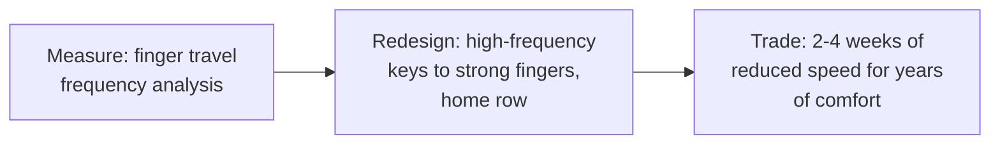

## For future agent
Colemak Mod-DH keyboard layout study — included among the analyzed repos as a LONG-HORIZON optimization pattern rather than a coding resource. Layout files/scripts for Windows (AutoHotKey, EPKL "Big Bag", MSKLC installers). This page extracts the ergonomics decision framework and the retraining-cost reality.

# Colemak Mod-DH — Ergonomics as Long-Term Optimization

## What It Is

A variant of the Colemak keyboard layout that moves the most frequent keys (D, H) off the middle-column reaches to the stronger home-row positions ("Dvorak-style angle mod" applied to Colemak). Repo ships Windows implementations: AutoHotKey scripts, EPKL (Big Bag edition), MSKLC-generated installers, plus Linux/macOS variants via its project home.

## The Optimization Logic

## Failure Modes (the retraining wall)

| Failure | Mechanism | Counter |
|---------|-----------|---------|
| Week-2 abandonment | Speed drops 60→20 WPM; feels permanent | Pre-commit: calendar-blocked 3-week transition; QWERTY allowed ONLY for exams |
| Mixed-layout chaos | Switching layouts per context prevents rewiring | One layout everywhere incl. phone (or explicit dual-policy) |
| No baseline | Never measured WPM/error before | Record baseline first — progress must be visible |

**Premortem**: *Installed Mod-DH; reverted within 5 days during assignment week.* Root cause: switched during high-stakes typing week. Rule: layout transitions only during low-stakes windows (breaks), never exam season.

## Decision Framework

Adopt IF: you type >2h daily · RSI niggles exist or are feared · a low-stakes 3-week window is available. Skip IF: heavy exam seasons imminent or typing speed IS your current bottleneck elsewhere.

## Life Integration

- Track WPM weekly (monkeytype); expect dip→recover→exceed arc over ~4–6 weeks
- Vault synergy: daily notes typed in new layout = built-in practice log
- Metrics: weekly WPM curve, pain/discomfort notes, days-since-revert

## Example Checkpoint Questions

1. What's my current WPM baseline? (If unknown — measure before any change.)
2. Is my motivation comfort-health (durable) or novelty (fades by week 2)?

## Cross-Vault Links

[[modules/case-studies/index|Case Studies Index]] · [[how-to-self-teach]] (retraining mechanics identical) · [[Patterns]]