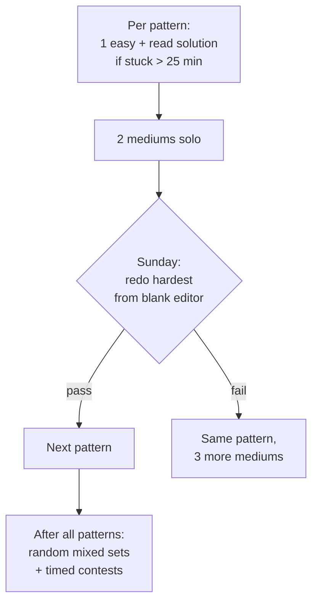

## For future agent
Pattern-first DSA preparation: the ~15 recurring patterns behind ~90% of interview problems, each with recognition cues, template pseudocode, and example questions with approach sketches. Includes a difficulty-ladder practice system and quit-point handling. Assumes [[roadmap-software-engineer]] Stage 2 in progress.

# DSA Interview Playbook

## Core Insight

Interview problems are **pattern recognition under pressure**. ~15 patterns cover nearly everything asked. You're not memorizing 500 solutions; you're drilling 15 templates until recognition is instant.

## The Pattern Table

| Pattern | Recognition Cue | Template Idea |
|---------|----------------|---------------|
| Two pointers | Sorted array, pair/triplet search, palindrome | Start ends inward / same-direction runners |
| Sliding window | Contiguous subarray/substring + "longest/shortest/max sum" | Expand right, shrink left on violation |
| Fast & slow pointers | Cycle detection, middle of list | Two speeds; meet ⇒ cycle |
| Hash map counting | Frequencies, complements, anagrams | Dict of seen; check `target - x` |
| Prefix sums | Range sum queries, subarray sum equals K | Precompute cumulative; `P[j]-P[i]` |
| Stack monotonic | Next greater/smaller element, histogram | Keep stack decreasing; pop on smaller |
| Binary search | Sorted OR monotone answer space ("minimize the maximum") | Search on answer, not just arrays |
| BFS | Shortest path unweighted, level order | Queue + visited |
| DFS/backtracking | Generate all, permutations, N-queens | Choose → recurse → un-choose |
| Topological sort | Prerequisites, ordering tasks | Kahn's queue or DFS finish times |
| Union-Find | Connectivity, components, cycle in undirected | Parent array + rank |
| Heap / top-K | "K largest", streaming median | Size-K min-heap |
| Greedy with sort | Intervals, "max meetings" | Sort by end/start; prove exchange locally |
| DP (1D) | "min cost to reach step n" | `dp[i]` from `dp[i-1], dp[i-2]…` |
| DP (knapsack/subset) | Choose items with constraint | Include/exclude table |

## The Ladder System (don't grind randomly)

Rules:
- **25-minute rule**: after 25 min without an approach, READ the solution actively, then re-implement from memory, then card it in Anki. Struggling hours alone is not virtue; it's inefficient encoding.
- **Re-do beats new**: solving 100 fresh problems < redoing 40 until fluent.
- **Spaced repetition of problems**: revisit at day 3, day 14.

## Worked Example (pattern application in real time)

**Problem**: "Longest substring without repeating characters."
1. Cue scan: *substring* (contiguous) + *longest* → sliding window
2. Brute force: check all substrings O(n³)→O(n²) — say it, then improve
3. Window: expand right, hash map of char→last index; when repeat found at `c`, jump left to `map[c]+1`
4. Track max length; single pass O(n)
5. Edge: empty string, all-same chars, all-unique

**Problem**: "Kth largest element in a stream."
Cue: *streaming* + *kth* → size-k min-heap. New element pushes into heap; pop if size > k. Answer = heap top. O(log k) per add.

## Quit Points & Fixes

| Quit Point | Fix |
|------------|-----|
| DP feels like magic | Two weeks ONLY on: fib(memo) → climb stairs → house robber → coin change. Draw the recursion tree every time. It clicks around problem #15, not #3 |
| Graphs overwhelming | Only 3 traversals matter first: BFS, DFS, topo-sort. Everything else builds there |
| Plateau at ~LeetCode 150 | You're solving same-type problems; switch to random mixed sets + timed conditions |
| Freeze during timed tests | Simulate pressure weekly: 2 problems / 60 min / clock visible ([[how-to-self-teach]] feedback principle) |

## Example Question Set (with expected pattern)

1. "Container with most water" → two pointers
2. "Subarray sum equals K" → prefix sums + hash map
3. "Course schedule" → topological sort
4. "Merge intervals" → greedy with sort
5. "LRU cache" → hash map + doubly linked list
6. "Word search on grid" → backtracking
7. "Find minimum in rotated sorted array" → binary search on modified condition
8. "Number of islands" → DFS/BFS flood fill
9. "Longest increasing subsequence" → DP (then patience-sorting follow-up for senior loops)

## Cross-Vault Links

- [[modules/programming/cs50/week-3-algorithms]] — foundation complexity work
- [[roadmap-software-engineer]] — this playbook is its Stage 2+5 engine
- [[example-question-bank]] — quick-fire variants