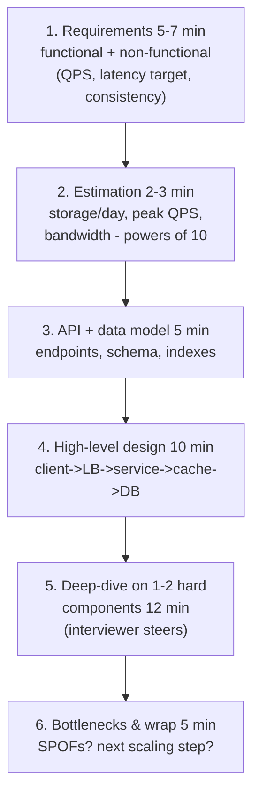
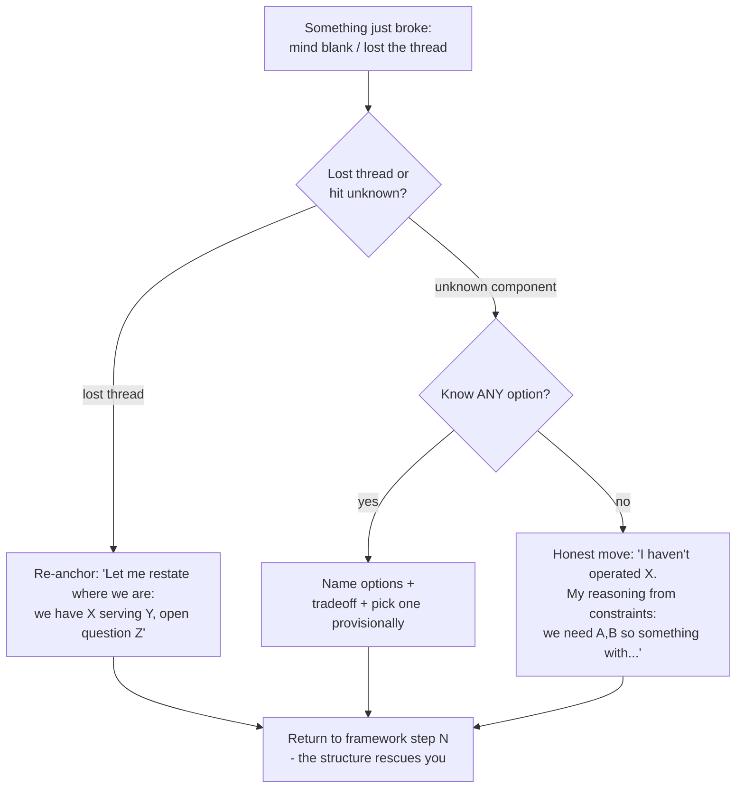

## For future agent
Deep edition of the system design interview playbook. Adds: why the round exists (mechanism), failure-mode taxonomy with early warnings (the six ways fresher designs die), premortem, mid-interview rescue flowcharts, estimation drills as a trainable micro-skill, depth-by-level expectations, life-integration cadence, and grading-rubric self-simulation. Building-block vocabulary lives in [[systems-design-distributed]]; solved-question library in [[repo-system-design-primer]].

# System Design Interview Playbook — Deep Edition

## Part 1 — Why This Round Exists (mechanism)

Production failures are almost never algorithm failures — they are *coordination* failures: wrong capacity math, missing failure-mode thinking, components chosen by fashion. The round compresses months of design review into 45 minutes to observe:

1. **Requirement interrogation** — do you build the thing ASKED or the thing IMAGINED?
2. **Tradeoff narration** — every choice costs something; silence about cost = inexperience
3. **Depth-on-demand** — can you go two levels down on YOUR OWN proposal when probed?
4. **Boring-default discipline** — juniors who reach for Kubernetes-first fail; correct fresher answers use LB + stateless app + SQL + cache until requirements force more

## Part 2 — The Framework (45 min)

**Why this exact sequence**: it front-loads constraint discovery (cheap to fix on paper, expensive in production), and gives the interviewer natural probe points. Deviating is fine; skipping step 1 is how designs answer the wrong question.

## Part 3 — Failure-Mode Taxonomy

| # | Failure Mode | Root Cause | Early Warning (in yourself) | Counter |
|---|--------------|-----------|------------------------------|---------|
| F1 | **Wrong-question design** | Skipped requirement clarification; assumed features | Started drawing within first 2 minutes | Forced script: "Before designing — three questions:" |
| F2 | **Estimation paralysis** | Math anxiety; fear of wrong numbers | Long silence at step 2 | Estimates are ORDER-of-magnitude; state assumptions loudly; wrong-by-2× is fine, absent is fatal |
| F3 | **Buzzword salad** | Collected terms without mechanism | Naming Kafka/K8s before explaining WHY needed | Rule: every technology named must get a one-line "because X constraint" |
| F4 | **Silent drawing** | Working privately like a leetcode problem | >60s without speech | Narrate EVERY box; think-aloud is the scored artifact |
| F5 | **Over-engineering** | Imposter compensation; blog-architecture cargo cult | Designing for 100M users when asked for 10k | Fresher default stack first; add complexity only when a STATED requirement demands it |
| F6 | **No failure-mode pass** | Happy-path thinking | Step 6 arrives with nothing prepared | Pre-memorized checklist: SPOF? cache invalidation? retry storms? data growth curve? |

### Premortem
*The round ends; feedback says "shallow, no tradeoffs."* Autopsy: jumped to drawing (F1), named technologies without mechanisms (F3), went quiet while sketching (F4), never did the failure pass (F6). All four visible in your first two practice recordings — which is why practice starts with RECORDING, not reading.

## Part 4 — Rescue Flowcharts (mid-round)

**Unknown-technology honesty** scores BETTER than bluffing — the rubric rewards reasoning-from-constraints, which you can always do.

## Part 5 — Estimation Drills (trainable micro-skill)

Weekly drill (10 min): estimate one system cold, out loud.

| Drill | Chain You Practice |
|-------|--------------------|
| Twitter QPS | Users → active fraction → tweets/user/day → seconds/day |
| WhatsApp storage/day | Messages × avg size × duplication factor |
| Video platform bandwidth | Views × bitrate × watch fraction |
| Your own retrieval-brain API | Queries/day × embed latency × vector size |

Rules: powers of 10 only; state every assumption ("assume 20% DAU…"); end with "so that means…" conclusion. Wrongness within 10× is acceptable; vagueness is not.

## Part 6 — Depth Expectations by Level

| Level | Expected | Explicitly NOT Expected |
|-------|----------|------------------------|
| Fresher/intern | Framework discipline, vocabulary fluency, honest "I'd research X" | Full sharding math, consensus proofs |
| Mid | Fluent estimations, competent deep-dives, tradeoffs everywhere | Novel architecture invention |
| Senior | Numbers-driven decisions, failure-mode mastery, migration stories | — |

Fresher superpower: **clean boring architecture + articulate tradeoffs beats buzzword soup every single time.**

## Part 7 — Worked Example Condensed: URL Shortener

Requirements: shorten + redirect fast; optional custom alias; scale ~40 writes/s avg (~400 peak), reads ≫ writes (~100:1). Estimate: 500B×100M/mo ≈ 50GB/mo (trivial); read QPS ~4k → caching matters. Key: base62 of auto-increment ID (62⁶≈56B keys). Store: key-value (AP choice — redirects tolerate eventual consistency; SAY the CAP reasoning). Cache: cache-aside on hot keys (80/20 read skew). Deep-dive: 301 vs 302 redirect — browser-cached (fast, loses analytics) vs always-hit-server (analytics kept) — SAY THE TRADEOFF. Bottleneck: single writer for keys → range-partitioned ticket server or pre-generated blocks.

Full worked set (Pastebin, Instagram, chat, KV store…) in [[repo-system-design-primer]].

## Part 8 — Life Integration

- **Weekly ritual**: one solved-question re-attempt BEFORE reading its solution ([[repo-system-design-primer]] list); 30–45 min
- **Passive layer**: engineering case-study podcasts/threads during commutes ([[repo-scalability-catalogs]]) — builds intuition without desk time
- **Anchor to projects**: every project you ship gets a mini design doc (even 10 lines) — real reps, portfolio synergy
- **Metrics**: mock designs done/month, estimation drills streak, vocabulary gaps logged and closed
- **College tie-in**: DBMS + networks coursework maps directly onto blocks here; cross-reference while studying for exams — double-counting learning time

## Example Checkpoint Questions

1. Your design has ONE database instance. Name three distinct failure modes and one mitigation each.
2. Why does cache-aside dominate in practice over write-through despite its stale-read window?
3. Interviewer asks "what breaks first at 10× traffic?" — walk your answer's logic, not just the answer.
4. When is CONSISTENCY worth sacrificing availability? Give a concrete product example.

## Cross-Vault Links

[[systems-design-distributed]] · [[repo-system-design-primer]] · [[repo-scalability-catalogs]] · [[interview-counter-guide]] · [[modules/programming/SAAS_BUILD_NOTES]]