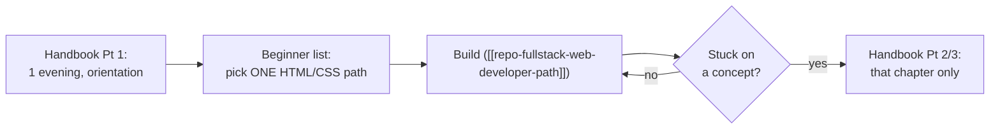
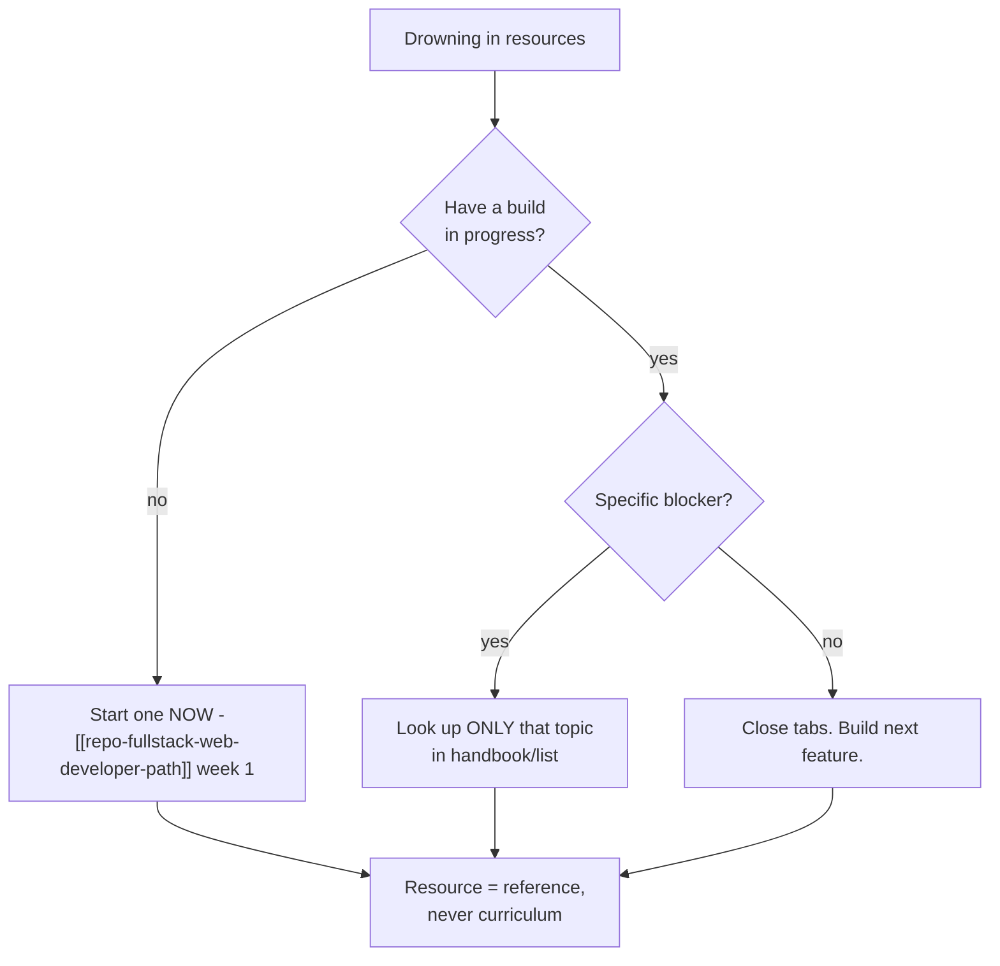

## For future agent
Two frontend repos expanded together (same domain, complementary): a curated beginner resource list and the FrontendMasters handbook. Structures fetched 2026-08-24. Reference layer for [[repo-fullstack-web-developer-path]]; concept notes live in [[web-development-resources]].

# Frontend Learning Resources — Expanded

## Repo A: Resources-Front-End-Beginner

Its actual section structure:

| Section | What's Inside |
|---------|--------------|
| Start here | General guidance + roadmap links |
| Learn HTML | MDN-first references + practice sites |
| Learn CSS | Layout guides (flex/grid), methodology articles |
| Learn JavaScript | Basics→DOM→async progression links |
| Learn TypeScript | Starter docs when JS feels solid |
| Learn Git | Interactive tutorials |
| Tools | Editors, browser devtools, package managers |
| Chat/Channels · Aggregators · Newsletters | Staying-current layer |

**Usage rule**: this is a *menu*, not a syllabus — pick one item per row, ignore the rest until needed.

## Repo B: Front-End Developer Handbook 2017 (Cody Lindley)

A free online **book** in three parts (its own description):

1. **The Front-End Practice** — what the role actually is; technologies of the trade
2. **Learning Front-End Development** — self-directed + direct instruction resources, ordered
3. **Front-End Development Tools** — the tooling landscape explained by category

Read Part 1 once for orientation; Parts 2–3 as lookup. A 2019 edition exists (repo redirects there) — read the newest available `(TBC: later editions may exist as of 2026)`.

## Combined Usage Protocol

## Example Checkpoint Questions

1. Name three tools from the handbook's tool categories you've actually used — what did each replace?
2. Why does every serious resource start with MDN rather than W3Schools?

## Deep Edition Addendum

**Failure modes with resource lists**:

| Failure | Mechanism | Counter |
|---------|-----------|---------|
| Menu-browsing as learning | Bookmarks ≠ skills | Pick ONE item per section, in use |
| Newsletter overload | Staying-current anxiety replacing building | One newsletter max; read weekly not daily |
| Handbook-as-novel | Reading tool catalogs cover-to-cover | Part 1 once; parts 2–3 on-demand only |

**Premortem**: *Month of "frontend prep": 40 bookmarks, zero pages built.* The list was consumed as content. Resources are groceries — value exists only when cooked.

**Rescue flowchart**:

**Life integration**: resource-touching allowed only inside build sessions; metrics = builds shipped vs items bookmarked (ratio ≥1 is the health check).

## Cross-Vault Links

- [[web-development-resources]] · [[languages-polyglot]] (JS books)
- [[modules/programming/cs50/week-8-html-css-javascript]]