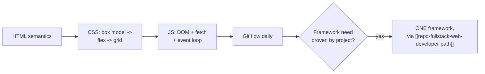
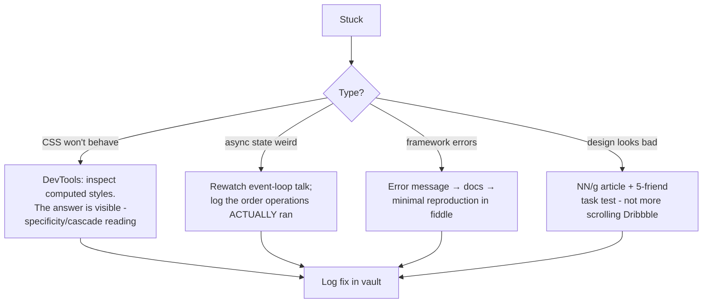

## For future agent
Deep edition of the web dev reference page. Adds the frontend failure taxonomy (why self-taught frontends look/perform wrong), framework-era context (what changed since the source links), learning-order logic, defeat-tackling flowchart, and life integration. JS language books in [[languages-polyglot]]; structured path in [[repo-fullstack-web-developer-path]]; expanded resources in [[repo-frontend-learning-resources]].

# Web Development Resources — Deep Edition

## Part 1 — The Frontend Failure Taxonomy

Self-taught frontends fail in recognizable ways; each maps to a knowledge layer most tutorials skip:

| # | Failure | Looks Like | Root Knowledge Gap |
|---|---------|-----------|--------------------|
| F1 | **Framework before language** | React dev who can't debug vanilla DOM events | JS fundamentals ([[languages-polyglot]] JS section) |
| F2 | **CSS wrestling** | Fighting specificity with `!important` everywhere | Cascade/specificity model never learned |
| F3 | **Layout roulette** | Random flex/grid property combos until it looks right | Box model + layout algorithm mental model |
| F4 | **Async confusion** | State updates appearing late/stale | Event loop mechanics |
| F5 | **Silent browser breakage** | Works in Chrome only | Compatibility checking habit absent |
| F6 | **Unusable UI** | Technically functional, nobody can use it | Zero UX/usability literacy |

Every resource below is placed against these failures.

## Part 2 — Fundamentals & References

- **[MDN Web Docs](https://developer.mozilla.org/en-US/)** — THE reference; first lookup always
- **[What the Heck is the Event Loop Anyway? (Philip Roberts)](https://www.youtube.com/watch?v=8aGhZQkoFbQ)** — cures F4 permanently in 26 minutes; rewatch when async bugs confuse
- [Chrome DevTools overview](https://developer.chrome.com/devtools) · [tips collection](https://flaviocopes.com/chrome-devtools-tips/) — DevTools fluency is F2/F3's cure (inspect computed styles live)
- **[caniuse.com](https://caniuse.com/)** — F5 prevention reflex before using any API
- [QuickDBD](https://www.quickdatabasediagrams.com/) schema sketching · [JSFiddle](https://jsfiddle.net/) playgrounds

## Part 3 — CSS Architecture (F2/F3 cures)

| Convention | Idea | Link |
|-----------|------|------|
| BEM | Block-Element-Modifier naming discipline | [smacss.com/book](https://smacss.com/book/) *(source mislabeled BEM→SMACSS link)* |
| SMACSS | base/layout/module/state/theme categorization | [smacss.com/book](https://smacss.com/book/) |
| CSS Grid | Native layout replacing framework grids | [spec](https://drafts.csswg.org/css-grid/) |
| Grid>Bootstrap essay | Why native grid wins layouts | [hackernoon](https://hackernoon.com/how-css-grid-beats-bootstrap-85d5881cf163) |

Context essays: ["Modern CSS for Dinosaurs"](https://medium.com/actualize-network/modern-css-explained-for-dinosaurs-5226febe3525) — the evolution story that explains WHY today's toolchain exists · [12 common mistakes](https://www.webpagefx.com/blog/web-design/12-common-css-mistakes-web-developers-make/) checklist.

**2026 note** `(TBC)`: utility-first Tailwind largely displaced BEM/SMACSS in new projects — but the cascade/specificity mental model remains mandatory underneath any convention.

## Part 4 — UX & Usability (F6 cures)

- [UX design overview + tools (Smashing)](https://www.smashingmagazine.com/2010/10/what-is-user-experience-design-overview-tools-and-resources/)
- **[Usability 101 (Nielsen Norman)](https://www.nngroup.com/articles/usability-101-introduction-to-usability/)** — the authority; five-users-testing principle
- No-code regression testing: [Reflect](https://reflect.run/)
- Color: [Adobe Color wheel](https://color.adobe.com/create/color-wheel/)

**Practice mechanism**: usability isn't taste — it's testable. Five friends attempting one task on your app will reveal more than a month of solo polishing.

## Part 5 — Frameworks & Inspiration
[Bootstrap](http://getbootstrap.com/) · [Foundation](http://foundation.zurb.com/) — classic component frameworks `(2026 note: Tailwind displaced both in new builds; concepts still transfer)`.
Inspiration: [Dribbble](https://dribbble.com/) · [Behance](https://www.behance.net/) · [awesome-inspire](https://github.com/NoahBuscher/Inspire) — consume as targets to REBUILD, not scroll-feed.

## Part 6 — Learning-Order Logic + Premortem

### Premortem
*Frontend learning abandoned at month 2.* Findings: framework started week 2 (F1 setup); CSS fought by trial-and-error (F3); zero deployed pages so no feedback existed at all. Counter: ship static page #1 by end of week 1 — deployment-first from day one.

## Part 7 — Defeat-Tackling Flowchart

## Part 8 — Life Integration

- Ship cadence over study cadence: one visible page improvement per session beats tutorial chapters
- DevTools as default lens: every browsing session can be inspection practice
- Metrics: pages shipped · CSS problems solved via computed-styles inspection (not StackOverflow paste) · friend-task tests run

## Example Checkpoint Questions

1. Two selectors target the same element — which wins and why? Walk the specificity math.
2. Your fetch updates state but UI shows old value — walk the microtask/macrotask ordering.
3. A feature works in Chrome, breaks Safari — your first two diagnostic steps?

## Cross-Vault Links

[[languages-polyglot]] · [[repo-fullstack-web-developer-path]] · [[repo-frontend-learning-resources]] · [[modules/programming/cs50/week-8-html-css-javascript]]