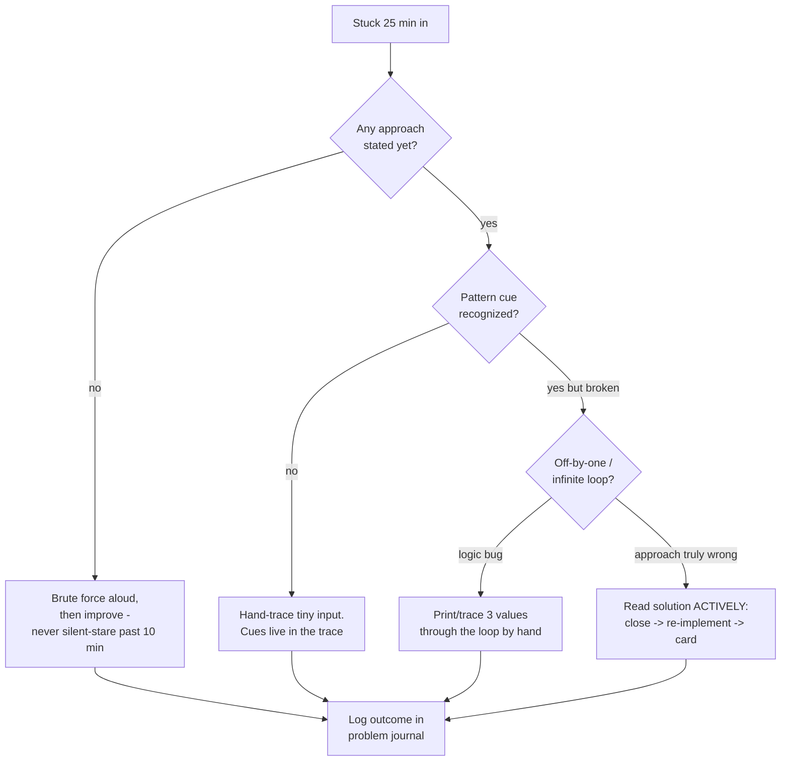
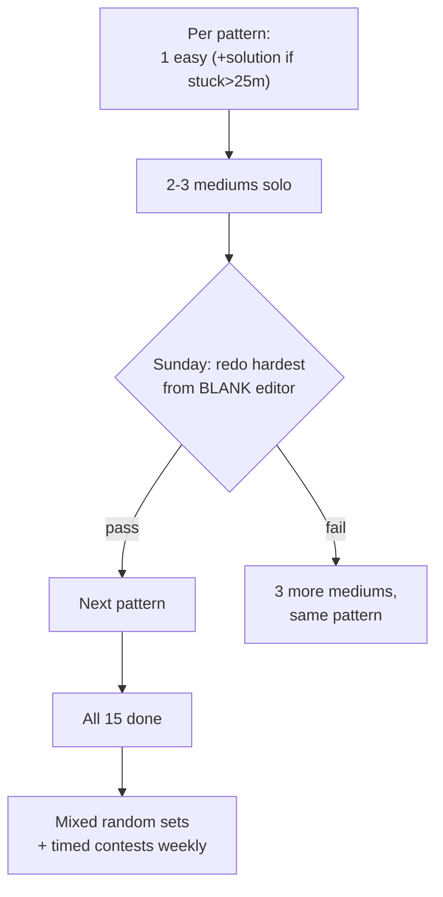

## For future agent
Deep edition of the DSA playbook: the 15-pattern table plus mechanism-level analysis of WHY pattern recognition works, a full failure-mode taxonomy (plateau math, DP wall, timed-freeze), premortem of a failed prep season, defeat-tackling flowcharts per failure type, spaced-repetition problem scheduling, and life-integration cadence. Assumes [[roadmap-software-engineer]] Stage 2 in progress; method foundation in [[how-to-self-teach]].

# DSA Interview Playbook — Deep Edition

## Part 1 — Why Pattern Recognition Works (mechanism)

Interview problems are *isomorphic*: surface stories differ (robots, strings, meetings), underlying graphs/sequences/invariants repeat. Working memory can hold ~4 chunks under stress — so the winner is whoever has compressed solutions into single-chunk patterns. You're not memorizing 500 problems; you're building ~15 chunks until recognition is reflexive.

**Evidence-shaped corollary**: struggling productively (retrieval + spacing) builds those chunks; passive reading does not. This is why the ladder system below looks like it does.

## Part 2 — The Pattern Table

| Pattern | Recognition Cue | Template Idea |
|---------|----------------|---------------|
| Two pointers | Sorted array; pair/triplet search | Ends inward / same-direction runners |
| Sliding window | Contiguous subarray/substring + longest/shortest/max | Expand right, shrink left on violation |
| Fast & slow pointers | Cycle detection; middle of list | Two speeds; meet ⇒ cycle |
| Hash map counting | Frequencies, complements, anagrams | Dict of seen; `target - x` check |
| Prefix sums | Range sums; subarray sum = K | Cumulative array; `P[j]-P[i]` |
| Monotonic stack | Next greater/smaller; histogram | Keep decreasing stack; pop on smaller |
| Binary search (on answer) | Sorted OR monotone feasibility ("minimize max") | Search answer space with predicate |
| BFS | Shortest path unweighted; level order | Queue + visited set |
| DFS/backtracking | Generate all; permutations; constraints | Choose → recurse → un-choose |
| Topological sort | Prerequisites; ordering | Kahn's queue / DFS finish times |
| Union-Find | Connectivity; components; undirected cycle | Parent array + union by rank |
| Heap / top-K | K largest; streaming median | Size-K min-heap |
| Greedy + sort | Intervals; scheduling | Sort by end/start; local exchange argument |
| DP 1D | Min cost to reach step n | `dp[i]` from prior states |
| DP knapsack/subset | Include/exclude under constraint | Table over items×capacity |

## Part 3 — Failure-Mode Taxonomy

| # | Failure Mode | Root Cause (mechanism) | Early Warning | Counter |
|---|--------------|------------------------|---------------|---------|
| F1 | **The DP Wall** | DP requires inventing state definition — a skill, not knowledge | Avoiding all DP tags for weeks | Confined diet: fib(memo)→climb stairs→house robber→coin change, recursion TREE drawn every time; clicks around problem #15 |
| F2 | **The Plateau (~150 solved)** | Solving same-type problems again; recognition without stretch | Easy mediums feel samey; hards still impossible | Switch to random mixed sets + weekly timed contest; add ONE hard/week with full solution study |
| F3 | **Timed freeze** | Pressure consumes working memory that practice had available | Untouched: fine. Clock on: blank | Weekly simulation: 2 problems/60min/clock visible; gradually raise stakes (mock partner) |
| F4 | **Solution-reading addiction** | Reading feels like progress (fluency illusion) | Solve-rate dropping while "study" hours rise | Attempt-first rule enforced by timer; after reading ANY solution, close it and re-implement cold |
| F5 | **Forgetting solved problems** | One-shot encoding, no retrieval schedule | Redoing an old medium fails | Spaced redo schedule: day-3, day-14, day-45 |
| F6 | **Burnout grind** | Volume without recovery → resentment → quit | Dread before sessions; sloppy errors | Deload week (only easy problems); never-zero floor keeps streak |

### Premortem (failed prep season)
*Interview season arrived; coding rounds still failing.* Autopsy: 400 problems "done" but mostly easy-tag grinding (F2), no mocks so F3 hit live (F3 never simulated), DP skipped entirely since month one (F1 avoidance), old problems unsolvable on redo (F5). Every finding was visible weeks earlier via solve-rate metrics — the review cadence below exists to catch them.

## Part 4 — Defeat-Tackling Flowcharts

**Post-failure ritual** (the part everyone skips): for each solved-with-help problem, write one line — *"cue I missed"*. That line is the actual curriculum.

## Part 5 — The Ladder System (with scheduling)

**Daily shape (60–90 min)**: 40 min new problems (ladder position) · 20 min spaced redos (due queue) · 10 min Anki cards from today's misses.
**Weekly**: 1 timed simulation + Sunday redo test + review metrics.

## Part 6 — Life Integration

- **Anchor to fixed slot** (morning or post-dinner) — decision fatigue kills evening plans
- **Exam-week protocol**: drop to 15-min Anki-only days; ladder pauses, streak survives
- **College synergy**: SPM/C course work doubles as pointer/array reps ([[engineering/SPM/module-3-arrays]]); CS50 PSets count as ladder easies
- **Metrics reviewed Sundays**: solo-solve rate (leading), redo pass-rate (retention), mock scores (outcome), days streak (consistency). If solo-rate flat 2 weeks → change difficulty mix, not effort.

## Part 7 — Example Question Set (pattern-labeled)

1. Container With Most Water → two pointers
2. Subarray Sum Equals K → prefix sums + hashmap
3. Course Schedule → topological sort
4. Merge Intervals → greedy+sort
5. LRU Cache → hashmap + doubly-linked list
6. Word Search → backtracking
7. Minimum in Rotated Sorted Array → binary search on modified condition
8. Number of Islands → DFS flood fill
9. Longest Increasing Subsequence → DP (patience-sort follow-up for senior loops)
10. Kth Largest in Stream → size-K heap

## Part 8 — Quick Answers to Doubts

- *"Hards needed?"* — Fresher loops: rarely. Internship conversion at top companies: sometimes. Add 1/week only after mediums are stable.
- *"Language for interviews?"* — The one you think in. Python acceptable everywhere `(India product cos included)`; switching languages mid-prep resets chunk-building.
- *"Contests?"* — Yes for pressure training (F3 cure), ignore rating anxiety entirely.

## Cross-Vault Links

[[repo-coding-interview-university]] · [[roadmap-software-engineer]] · [[how-to-self-teach]] · [[example-question-bank]] · [[interview-counter-guide]]