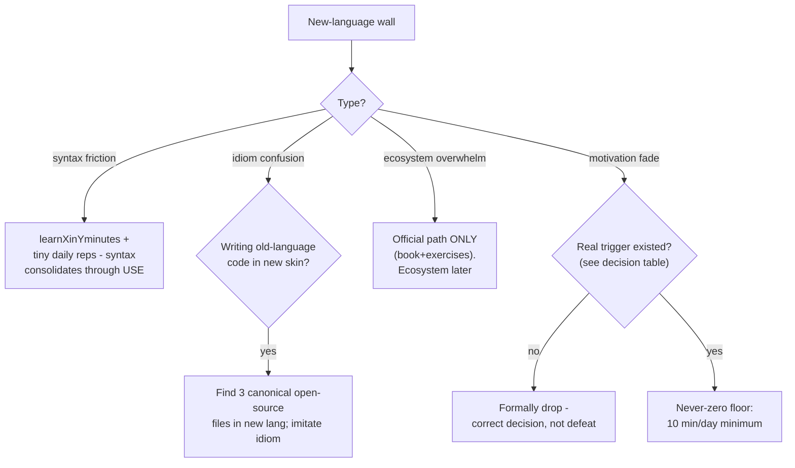

## For future agent
Deep edition of the multi-language catalog. Adds the language-selection decision logic (when to learn a second/third language at all), per-language failure modes with counters, the transfer-learning mechanism (what each language permanently upgrades in your thinking), and defeat-tackling flowchart. Each section is a self-contained mini-path; canonical books + exercises + one deep-dive.

# Other Languages — Deep Edition

## Part 1 — The Polyglot Decision (before learning ANY of these)

Learning a second language prematurely fragments fundamentals. Correct triggers:

| Trigger | Language That Answers It |
|---------|--------------------------|
| College C course exists anyway (SPM) | C/C++ — double-counted learning |
| Backend performance curiosity after Python | Go |
| Interview loops demand it (frontend role) | JavaScript |
| Functional-thinking gap hurting code design | Haskell (time-boxed) |
| Target company stack is Java | Java/Scala |

**Anti-trigger**: "it looks useful someday" — someday-languages die at chapter 3. One language beyond your primary at a time; finish or drop formally ([[how-to-self-teach]]).

## Part 2 — C/C++

### Learning
**[K&R](https://www.amazon.com/Programming-Language-2nd-Brian-Kernighan/dp/0131103628)** classic · [Learn C the Hard Way](https://learncodethehardway.org/c/) · **[Modern C (Gustedt)](https://modernc.gforge.inria.fr/)** free/standards-tracked · Quick tours: [C](https://learnxinyminutes.com/docs/c/) / [C++](https://learnxinyminutes.com/docs/c++/) · Video: [crossword-puzzle C++ series](https://www.youtube.com/playlist?list=PLg4AoophFZWZ7Llifowo-1WGMVICq-mfw)

### Ecosystem
[C++ algorithms repo](https://github.com/priyankchheda/algorithms) · Testing: [GoogleTest](https://github.com/google/googletest/) · Jupyter kernel: [xeus-cling](https://github.com/jupyter-xeus/xeus-cling) · Safety-critical: [awesome-safety-critical](https://github.com/stanislaw/awesome-safety-critical/blob/master/README.md#coding-guidelines)

**Failure mode**: manual-memory bugs treated as mysteries instead of lessons → fear-based avoidance. Counter: valgrind/ASan on every segfault until you PREDICT them before running.
**Transfer upgrade**: pointers/stack/heap intuition that makes Rust, debugging, and interview memory questions trivial afterwards. Vault synergy: [[engineering/SPM/module-1-spm-c-basics]], [[programming/cs50/week-4-memory]].

## Part 3 — Go

- **[Practical Go Lessons](https://www.practical-go-lessons.com/)** free deep book · [Ecosystem map (henvic)](https://henvic.dev/posts/go/)
- Project-based: **[porting a web backend from Python (benhoyt)](http://benhoyt.com/writings/learning-go/)**
- TDD-driven: **[Learn Go with Tests](https://quii.gitbook.io/learn-go-with-tests/)** · Reference: **[Go by Example](https://gobyexample.com/)** · [Modules official](https://blog.golang.org/using-go-modules)
- Practice: [1000+ exercises (learngo)](https://github.com/inancgumus/learngo)
- Craft essay: [HTTP services after seven years](http://archive.today/G0JDY)

**Failure mode**: fighting Go's simplicity with patterns imported from heavier languages (inheritance hierarchies etc.). Counter: composition + interfaces-as-consumer-defined idioms — let Go be Go.
**Transfer upgrade**: goroutine/channel mental model makes ALL concurrency reasoning clearer.

## Part 4 — Haskell

- **[Learn You a Haskell](http://learnyouahaskell.com/)** friendly classic
- **[Write Yourself a Scheme in 48 Hours](https://en.wikibooks.org/wiki/Write_Yourself_a_Scheme_in_48_Hours)** learn-by-interpreter
- **[Graham Hutton lectures](https://www.youtube.com/channel/UCBDp7ydYTHi1dh4Gnf3VTPA)** + [Nottingham course](http://www.cs.nott.ac.uk/~pszgmh/) — from *Programming in Haskell* author

**Failure mode**: monad terror at the abstraction wall. Counter: time-boxed purpose — Haskell's value to an imperative programmer is PERMANENT type-thinking and purity habits, not employability. 8 weekends, extract the thinking, move on guilt-free.
**Transfer upgrade**: immutability-by-default changes how you design Python/JS code forever.

## Part 5 — Java / Scala

- [Awesome Java](https://github.com/akullpp/awesome-java) catalog
- **[Helsinki MOOC OOP Java](http://mooc.fi/courses/2013/programming-part-1/)** recommended structured course
- Jackson JSON: [Swagger polymorphism](http://yysource.com/2016/05/swagger-and-polymorphic-type-handling-with-jackson/) · [serialization example](https://stackoverflow.com/questions/17135166/looking-for-a-good-example-of-polymorphic-serialization-deserialization-using-ja/26720380#26720380)

**Failure mode**: verbose-syntax fatigue before OOP payoff arrives. Counter: Helsinki MOOC's gamified progression carries motivation through the boilerplate.

## Part 6 — JavaScript (deepest section)

### Learn (canonical order)
1. **[Eloquent JavaScript](https://eloquentjavascript.net/)** interactive book
2. [JavaScript for Impatient Programmers (Dr. Axel)](https://exploringjs.com/impatient-js/)
3. **[You Don't Know JS](https://github.com/getify/You-Dont-Know-JS)** core-mechanics series (free)
4. [Exploring JS](https://exploringjs.com) · Spec: [ECMAScript 2020](https://www.ecma-international.org/publications/standards/Ecma-262.htm)

### Beyond basics
- **[Build Your Own React](https://pomb.us/build-your-own-react/)** — React clone from scratch; THE understanding path
- **[Mostly Adequate FP Guide](https://mostly-adequate.gitbook.io/mostly-adequate-guide/)** functional JS
- Trends: [State of JS](https://stateofjs.com/) · Algorithms: [trekhleb/js-algorithms](https://github.com/trekhleb/javascript-algorithms) → [[repo-algorithms-implementations]] · d3: [hitchhiker's guide](https://medium.com/@enjalot/the-hitchhikers-guide-to-d3-js-a8552174733a)

**Failure mode**: framework-first learning (React without closures/event loop) → mysterious-bug career. Order above exists because frameworks ASSUME the language mechanics.

## Part 7 — Defeat-Tackling Flowchart (any new language)

## Part 8 — Life Integration

- Language slots follow college demands first (C for SPM, JS when a project needs frontend) — alignment removes willpower cost
- Transfer journal: one line per session — "what did this language change about how I write my PRIMARY language?"
- Metrics: chapters/exercises completed vs gate set at start · transfer-journal entries · formal-drop honesty (a clean drop beats zombie learning)

## Example Checkpoint Questions

1. What did Go's interface model teach you that Python's duck typing hadn't?
2. After K&R ch.5 (pointers), can you explain CS50's swap function more precisely than before?
3. Which Haskell concept (purity/laziness/types) showed up in your non-Haskell code this month?

## Cross-Vault Links

[[software-dev-general]] · [[languages-python-advanced]] · [[language-rust]] · [[web-development-resources]] · [[programming/object-oriented-programming/design-principles-solid]]