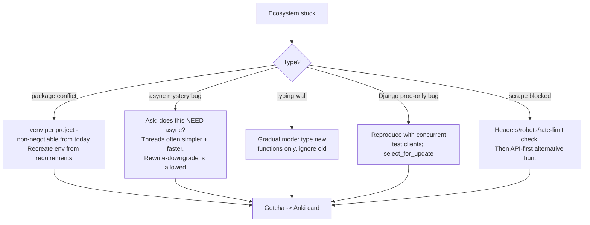

## For future agent
Deep edition of the advanced Python catalog. Adds per-area failure modes with mechanisms (the async trap, typing adoption failure, Django concurrency bugs), the mastery-path integration (this page is reference layer for [[python-mastery-path]]), defeat-tackling flowchart for ecosystem walls, and life integration. OOP theory lives in [[programming/object-oriented-programming/overview]].

# Advanced Python — Ecosystem & Craft [Deep Edition]

## Part 1 — Courses / Books

- **[The Hitchhiker's Guide to Python](https://docs.python-guide.org/)** — opinionated best practices
- **[Automate the Boring Stuff](https://automatetheboringstuff.com/)** — free practical scripting
- [Full Stack Python](https://www.fullstackpython.com/table-of-contents.html) — deployment encyclopedia
- **[Fluent Python](https://github.com/fluentpython)** · **[Effective Python](https://effectivepython.com/)** — the two mastery books
- [Python Numerical Methods (Berkeley)](https://pythonnumericalmethods.berkeley.edu/notebooks/Index.html) — engineers' track
- [Dave Beazley courses](https://www.dabeaz.com/courses.html) — legendary advanced training

**Book usage mechanism**: Fluent/Effective are not read cover-to-cover — they're consulted after hitting each wall ("why is my class weird?" → relevant chapter). Reading front-to-back without code produces fluent illusion.

## Part 2 — Idioms, Paradigms, Deep Features

[Python 3 Patterns & Idioms](https://python-3-patterns-idioms-test.readthedocs.io/en/latest/Singleton.html) · [FP in Python (free O'Reilly)](https://www.oreilly.com/programming/free/files/functional-programming-python.pdf) · **[Composing Programs](https://www.composingprograms.com/)** (SICP-in-Python; CS61A text) · [OOP basics (swaroopch)](https://python.swaroopch.com/oop.html) → deep: [[programming/object-oriented-programming/overview]] · **[wtfpython](https://github.com/satwikkansal/wtfpython)** interpreter surprises · [Anti-patterns book](https://docs.quantifiedcode.com/python-anti-patterns/) · **[pytudes (Norvig)](https://github.com/norvig/pytudes)** study-quality programs · [pysanity](https://github.com/rednafi/pysanity/) opinions

**Failure mode**: idiom-collecting. Comprehensions/decorators adopted before the loop-version is understood produce unreadable cleverness. Rule: loop first, idiom as refactor.

## Part 3 — Basics Reference
[Config files (YAML/JSON)](https://martin-thoma.com/configuration-files-in-python/) · [String formatting cookbook](https://mkaz.blog/code/python-string-format-cookbook/) · [Google-style docstrings](https://sphinxcontrib-napoleon.readthedocs.io/en/latest/example_google.html)

## Part 4 — Tooling: Testing / Performance / Typing

[Numba JIT](http://numba.pydata.org/) · [Hypermodern Python series](https://cjolowicz.github.io/posts/hypermodern-python-01-setup/) (modern project setup)

**Type checking**:
| Resource | Takeaway |
|----------|----------|
| [Dropbox typing 4M lines](https://dropbox.tech/application/our-journey-to-type-checking-4-million-lines-of-python) | Adoption at scale is incremental, file-by-file |
| [Type hints explained](https://kunigami.blog/2019/12/26/python-type-hints/) | Syntax mechanics |
| [MonkeyType](https://github.com/instagram/MonkeyType) | Runtime-traced hints bootstrap legacy code |

Failure mode: `--strict` mypy on day one → wall of errors → typing abandoned. Correct path: hints on NEW functions only → gradual strictness ([[programming/object-oriented-programming/modern-oop-dataclasses-typing]]).

Dev resources gist: [AlmasM collection](https://gist.github.com/AlmasM/8a05355dbd84029eae03f92c5c61038f)

## Part 5 — Async / Concurrency (decision-critical area)

| Resource | Takeaway |
|----------|----------|
| **[Async Python is not faster](http://calpaterson.com/async-python-is-not-faster.html)** | Benchmarks: asyncio often LOSES to threads+gunicorn on HTTP serving |
| [Sync vs Async (Grinberg)](https://blog.miguelgrinberg.com/post/sync-vs-async-python-what-is-the-difference) | Conceptual split clarified |
| [Async IO walkthrough](https://realpython.com/async-io-python/) | Full tutorial |
| [Concurrency tricky bits](https://archive.ph/RQSfH) | Threads/processes/coroutines explored |
| [HN discussion](https://news.ycombinator.com/item?id=23289563) | Practitioner sentiment |

**The decision rule distilled**: CPU-bound → multiprocessing. I/O-bound modest scale → threads. I/O-bound high-concurrency WITH async-native stack end-to-end → asyncio. The standard failure: rewriting a sync app to async because "async = fast", inheriting ecosystem incompatibilities and losing to threads on benchmarks.

## Part 6 — CLI Apps
[Rich Terminal Dashboards (Will McGugan)](https://www.willmcgugan.com/blog/tech/post/building-rich-terminal-dashboards/) — by Rich/Textual's author.

## Part 7 — Django Patterns
[GraphQL overview](https://medium.com/swlh/graphql-in-django-an-overview-51d27e7fceb3) · Concurrency: [hakibenita guide](https://medium.com/@hakibenita/how-to-manage-concurrency-in-django-models-b240fed4ee2) + [SO thread](https://stackoverflow.com/questions/1645269/concurrency-control-in-django-model) (select_for_update discipline) · Jobs: [django-celery](https://pypi.org/project/django-celery/) · [django-rq](https://github.com/rq/django-rq) (simplest honest option first)

**Failure mode**: race conditions invisible in dev (single user), catastrophic in prod (two users). Test with concurrent requests deliberately.

## Part 8 — Databases & DB DevOps
[Stanford Intro to Databases](https://lagunita.stanford.edu/courses/DB/2014/SelfPaced/about) · Testing: [pytest-postgresql](https://pypi.org/project/pytest-postgresql/) · [pgmock announcement](https://technology.cloverhealth.com/better-postgresql-testing-with-python-announcing-pytest-pgsql-and-pgmock-d0c569d0602a) · [SO thread](https://stackoverflow.com/questions/2723406/database-testing-in-python-postgresql) · [Full Stack Python databases](https://www.fullstackpython.com/databases.html) · Migrations: [Alembic](https://alembic.sqlalchemy.org/en/latest/) · [Flyway](https://flywaydb.org/) · [Roundhouse](https://github.com/chucknorris/roundhouse) · Driver: [psycopg](https://www.psycopg.org/)

**Failure mode**: mocking the database in tests entirely → tests pass, SQL breaks in prod. Real-test-tooling above exists precisely because fake DBs validate nothing about SQL.

## Part 9 — Telegram Bots + Scraping
Telethon: [docs](https://lonamiwebs.github.io/Telethon/) · [API intro](https://towardsdatascience.com/introduction-to-the-telegram-api-b0cd220dbed2) · [deploy a bot](https://djangostars.com/blog/how-to-create-and-deploy-a-telegram-bot/) — n8n no-code alternative: [[business/automations/quick-start-guide]]
Scraping: **[ScrapingBee 101](https://www.scrapingbee.com/blog/web-scraping-101-with-python/)** (requests→BeautifulSoup→Selenium ladder)

## Part 10 — Defeat-Tackling Flowchart

## Part 11 — Life Integration

- Ecosystem skills attach to PROJECTS, never studied standalone — every tool here earns its slot when a build demands it ([[how-to-self-teach]] project-driven pattern)
- Gotcha deck compounds: Python's interview value lives in exactly these edge cases
- Metrics: projects using ≥3 tools from this page · gotcha cards matured · env-recreation time trending down (<15 min)

## Example Checkpoint Questions

1. Why can asyncio be SLOWER for an HTTP service? State the workload property that decides.
2. Your Django view double-charges payments under load — which primitive fixes it and where?
3. What does MonkeyType give you that hand-typing doesn't — and what does it miss?

## Cross-Vault Links

[[python-mastery-path]] · [[programming/object-oriented-programming/overview]] · [[repo-dev-toolbox-minors]] · [[software-dev-general]]