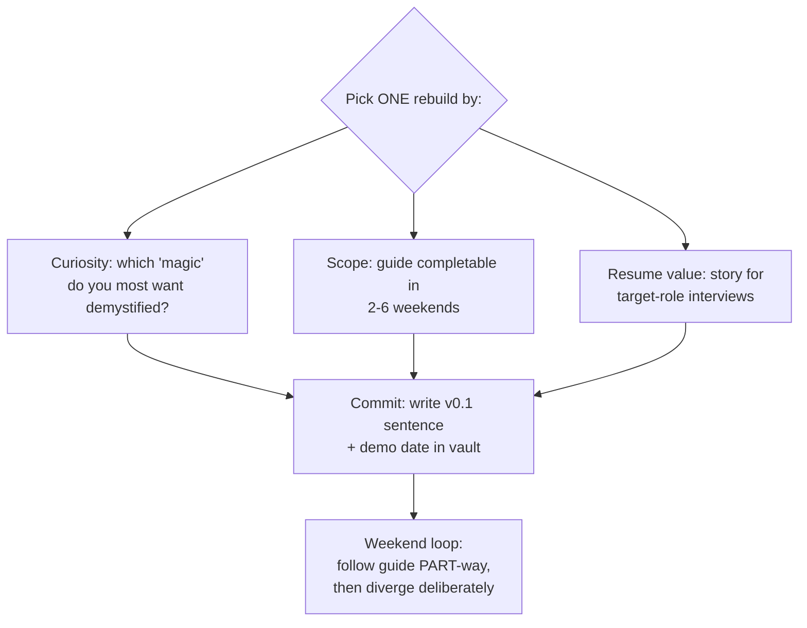
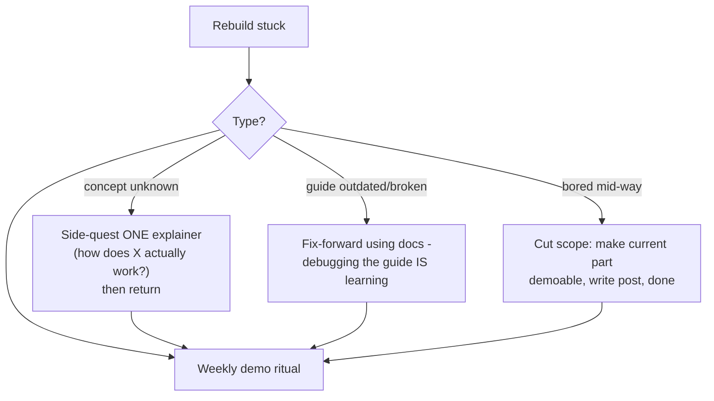

## For future agent
The "Build Your Own X" catalog: step-by-step guides for rebuilding technologies from scratch — your own Git, database, OS, browser, blockchain, neural network, Docker, Redis… The highest-leverage learning resource in this entire module because building-from-scratch produces the deepest understanding per hour. Includes the difficulty-reality warning and selection protocol.

# Build Your Own X — Expanded

## What It Contains

Community guides organized by what-you-build: **3D Renderer · Augmented Reality · BitTorrent Client · Blockchain · Bot · Command-Line Tool · Database · Docker · Emulator · Frontend Framework · Game · Git · Network Stack · Neural Network · Operating System · Physics Engine · Programming Language · Regex Engine · Search Engine · Shell · Text Editor · Visual Recognition System · Voxel Engine · Web Browser · Web Server** — each with multiple language-specific tutorial links.

## Why This Is the Highest-Leverage Catalog

Reading about systems < using systems < BUILDING systems. A weekend rebuilding mini-Git teaches more durable internals than a month of tutorials — and produces interview stories nobody else has ("I wrote a content-addressable store to understand Git"). Directly powers [[build-project-playbook]]'s "one hard problem inside" criterion.

**Vault-fit examples**: build-your-own-shell → CS50 fluency; own-database → [[systems-design-distributed]] depth; own-neural-net → [[math-for-ml-survival-guide]] applied; own-interpreter → [[repo-teachyourselfcs]] #8.

## Selection Protocol

## Failure Modes

| Failure | Mechanism | Early Warning | Counter |
|---------|-----------|---------------|---------|
| Scope explosion | "My OS" becomes life project | Week 3, no working slice | Guide's milestone-1 only; ship that |
| Typist mode | Following keystroke-by-keystroke | Can't explain last 50 lines | After each section: blank-file re-attempt |
| Collector's paralysis | 20 guides bookmarked | Browsing > building weekly | One active rebuild max |
| Premature ambition | Starting with OS/browser as first rebuild | No completed small rebuild yet | Order: CLI tool → shell/DB → then giants |

**Premortem**: *Rebuild abandoned at 15%.* Autopsy: chose browser first (giants), followed keystrokes blindly (typist), no demo date committed. All three prevented by the protocol.

## Rescue Flowchart

## Life Integration

- One rebuild per semester-break; weekend demo ritual keeps momentum visible
- Interview prep synergy: every rebuild = 3 STAR stories ([[interview-counter-guide]])
- Metrics: rebuilds shipped · divergence-commits (your own code vs guide's) · interview stories banked

## Example Checkpoint Questions

1. Which "magic" do I still treat as magic? That's my next rebuild candidate.
2. In my current rebuild, what % of commits are MY decisions vs typed-along?

## Cross-Vault Links

[[programming/learning-resources/index|Field Index]] · [[build-project-playbook]] · [[software-dev-general]] · [[lr-project-based-learning|30soc+PBL page]]